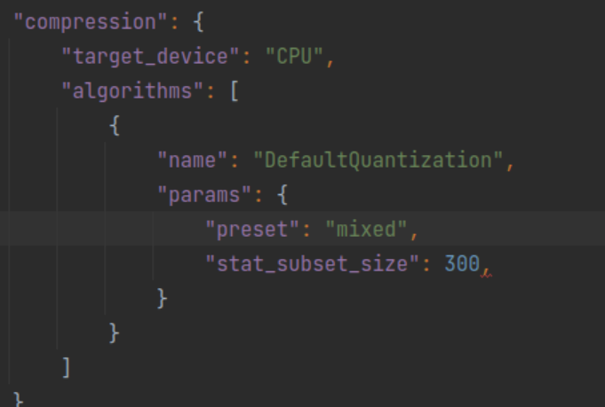

- 09:45
	- [[POT]]
		- [[Accuracy Tuning using POT]]
			- https://docs.openvino.ai/latest/pot_docs_BestPractices.html
		- [[Quantization config in POT]]
			- [apply_preset_rule](https://github.com/openvinotoolkit/openvino/blob/0c855ee8b23218116a74368766196d9840a0cd76/tools/pot/openvino/tools/pot/algorithms/quantization/fake_quantize_configuration.py#L177)
			- ```
			      def _apply_preset_rule(preset_, fq_name, param_type, confs, to_skip=None):
			          if param_type == 'weights':
			              if preset_ == 'accuracy':
			                  return confs[-1]
			              return confs[0]
			          if not to_skip or fq_name not in [fq for _, fqs in to_skip for fq in fqs]:
			              if preset_ == 'performance':
			                  return confs[0]
			              return confs[-1]
			          return confs
			  ```
			- 'conf' here refers to
				- [cpu.json](https://github.com/openvinotoolkit/openvino/blob/2d0ae6028a7cc3e2f2d7a9ba145c1c5b2a2f4260/tools/pot/tests/data/hardware_configs/cpu.json#L35)
				- ```
				      "operations": [
				          {
				              "type": "Convolution",
				              "quantization": {
				                  "activations": "q8_a",
				                  "weights": ["q8_w_sym", "q8_w_asym"]
				              }
				          },
				  ```
			- Thus, for cpu config, if preset is set to 'mixed', which is translated to 'accuracy' [here](https://github.com/openvinotoolkit/openvino/blob/37923a9183817d3ae8d4b4aa5340b7934538ea82/tools/pot/openvino/tools/pot/configs/config.py#L356)
			- Quantization preset on CPU
				- For Asymmetric quantization: set preset to 'mixed' in quantization config, the quantization would be symmetric for weights and asymmetric for activations under CPU device configuration.
					- 
				- If you set preset to 'performance', the quantization would be symmetric for weights and symmetric for activations.
					- _1646186980617_0.png)
				- Currently, pot tool don't support asymmetric quantization on weights by configuration, to enable that, we need to hack compression/configs/hardware/cpu.json file as follows:
					- Change
						- _1646187047456_0.png)
					- To
						- _1646187032002_0.png)
					-