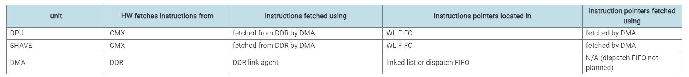
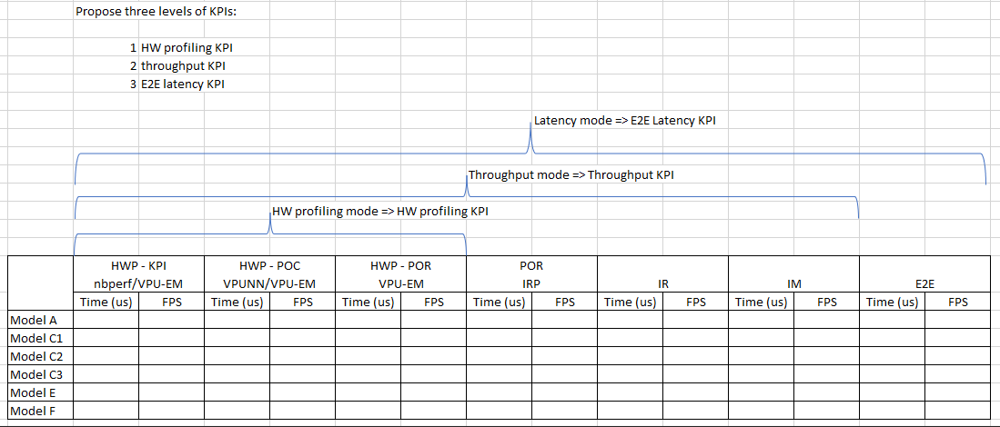
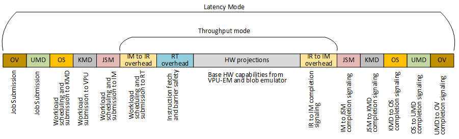

- workload scheduling in VPU
	- #workload_scheduling
	- https://docs.intel.com/documents/MovidiusExternal/vpu27/MTL/SW/VPU27SAS.html#layer-2-low-level-workload-scheduling-workload-management
	- ##### instruction fetch
		- 
- Barrier safety
	- #barrier_safety
	- Sync with Jain
		- Problem:
			- There is DMA task to assign physical barrier id to barrier. Lined list of DMA operators, implicit control order. So we can skip assign physical barrier for these DMAs.
			- Don't want to add DMA task with virtual barrier or edges with other nodes, or the physical barrier assignment algorithm will add physical barrier for these DMAs, this is undesired.
		- Solution:
			- 1. Add these DMA tasks in nbperf and have some identification for these nodes. So that physical barrier algorithm can specially take care of these nodes.
			  2. Linked list of DMA operations. Add the DMA to assign physical barriers in the algorithm and add the DMA ids to the list.
		- Overhead of the DMA barrier program.
- Full stack KPI
	- #kpi
	- https://intel-my.sharepoint.com/:p:/r/personal/sandeep_aswath_narayana_intel_com/_layouts/15/Doc.aspx?sourcedoc=%7B694CA0F0-1C9B-44ED-A738-62C49A996DAF%7D&file=E2EInferenceLatencyProfiling.pptx&wdLOR=c3BEF1153-92AA-4349-A794-81FC4BD10263&action=edit&mobileredirect=true
- Three levels of KPI from charles
	- #kpi
	- 
- e2e latency for VPU
	- #kpi
	- 
	- I would
	  propose the following three work groups:
		- Low level (NN Runtime to HW): identify if anything can be optimized at this low level – document what performance features do not exist and what is their impact
		- FW (Front End NN Runtime) to JSM to KMD: Document SW overhead on the interface from the VPU to the Host, identify what is the minimum allowed latency and optimize
		- OV to UMD to OS to KMD: examine user space flows, CiD, understand if there are any bottlenecks, understand latency.
- important notice from Darren
	- #VPU_feature
	- [9/10 3:49 AM] Crews, Darren S
	  ==Important!==A couple of important points to note:
	- it turns out the the CHW to HWC conversion in the DMA engine is only 1 element per cycle per DMA engine. so for FP16 we will get throughput of 4B/C for both DMA engines rather than 64B/c.  Li, Victor Y and Wang, Yi6 we would need some update in nbperf and vpu-em for this.
	- we also need to consider the output needs to be in CHW format also.  We can do this in DPU or DMA, both should actually be the same throughput but since DPU likely can't saturate the output it is better to do this in the DPU.  It seems that this feature isn't supported, so we should add it.  Likely for now we're just ignoring this layout change and assuming DMA does it with full throughput
	- we'll need to update all of our KPIs based on this.  Roy, Shivaji you might want to look at how this impacts the MEP KPIs manually until we have a fix.  For some models this could add ~200us or so, maybe even more for Model F.
	- [9/10 4:10 AM] Crews, Darren S
	- to hide this extra DMA time one thing we could consider is doing vertical fusion for the first and last layers to hide this extra DMA time and pipeline it with compute
	- [9/10 4:30 AM] Qi, Charles
	- Here the DMA based approach is referring to using DMA to do transpose CMX <=> CMX, right?
	- [9/10 4:32 AM] Crews, Darren S
	- actually DDR-> CMX, you would do the transpose when fetching the data from DDR -> CMX, and then same for writing the output
	- [9/10 6:28 AM] Wang, Yi6
		- I guess I lose the trace here. SO the plan for MTL is  DDR_CMX( entire tenor) -> CMX_CMX (or DSP for transpose) and Then Fakequant (FP16 ->uint8, potentially being fused)?