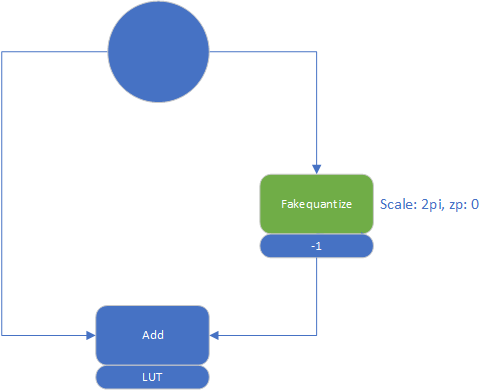

- [[Idea pool for IDF or paper]]
	- Local for global
		- MVN/SoftMax
	- LLM related:
		- Dynamic Flash Attention
		- Flash attention:
			- Support flash attention for spatial accelerator (SOC for softmax)
		- Dynamic shape:
			- A generic way to support dynamic shape for spatial accelerator sw+hw stack
			- dynamic shape engine? equation calculation + task skip
	- Compiler algo
		- Memory aware weight prefetching
			- benefit: time efficiency for a np-hard problem
	- HW (TR) related
		- unicast without broadcast for SOK-->SOH
		- dynamic min/max for transformer quantization bit
		- Sin/Cos
			- 