- [[CUDA kernel]]
	- ## Relu
		- ```c++
		  // Relu x: N, y: N y=max(0,x)
		  // grid(N/128), block(K=128) 
		  __global__ void relu(float* x, float* y, int N) {
		    int idx = blockIdx.x * blockDim.x + threadIdx.x;
		    if (idx < N) y[idx] = fmaxf(0.0f, x[idx]);
		  }
		  
		  // Relu x: N, y: N y=max(0,x) Vec4
		  // grid(N/128/4), block(128/4) 
		  __global__ void relu_vec4(float* x, float* y, int N) {
		    int idx = (blockIdx.x * blockDim.x + threadIdx.x) * 4;
		    if (idx < N) {
		      float4 reg_x = FLOAT4(x[idx]);
		      float4 reg_y;
		      reg_y.x = fmaxf(0.0f, reg_x.x);
		      reg_y.y = fmaxf(0.0f, reg_x.y);
		      reg_y.z = fmaxf(0.0f, reg_x.z);
		      reg_y.w = fmaxf(0.0f, reg_x.w);
		      FLOAT4(y[idx]) = reg_y;
		    }
		  }
		  ```
- # Lecture 8: CUDA Performance Checklist
  collapsed:: true
	- LATER  Read https://arxiv.org/pdf/1804.06826
	  SCHEDULED: <2025-01-12 Sun>
	- 
	- ## Performance checklist
		- 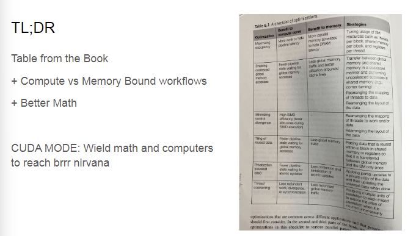
		- Coalesced Global Memory Access
		  collapsed:: true
			- [[Memory Coalescing]]
		- Maximize occupancy
		  collapsed:: true
			- 硬件占用率指 GPU 的计算资源（如寄存器、共享内存、线程）被充分利用的程度。更高的占用率通常意味着更高的吞吐量。
		- Understand if memory or compute bound
		  collapsed:: true
			- [[compute bound vs dma bound]]
		- Minimize control divergence
		  collapsed:: true
			- [[warp divergence]]
			- 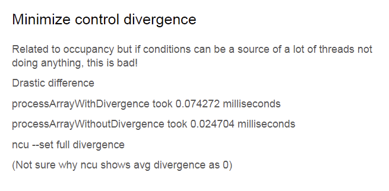
				- Write everything in a single code without control divergence
					- example:
					- 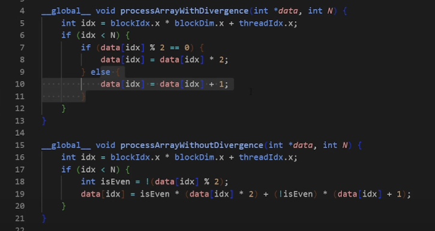
		- [[Tiling of reused data]]
		  collapsed:: true
			- [[matrix multiplication]]
		- [[Privatization]]
		  collapsed:: true
			- 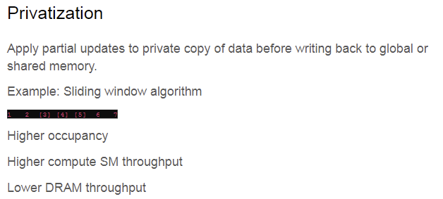
			- good example:
				- [Sliding window average](https://github.com/gpu-mode/lectures/blob/main/lecture_008/privatization2.cu)
					- ```c++
					  // Kernel without privatization: Direct global memory access
					  __global__ void windowSumDirect(const float *input, float *output, int n, int windowSize) {
					      int idx = blockIdx.x * blockDim.x + threadIdx.x;
					      int halfWindow = windowSize / 2;
					      if (idx < n) {
					          float sum = 0.0f;
					          for (int i = -halfWindow; i <= halfWindow; ++i) {
					              int accessIdx = idx + i;
					              if (accessIdx >= 0 && accessIdx < n) {
					                  sum += input[accessIdx];
					              }
					          }
					          output[idx] = sum;
					      }
					  }
					  
					  // Kernel with privatization: Preload window elements into registers
					  __global__ void windowSumPrivatized(const float *input, float *output, int n, int windowSize) {
					      int idx = blockIdx.x * blockDim.x + threadIdx.x;
					      int halfWindow = windowSize / 2;
					      __shared__ float sharedData[1024]; // Assuming blockDim.x <= 1024
					  
					      // Load input into shared memory (for demonstration, assuming window fits into shared memory)
					      if (idx < n) {
					          sharedData[threadIdx.x] = input[idx];
					          __syncthreads(); // Ensure all loads are complete
					  
					          float sum = 0.0f;
					          for (int i = -halfWindow; i <= halfWindow; ++i) {
					              int accessIdx = threadIdx.x + i;
					              // Check bounds within shared memory
					              if (accessIdx >= 0 && accessIdx < blockDim.x && (idx + i) < n && (idx + i) >= 0) {
					                  sum += sharedData[accessIdx];
					              }
					          }
					          output[idx] = sum;
					      }
					  }
					  ```
		- [[Thread Coarsening]]
			- Wrong example:
			  collapsed:: true
				- ==Results are way off might because everything is stored in shared memory after VecAdd executed, so VecAddCoarsened get much faster.==
				- 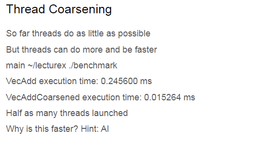
				- ```c++
				  // Original vector addition kernel without coarsening
				  __global__ void VecAdd(float* A, float* B, float* C)
				  {
				      int i = blockIdx.x * blockDim.x + threadIdx.x;
				      if (i < N)
				          C[i] = A[i] + B[i];
				  }
				  
				  // Vector addition kernel with thread coarsening
				  // Assuming a coarsening factor of 2
				  __global__ void VecAddCoarsened(float* A, float* B, float* C)
				  {
				      int i = (blockIdx.x * blockDim.x + threadIdx.x) * 2; // Coarsening factor applied here
				      if (i < N)
				          C[i] = A[i] + B[i];
				      if (i + 1 < N) // Handle the additional element due to coarsening
				          C[i + 1] = A[i + 1] + B[i + 1];
				  }
				  
				  ```
		- *Rewrite your algorithm using better math*
			- [[online softmax]]
				- 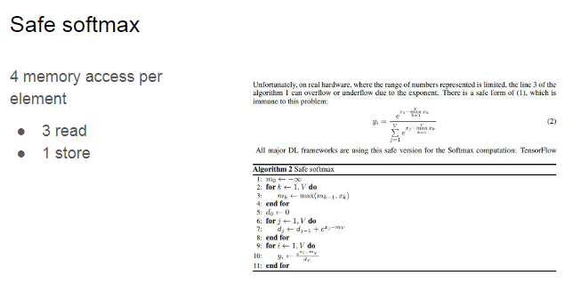
				- 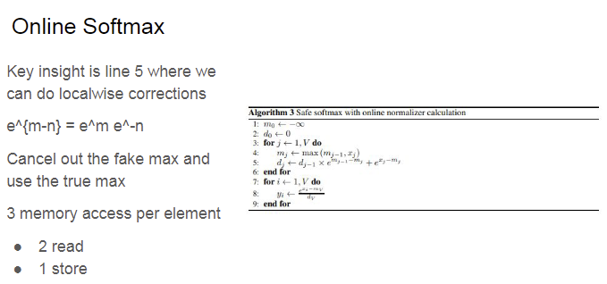
	- ## Memory latencies
	  collapsed:: true
		- https://arxiv.org/abs/2208.11174
		- 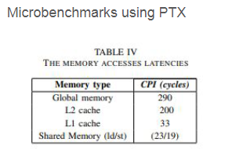
	-
	- ## It’s the latency stupid
	- ## Memory Coalescing Example
	  collapsed:: true
		- collapsed:: true
		  ```C++
		  __global__ void copyDataNonCoalesced(float *in, float *out, int n) {
		      int index = blockIdx.x * blockDim.x + threadIdx.x;
		      if (index < n) {
		          out[index] = in[(index * 2) % n];
		      }
		  }
		  
		  __global__ void copyDataCoalesced(float *in, float *out, int n) {
		      int index = blockIdx.x * blockDim.x + threadIdx.x;
		      if (index < n) {
		          out[index] = in[index];
		      }
		  }
		  ```
			-
		- stride copy vs continuous copy
		  collapsed:: true
			- continuous copy: less time and better L1 cache hit rate
			- 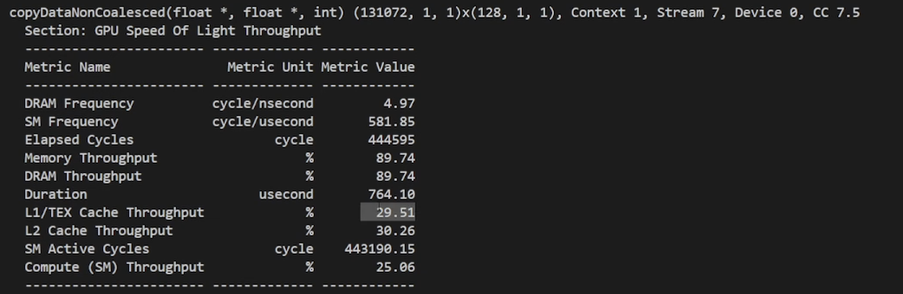
			- 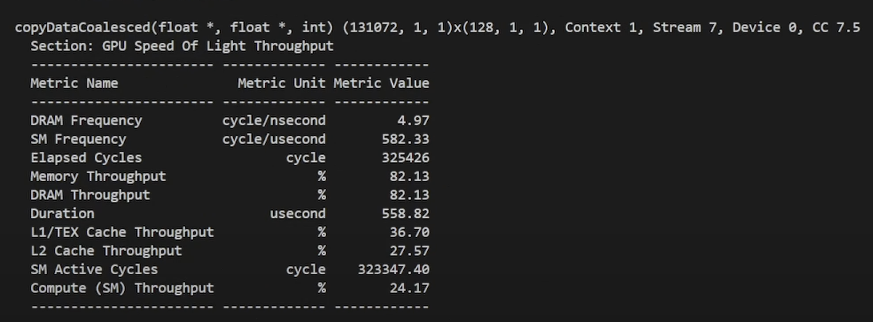{:height 262, :width 688}
	- ## Occupancy
	  collapsed:: true
		- 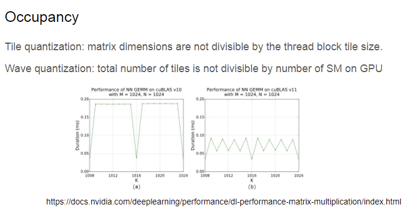
		- Explanation:
		  collapsed:: true
			- 每个thread block 都被分配计算一个tile的输出。如果不能被thread block的tile size整除。那么会出现SM上有一些计算资源没有被充分利用。
			- 每个thread block 被分配到一个SM，如果number of tile不能被SM数量整除，会出现SM空闲。
	- ## Why padding and How?
	  collapsed:: true
		- 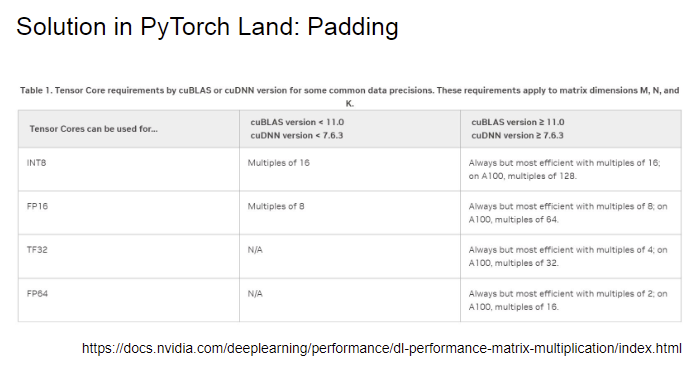
	- ## CUDA occupancy calculator
	  collapsed:: true
		- 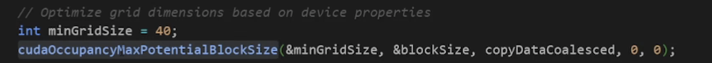
	- ## [[Roofline model]]
		- [[compute bound vs dma bound]]
		- small operational indensity
		  collapsed:: true
			- memory bound
		- large operational indensity
		  collapsed:: true
			- compute bound
		- 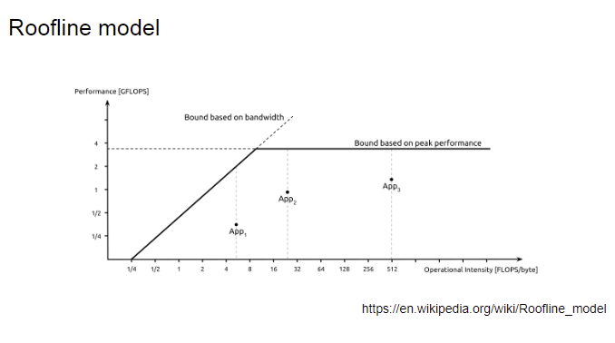
	- ## Roofline analysis for MM
	  collapsed:: true
		- 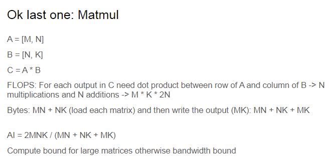
	- ## TL;DR
	  collapsed:: true
		- 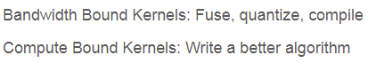
		  id:: 67834570-629b-4f9a-8574-3de0443b5ff2
	-