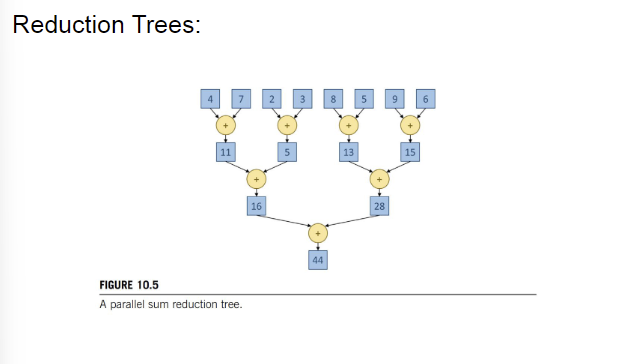

- 10:18
	- C++ map的构建和遍历? #card
		- ```C++
		  #include <map>
		  #include <iostream>
		  //...
		  std::map<int, string> m;
		  //...
		  for (auto it = m.begin(); it != m.end(); ++it) { 
		     
		  	//key
		  	std::cout << it->first << std::endl;
		  	//value 
		  	std::cout << it->second << std::endl;
		  }
		  ```
- [[CUDA Mode]]
	- # Lecture 9 Reductions
	  collapsed:: true
		- 
		- ## Floating point accuracy issue
			- 
		- ## Reduction optimization
			- 
		- ## Reduction kernel
			- 
			- ```C++
			  __global__ void SimpleSumReductionKernel(float* input, float* output) {
			      unsigned int i = 2 * threadIdx.x;
			      for (unsigned int stride = 1; stride <= blockDim.x; stride *= 2) {
			          if (threadIdx.x % stride == 0) {
			              input[i] += input[i + stride];
			          }
			          __syncthreads();
			  
			      }
			      if (threadIdx.x == 0) {
			      *output = input[0];
			      }
			  }
			  ```
		- ## Minimize Control Divergence
			- 
			- ```c++
			  __global__ void FixDivergenceKernel(float* input, float* output) {
			      unsigned int i = threadIdx.x; //threads start next to each other
			      for (unsigned int stride = blockDim.x; stride >= 1; stride /= 2) { // furthest element is blockDim away
			          if (threadIdx.x < stride) { // 
			              input[i] += input[i + stride]; // each thread adds a distant element to its assigned position
			          }
			          __syncthreads();
			  
			      }
			      if (threadIdx.x == 0) {
			      *output = input[0];
			      }
			  }
			  ```
		- ## Minimize Global memory access
			- 
			- ```c++
			  // This is the code from the book but I couldn't get this to run faster even with occupancy calculator
			  // L1 throughput is dramatically increased though
			  __global__ void SharedMemoryReduction(float* input, float* output) {
			      __shared__ float input_s[BLOCK_DIM];
			      unsigned int t = threadIdx.x;
			      input_s[t] = input[t] + input[t  + BLOCK_DIM];
			      for (unsigned int stride = blockDim.x/2; stride >= 1; stride /=2) {
			          __syncthreads();
			          if (threadIdx.x < stride) {
			              input_s[t] += input_s[t + stride];
			          }
			      }
			  
			      if (threadIdx.x == 0) {
			          *output = input_s[0];
			      }
			  }
			  ```
		- ## Hierarchical reduction
			- 
			- ```c++
			  __global__ void SharedMemoryReduction(float* input, float* output, int n) {
			      __shared__ float input_s[BLOCK_DIM]; 
			      unsigned int idx = blockIdx.x * blockDim.x + threadIdx.x; // index within a block
			      unsigned int t = threadIdx.x; // global index
			  
			      // Load elements into shared memory
			      if (idx < n) {
			          input_s[t] = input[idx];
			      } else {
			          input_s[t] = 0.0f;
			      }
			      __syncthreads();
			  
			      // Reduction in shared memory
			      for (unsigned int stride = blockDim.x / 2; stride > 0; stride >>= 1) {
			          if (t < stride && idx + stride < n) {
			              input_s[t] += input_s[t + stride];
			          }
			          __syncthreads();
			      }
			  
			      // Reduction across blocks in global memory
			      // needs to be atomic to avoid contention
			      if (t == 0) {
			          atomicAdd(output, input_s[0]);
			      }
			  }
			  ```
		- ## Thread Coarsening
			- ```c++
			  __global__ void CoarsenedReduction(float* input, float* output, int size) {
			      __shared__ float input_s[BLOCK_DIM];
			  
			      unsigned int i = blockIdx.x * blockDim.x * COARSE_FACTOR + threadIdx.x;
			      unsigned int t = threadIdx.x;
			      float sum = 0.0f;
			  
			      // Reduce within a thread
			      for (unsigned int tile = 0; tile < COARSE_FACTOR; ++tile) {
			          unsigned int index = i + tile * blockDim.x;
			          if (index < size) {
			              sum += input[index];
			          }
			      }
			  
			      input_s[t] = sum;
			      __syncthreads();
			      
			      //Reduce within a block
			      for (unsigned int stride = blockDim.x / 2; stride > 0; stride >>= 1) {
			          if (t < stride) {
			              input_s[t] += input_s[t + stride];
			          }
			          __syncthreads();
			      }
			  
			      //Reduce over blocks
			      if (t == 0) {
			          atomicAdd(output, input_s[0]);
			      }
			  }
			  ```
		- [[torch.compile]]
			- {:height 251, :width 374}
	- # Lecture 10: Build a Prod Ready CUDA library
		- 
		- [[CUDAStream]]
		- ## Balance abstraction and performance
		  collapsed:: true
			- 
		- ## GPU communication utility
		  collapsed:: true
			- [[pinned memory]] vs [[UnifiedMemory]]
				- ### **Unified Memory vs. Pinned Memory**
				  collapsed:: true
					- | **特性** | **Unified Memory** | **Pinned Memory** |
					  | ---- | ---- | ---- |
					  | **管理方式** | 自动管理数据迁移（CPU-GPU 之间） | 手动分配和管理内存 |
					  | **数据迁移** | 自动迁移，开发者无需显式调用 | 需要显式调用 `cudaMemcpy` 进行数据传输 |
					  | **性能** | 数据迁移可能引入延迟，性能依赖 CUDA 的自动优化 | 数据传输效率高，支持异步传输，实现更高性能 |
					  | **开发难度** | 简化内存管理，适合开发者关注算法而非数据传输 | 更复杂，需要开发者明确管理数据传输和分配 |
					  | **适用场景** | 数据访问模式复杂、不确定，开发者不想管理内存 | 高性能计算、对数据传输效率和资源控制要求高的场景 |
				- ### 普通拷贝
					- 当你使用普通的主机内存（通过 `malloc` 或类似方法分配）并调用 `cudaMemcpy` 将数据从主机传输到设备时，CUDA 运行时是无法直接使用虚拟内存完成传输的，因为 GPU 只能访问物理内存。实际传输过程如下：
					- ### **步骤：普通内存拷贝的隐式过程** #card
						- **虚拟内存到物理内存的转换**：
							- 主机内存（普通内存）是由操作系统管理的虚拟内存，可能部分数据被分页到磁盘（swap）。
							- 在执行 `cudaMemcpy` 时，CUDA 运行时会确保数据已经在物理内存中，这可能需要操作系统将数据从磁盘加载回物理内存。
						- **临时固定内存分配**：
							- CUDA 运行时会在内部分配一个临时的 Pinned Memory 缓冲区，将普通内存的数据拷贝到这块临时的 Pinned Memory 中。
							- 这个固定的缓冲区是由 CUDA 隐式分配的，开发者无法直接访问。
						- **通过 PCIe 通道传输**：
							- GPU 使用 DMA（Direct Memory Access）直接从临时的 Pinned Memory 缓冲区将数据传输到设备内存。
						- **释放临时缓冲区**：
							- 数据传输完成后，CUDA 运行时会释放临时分配的 Pinned Memory 缓冲区。
					- ### **图示：普通主机内存到设备内存的隐式拷贝过程**
						- ```
						  +-------------+          +-------------+          +-------------+
						  |  虚拟内存   |   拷贝    | 临时 Pinned  |   PCIe   |   GPU 显存  |
						  |  (普通内存) | --------> |  Memory     | -------> |   (设备内存) |
						  +-------------+          +-------------+          +-------------+
						  ```
					- ```c++
					  // 分配普通的主机内存
					  float* h_data = (float*)malloc(SIZE * sizeof(float));
					  
					  // 初始化数据
					  for (int i = 0; i < SIZE; ++i) {
					      h_data[i] = i * 1.0f;
					  }
					  
					  // 分配 GPU 内存
					  cudaMalloc((void**)&d_data, SIZE * sizeof(float));
					  
					  // 普通内存拷贝
					  cudaMemcpy(d_data, h_data, SIZE * sizeof(float), cudaMemcpyHostToDevice);
					  ```
				- ### pinned 拷贝
				  collapsed:: true
					- ```c++
					  // 分配 Pinned Memory
					  float* h_pinned_data;
					  cudaMallocHost((void**)&h_pinned_data, SIZE * sizeof(float));
					  
					  // 初始化数据
					  for (int i = 0; i < SIZE; ++i) {
					      h_pinned_data[i] = i * 1.0f;
					  }
					  
					  // 分配 GPU 内存
					  cudaMalloc((void**)&d_data, SIZE * sizeof(float));
					  
					  // 使用 Pinned Memory 进行拷贝
					  cudaMemcpy(d_data, h_pinned_data, SIZE * sizeof(float), cudaMemcpyHostToDevice);
					  ```
			- 
		- ## Number of copies
		  collapsed:: true
			- 
			- GPU -> peer GPU (PCIE Express or NVLINK) 1 copy
		- ## GPU communication utility
			- 
	-
		- ## [[Producer consumer model]]
			- **生产者-消费者模型（Producer-Consumer Model）** 是一种经典的并发编程模型，常用于解决多个线程或进程之间的同步问题。它定义了一种机制，让**生产者**（负责生成数据的任务）和**消费者**（负责消费数据的任务）通过一个共享的缓冲区高效地协作工作。
				- 
			- ### 常用的buffer
				- | **数据结构** | **特点** | **适用场景** |
				  | ---- | ---- | ---- |
				  | **队列（Queue）** | FIFO，简单高效 | 数据流处理、任务调度 |
				  | **循环缓冲区（Circular Buffer）** | 环形队列，固定大小，内存高效 | 实时音视频处理、嵌入式系统 |
			- ### 例子
				- GPU1 --> CPU --> GPU2
				- Similar to what we can do with DDR2DDR transactions.
					- Decomposed to DDR2CMX and CMX2DDR.
					- Tile the transactions and make that pipeline with double buffer.
			- ### Code
				- ```c++
				  #include <cuda_runtime.h>
				  #include <iostream>
				  #include <vector>
				  #include <cassert>
				  
				  // 核函数：对每个元素加一作为简单计算
				  __global__ void kernel(float* data, size_t size) {
				      int idx = blockIdx.x * blockDim.x + threadIdx.x;
				      if (idx < size) {
				          data[idx] += 1.0f;
				      }
				  }
				  
				  int main() {
				      // 检查是否有至少两个 GPU
				      int numGPUs = 0;
				      cudaGetDeviceCount(&numGPUs);
				      if (numGPUs < 2) {
				          std::cerr << "This example requires at least two GPUs." << std::endl;
				          return -1;
				      }
				  
				      // 设置两个 GPU 的 ID
				      int gpuSrc = 0; // 源 GPU ID
				      int gpuDst = 1; // 目标 GPU ID
				  
				      // 数据大小
				      const size_t totalSize = 1024 * 1024 * 10; // 10 MB
				      const size_t tileSize = 1024 * 1024;       // 每块大小（1 MB）
				      const size_t numTiles = totalSize / tileSize;
				  
				      // 分配 GPU 0 和 GPU 1 的双缓冲区
				      float *srcBufferA, *srcBufferB;
				      float *dstBufferA, *dstBufferB;
				  
				      cudaSetDevice(gpuSrc);
				      cudaMalloc(&srcBufferA, tileSize * sizeof(float));
				      cudaMalloc(&srcBufferB, tileSize * sizeof(float));
				  
				      cudaSetDevice(gpuDst);
				      cudaMalloc(&dstBufferA, tileSize * sizeof(float));
				      cudaMalloc(&dstBufferB, tileSize * sizeof(float));
				  
				      // 启用 Peer-to-Peer 访问
				      cudaDeviceEnablePeerAccess(gpuDst, 0);
				      cudaDeviceEnablePeerAccess(gpuSrc, 0);
				  
				      // 创建 CUDA Streams
				      cudaStream_t streams[2]; // 双缓冲需要两个流
				      for (int i = 0; i < 2; ++i) {
				          cudaStreamCreate(&streams[i]);
				      }
				  
				      // 初始化数据（在 GPU 上模拟初始化）
				      cudaSetDevice(gpuSrc);
				      for (size_t i = 0; i < numTiles; ++i) {
				          cudaMemset(srcBufferA, 0, tileSize * sizeof(float));
				          cudaMemset(srcBufferB, 0, tileSize * sizeof(float));
				      }
				  
				      // GPU 计算参数
				      const int threadsPerBlock = 256;
				      const int blocksPerGrid = (tileSize + threadsPerBlock - 1) / threadsPerBlock;
				  
				      // 分块传输和计算
				      for (size_t i = 0; i < numTiles; ++i) {
				          // 当前缓冲区和流（奇偶交替）
				          float* srcBuffer = (i % 2 == 0) ? srcBufferA : srcBufferB;
				          float* dstBuffer = (i % 2 == 0) ? dstBufferA : dstBufferB;
				          cudaStream_t currentStream = streams[i % 2];
				  
				          // GPU 0 -> GPU 1: 异步传输数据
				          cudaMemcpyPeerAsync(dstBuffer, gpuDst, srcBuffer, gpuSrc, tileSize * sizeof(float), currentStream);
				  
				          // 在目标 GPU 上执行计算
				          cudaSetDevice(gpuDst);
				          kernel<<<blocksPerGrid, threadsPerBlock, 0, currentStream>>>(dstBuffer, tileSize);
				  
				          // 回到源 GPU，准备下一个传输
				          cudaSetDevice(gpuSrc);
				      }
				  
				      // 等待所有流完成
				      for (int i = 0; i < 2; ++i) {
				          cudaStreamSynchronize(streams[i]);
				      }
				  
				      // 清理资源
				      cudaSetDevice(gpuSrc);
				      cudaFree(srcBufferA);
				      cudaFree(srcBufferB);
				  
				      cudaSetDevice(gpuDst);
				      cudaFree(dstBufferA);
				      cudaFree(dstBufferB);
				  
				      for (int i = 0; i < 2; ++i) {
				          cudaStreamDestroy(streams[i]);
				      }
				  
				      // 禁用 Peer-to-Peer 访问
				      cudaDeviceDisablePeerAccess(gpuDst);
				      cudaDeviceDisablePeerAccess(gpuSrc);
				  
				      std::cout << "P2P data transfer with double buffering completed successfully." << std::endl;
				  
				      return 0;
				  }
				  ```