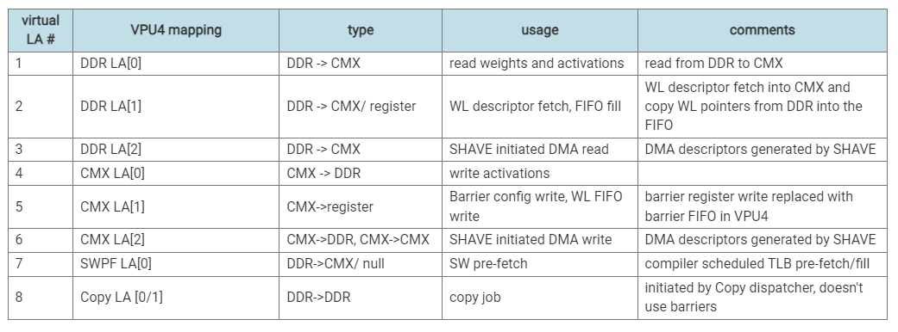
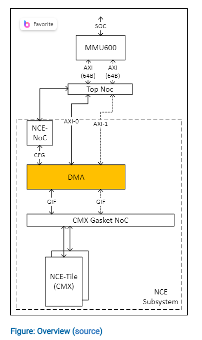

- questions:
	- What is the [[DMA Channels]] ? 这个跟[[link agents]] 和 [[link list]] 的关系是什么？还有[[CTRG]]的关系？
		- ### DMA通道（DMA Channels）
			- DMA通道是负责在不同内存区域之间高效传输数据的组件。它们可以根据任务的需求，将数据从系统内存（如DDR）移动到VPU内部的内存（如CMX），或者在内部内存区域之间进行数据传输。DMA通道能够处理各种数据操作，包括数据的压缩、解压缩、类型转换等。
		- ### 链接代理（Link Agents）
			- 链接代理是DMA架构中的调度器，负责接收和管理来自编译器或运行时的DMA任务请求。每个链接代理接受一个指向任务描述符链表（Link List）起始点的指针。链接代理负责读取这些描述符，解析任务需求，并将任务分配给相应的DMA通道执行。
		- ### 链接列表（Link List）
			- 链接列表是一种数据结构，用于存储DMA任务的描述符。每个描述符包含了执行DMA任务所需的所有信息，如源地址、目标地址、数据长度、以及任何特定的数据操作要求。链接列表使得多个DMA任务可以被组织成一个序列，由链接代理逐一读取和分配给DMA通道。
		- ### 计算资源组（CTRG）
			- CTRG是一组特定的DMA通道和加速器，主要用于处理推理任务（即神经网络的前向传播）。每个CTRG包括一定数量的DDR读取通道、CMX读取通道和软件预取通道，以及所有三种类型的加速器实例。CTRG的设计旨在为推理任务提供专用的计算资源，以优化性能和资源利用率。
		- ### 它们之间的关系
			- **链接代理**接收指向**链接列表**的指针，通过解析列表中的描述符，将具体的数据传输任务分配给相应的**DMA通道**执行。
			- **DMA通道**根据链接代理分配的任务，执行数据在不同内存区域之间的移动和处理。
			- 对于推理任务，**CTRG**提供了一组专用的DMA通道和加速器，以优化这些任务的执行。链接代理会将与推理相关的DMA任务分配给CTRG中的通道。
		- 总的来说，链接代理、链接列表、DMA通道以及CTRG之间的协作，确保了数据能够根据任务需求高效、准确地在系统内部移动和处理，从而支持复杂的计算任务，特别是在AI和机器学习应用中的数据处理需求。
	- What is Copy channel  and what is the difference with other DMA channel?
		- 在VPU（Visual Processing Unit）架构中，Copy Channel是一种特殊的DMA（Direct Memory Access）通道，专门设计用于执行数据复制任务。这些任务通常涉及将数据从一个内存区域复制到另一个内存区域，例如从系统内存（DDR）复制到VPU内部的内存（CMX），或者在系统内存区域之间进行复制。Copy Channel的设计旨在优化这类数据移动操作的效率和性能。
		- ### Copy Channel的特点和功能：
			- **高效的数据复制**：Copy Channel能够高效地处理大量的数据复制任务，确保数据能够快速从源地址移动到目标地址。
			- **简化的地址模式**：与其他DMA通道相比，Copy Channel通常支持更简单的地址生成模式，因为它的主要任务是直接复制数据，而不涉及复杂的数据操作或转换。
			- **硬件预取（HW Prefetch）**：Copy Channel实现了专门的硬件预取机制，这意味着在实际执行数据复制之前，它可以预先获取目标地址的信息。这有助于减少访问延迟，提高数据复制的速度。
			- **优先级配置**：在存在其他类型的数据移动任务时（如张量数据移动），Copy Channel的任务可以被配置为具有较低的优先级，以确保关键的计算任务能够优先获得所需的带宽和资源。当没有其他紧急任务时，Copy Channel可以充分利用可用的带宽。
			- **支持大规模数据移动**：Copy Channel特别适用于处理大规模的数据复制任务，如为未来的推理任务准备数据。
	- CMX2CMX 和DDR2CMX在一个resource group的时候会竞争吗？
		- 每个CTRG中有一个CMX channel以及一个DDR channel，表示从CMX读数据的channel是一个，从DDR读数据的channel是一个。所以CMX2CMX和DDR2CMX可以同时用两个channel，但是写CMX的时候会竞争。
		- 同理，对于CMX2CMX和CMX2DDR，他们写的时候不会竞争，但是不能同时执行，因为这两个都用了CMX channel，所以会由link arbiter去调度。
	- 不同的thread的意义在于什么？区分context吗？另外一个thread里面有三个CMX link agent，为什么？
		- 这里的thread应该对应于不同的tile。每个thread里面多个CMX/DDR link agent 因为不同的link agent对应了不同的功能：
			- {{embed ((65acce80-ccec-45a0-afcc-f7deeec17541))}}
	- #### DMA Engine Scheduling
		- This is for VPU2P7
		- 总共有9个[[link agent]]，每一个link agent我们都可以提交[[link list]]，具体的功能如下。值得注意的是，WL descriptor fetch, fifo fill 以及barrier config write都是通过DMA来实现的。
		- 这里的usage有问题。。。
		- 
	- VPU4说的两个DMA channel指的是什么？
		- 应该就是两个CTRG
	- Link list 对应的硬件是什么？Link agent又是什么？
		- 在VPU（Visual Processing Unit）或其他支持DMA（Direct Memory Access）的系统架构中，"link list"（链接列表）是一种数据结构，用于组织和管理一系列的DMA任务或操作。在硬件层面，link list并不直接对应于某个特定的硬件组件，而是通过软件在内存中构建的，并由DMA控制器按顺序访问和处理。
		- ### Link List的工作原理：
			- **内存中的数据结构**：Link list由一系列的DMA任务描述符（descriptors）组成，每个描述符包含了执行单个DMA任务所需的所有信息，如源地址、目标地址、数据长度、下一个任务描述符的地址等。这些描述符被存储在内存中，并通过指针链接成一个列表。
			- **Link Agent的角色**：DMA系统中的Link Agent负责读取link list中的任务描述符，解析其中的信息，并将DMA任务提交给DMA引擎执行。Link Agent可以视为硬件上的一个组件，它负责管理link list的遍历和任务的调度。
			- **DMA引擎的执行**：DMA引擎根据Link Agent提供的任务描述符执行数据传输操作。完成一个任务后，DMA引擎或Link Agent会根据当前任务描述符中的指针读取下一个任务描述符，直到整个link list被处理完毕。
		- ### 硬件上的对应：
			- **内存**：Link list实际上存储在系统的内存中，无论是DDR、SRAM还是其他类型的内存。DMA控制器通过系统总线访问这些内存地址来读取任务描述符。
			- **DMA控制器**：DMA控制器是硬件上执行数据传输任务的主要组件。它包含了Link Agent和其他逻辑单元，用于解析任务描述符、管理数据传输和处理link list。
			- **Link Agent**：在硬件层面，Link Agent是DMA控制器内的一个逻辑单元，负责从link list中读取和解析任务描述符。
		- ### 总结：
			- 虽然link list本身作为一种数据结构在内存中实现，但它与DMA控制器（包括Link Agent等组件）紧密配合，实现了高效的数据传输管理。通过link list，系统能够灵活地组织一系列复杂的DMA任务，支持高性能计算和数据处理的需求。
	- Link agent和fifo的关系？
		- 在VPU（Visual Processing Unit）或其他支持DMA（Direct Memory Access）的系统架构中，Link Agent通常是负责管理DMA任务的组件。虽然Link Agent本身不是一个FIFO（First-In, First-Out）队列，但它可能会使用FIFO或类似FIFO的机制来管理和调度DMA任务。
		- ### Link Agent与FIFO的关系：
			- **任务队列**：Link Agent可能会维护一个任务队列，用于存储和管理等待执行的DMA任务。这个队列在逻辑上可以被视为一个FIFO队列，其中最早提交的任务最先被执行。
			- **任务提交**：当软件层（如驱动程序或运行时环境）提交一个新的DMA任务时，该任务会被添加到Link Agent管理的队列中。如果队列采用FIFO机制，新任务将被放置在队列的末尾。
			- **任务执行**：Link Agent按照队列中任务的顺序（通常是FIFO顺序）从队列中取出任务，并将它们提交给DMA引擎执行。一旦DMA引擎完成了一个任务，Link Agent就会从队列中取出下一个任务进行处理。
			- **并行与流水线**：在一些高性能的VPU架构中，可能会有多个Link Agent同时工作，或者一个Link Agent能够同时管理多个并行或流水线的DMA任务。在这种情况下，FIFO机制有助于保持任务执行的有序性，但实际的任务调度可能会更复杂。
- ### Overview
	- 
	- This figure 包含了多个[[NOC]]，可以看到DMA上接[[Top NOC]]，下接[[CMX Gasket NOC]]。
		- 其中与Top NOC的接口是两个AXI，分别是64B/cycle
		- 与CMX Gasket NOC的接口是两个GIF
	- On the CMX interface, DMA engine can access any of the CMX tiles and the control registers (NCE FIFO's, barriers etc.).
	- {:height 821, :width 1110}
	- ##### [[DMA Channels]]
- ### Software Driver Notes
	- #### Address Map and Interfaces
		- CMX is mapped to global space, CMX看到的别的地址都map到AXI
		- 
	- #### Requesting a DMA Transfer
		- Once a DMA job descriptor is available in memory, at address DMA_JOB_LINK_ADDR, the CMX DMA can be requested to process it by either pushing the job into the dispatch FIFO (By designating specific link agents to be part of a common pool LA[*].CDMA_LA_CFG.COMMON) or by directly configuring a DMA Link Agent to process DMA_JOB through dedicated Link Agent Configuration register (CDMA_JOB_ADDR/CDMA_JOB_PUSH).
- ### Usecase Flows
	- ##### DDR2CMX Transfer
		- 
	- ##### CMX2DDR transfer
		- 