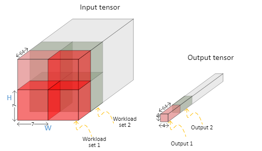

- #continousconv
- Basically when NCE_DPU_OFFSET_ADDR is set, the accumulated value of the workload will be kept. This can be used for the coming workload calculation.
- 
	- There are in total 4x16=64 workloads. The first three workloads are set with NCE_DPU_OFFSET_ADDR. The results are kept, after the fourth workload finishes calculating, then the next workload would be calculating the 2x2 kernel which will produce the final results of the 14x14 global average pooling.
	- Question is how can we support this in nbperf?
		- We will need to set the task correctly. We can generate tasks as follows:
			- 7x7(set)-->7x7(set)-->7x7(set)-->7x7-->2x2-->7x7(set)...
			- More of a optimization based on the already generated tasks
- https://docs.intel.com/documents/MovidiusExternal/vpu4/common/SW/VPU4SAS.html#convolution-continue-example
- https://jira.devtools.intel.com/browse/EISW-55165