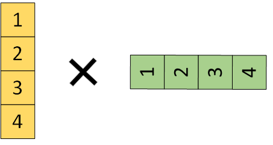
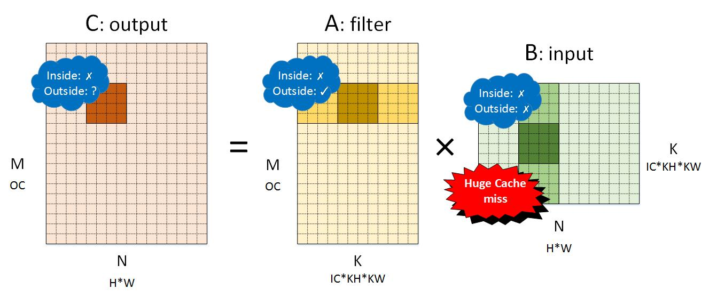
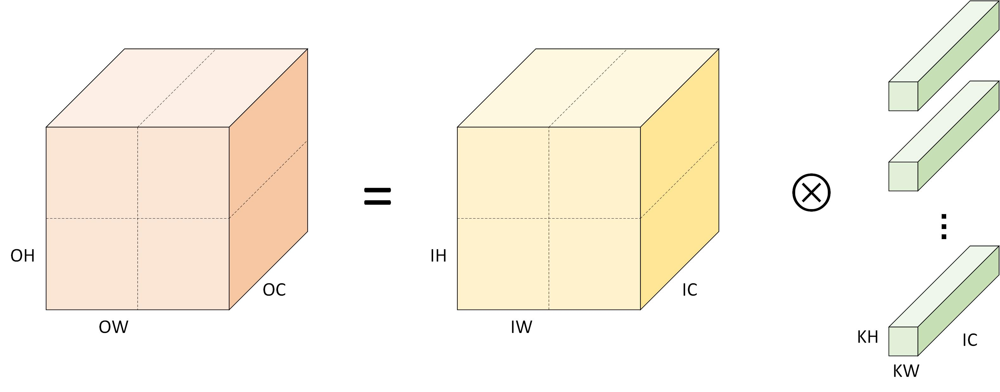
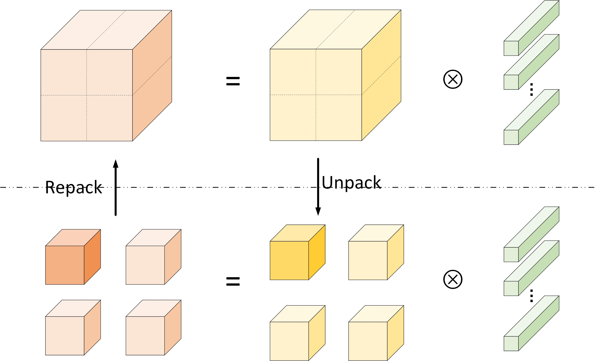
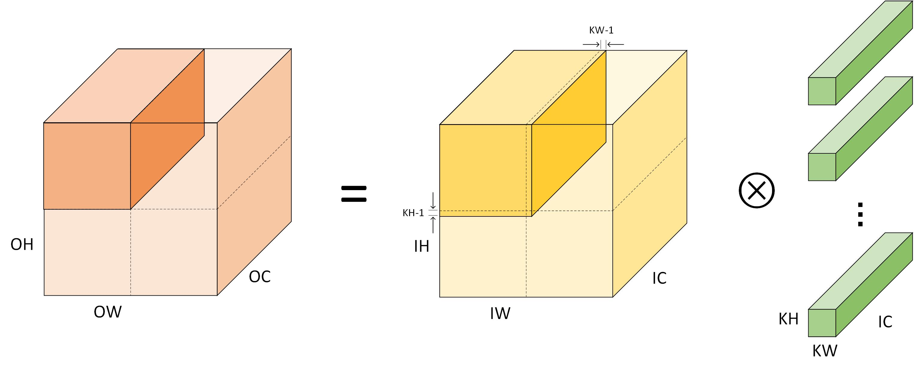
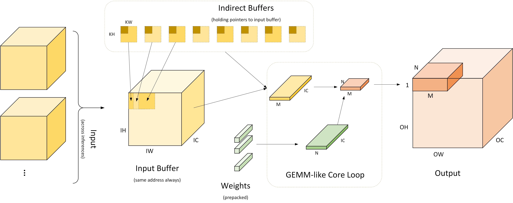
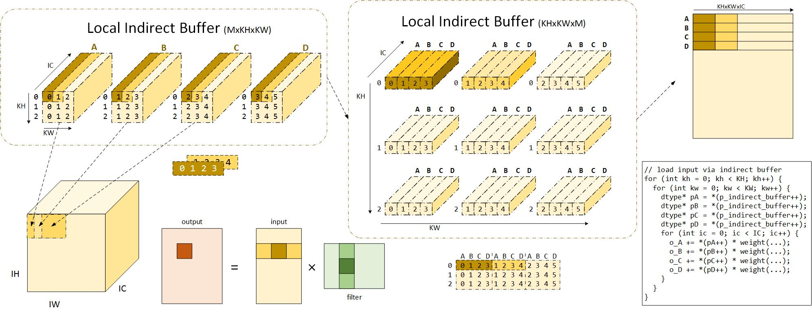

- Convolutions can be converted to gemm through img2col #Im2col
	- Different convolution output can be layout in different ways #[[MKLDNN memory layout]]
		- NHWC
			- ((f70160af-958d-45d3-8652-494550047071))
			- ((7c603991-8487-4ad5-be81-0929418cf9d0))
				- For kernel, the next 4x1 output channel is OC away from current 4x1 in memory.
				- For input, the input is near each other along the k dimension.
					- 
		- NCHW
			- 
				- The 4x1 input of next input channel would be HW away from the current processed input. That might cause some cache miss if H*W is huge.
				- The 1x4 kernel is near each other along the k dimension.
					- 
- Instead of GEMM, we can also sice the input into small convolution problems
	- Original convolution
		- 
	- Divide and conquer
		- 
		- [卷积神经网络优化算法 | 黎明灰烬 博客](https://jackwish.net/2019/convolution-neural-networks-optimization.html)
			- > 在 H 和 W 维度划分，将形状为 N × H × W × IC 的输入张量拆分为 h ∗ wh ∗ wh * w 个（两个方向分别拆分 h 和 w 次）形状为 N × Hh × Ww × IC 的张量，分别将这些小的张量组织为连续内存； 将得到的 h ∗ wh ∗ wh * w 个输入张量分别和卷积核做二维卷积操作，即可得到 h ∗ wh ∗ wh * w 个形状为 N × Hh × Ww × OC 的输出张量； 将这些输出张量重组内存布局得到最终形状为 N × H × W × OC 的输出。
	- The border problem when slicing
		- 
		- 切分时因为stride问题。所以边界上会带有 kw - 1 和kh -1 大小的数据。
		- 也可以在output channel上做切分。#AutoTVM 中存在slicing相关的优化。
- Indirect convolution algorithm, on the condition that the input can be stored within buffer.
	- 
		- We used pointers to access input when the pointer to the input is the same throughout the inference.
	- 
		- We can use a address with zeros padding in it to eliminate the memory copy introduced in padding operation.
	-
- 
  id:: 95fac5e9-6b13-451d-8d4d-c85346c303fa
	- The  Indirect  Convolution  algorithm  provides  the  effi-ciency  of  the  GEMM  primitive  without  the  overhead  ofim2col transformation.  In contrast to GEMM-based algo-rithms, the Indirect Convolution does not reshuffle the data to fit into the GEMM primitive but introduces an indirection buffer — a buffer of pointers to the start of each row of im-age pixels.  {{1  JbxfjyNWi}} [📑](((95fac5e9-6b13-451d-8d4d-c85346c303fa)))
	- #h:purpleAs  another  strategy,  Intel  MKL-DNN  [11]  and  IntelLibXSMM [15] libraries employ parametrized architecture-specific Just-in-Time code generator to produce optimized direct convolution implementation for parameters provide dat runtime.   TVM [5] takes the code-generation approach even  further  by  combining  Just-in-Time  code  generation with auto-tuning.  {{2  DyrWRmRw-}} [📑](((95fac5e9-6b13-451d-8d4d-c85346c303fa)))
	- The direct convolution algorithm in its simplest form is expressed as 7 nested loops iterating along batch sizeN,output heightHout, output widthWout, output channelsK,and accumulating partial results across kernel heightR, ker-nel widthS, and input channelsC, as illustrated in Listing1. Practical implementations of the direct convolution algo-rithm usually add extra loops for cache blocking and vector-ization, which further complicate computation flow.  {{1  LifNOwcfk}} [📑](((95fac5e9-6b13-451d-8d4d-c85346c303fa)))
	- The most common strategy, implementede.g. in cuDNN[6] and HexagonNN libraries,  as well as MACE [33] andncnn frameworks, is to use an optimized direct convolution implementation for the most popular convolution parame-ters, such as 5x1, 1x5 and 3x3 stride-2 kernels, and fall back to a default algorithm for non-common values {{1  jpMgwJxFQ}} [📑](((95fac5e9-6b13-451d-8d4d-c85346c303fa)))