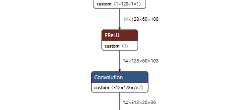
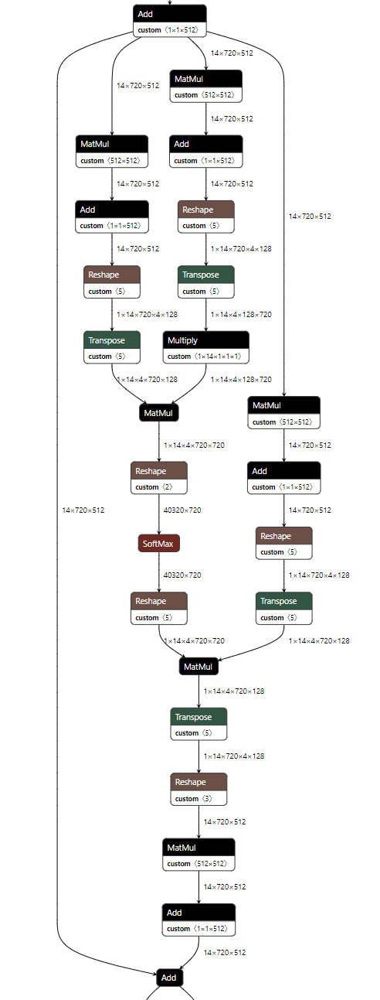
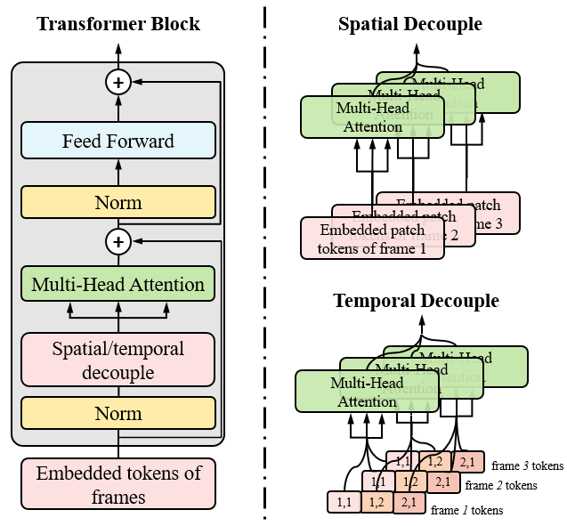

- 
- What is Video inpainting:
	- 视频的自动补全，盖掉某一块视频区域，自动补全Mask部分
- [XML](https://intel-my.sharepoint.com/:u:/r/personal/xu_qian_intel_com/Documents/dstt.xml?csf=1&web=1&e=sFxqyF)
- ## Notes
	- ### Summary
		- ((6264fa8e-af91-430b-93f1-2f2691650cab))
	- ### Structure
		- 先过一个hierarchical encoder, 对输入的时间图片序列进行编码。
		- ((62654dbf-36e1-4d79-9f94-c69b147cf7b8))
		- {:height 264, :width 1032}
			- In hierarchical encoder, features of different levels are represented as different colors.  The higher the level of feature is, the darker its color is.  With such hierarchical grouping processing, the local spatial structures of difference levels are stored in the final robust and representative features
				- XML file for downsample phase:
				  collapsed:: true
					- 
				- XML file for HE:
				  collapsed:: true
					- 
			- The output of HE:
				- 14x512x20x36 ->$$t \times 2c\times h/12\times w/12$$
				- 
				- $$F^i \in R^{h/12\times w/12\times 2c}$$
			- After that, we feed the obtained tokens  into  an  interweaving  stack  of  Decoupled  Spatial Temporal Transformer (DSTT) for fully aggregating information across tokens of different frames.
				- XML for spatial transformer:
					- 
				- XML for FFN:
				  collapsed:: true
					- 
				- XML for temporal transformer:
					- 
		- Decoupled Spatial Temporal Transformer
			- For a token feature $$F_i$$, split it into $$s^2$$ zones along both the height and width dimension. ($$s=2$$)
				- Each zone of $$F_i$$ is denoted as (for all transformer, each zone is 512x10x18):
					- $$F_{jk}^i \in R^{h/(12\cdot s)\times w/(12\cdot s)\times 2c}$$
					- Where $$j,k=1,...,s$$
				- We have a total number of $$t\cdot s^2 \cdot n$$ tokens where $$n=h/(12\cdot s)\times w/(12\cdot s)$$
			- For Temporal transformer:
				- Group the features in Temporal dimension,
					- For all transformer, each $$P_{jk}$$ shape is 14x20x36x512->4x14x10x18x512->4x14x4x10x18x128->4x4x2520x128
					- $$P_{jk}=\{F_{jk}^1,...,F_{jk}^t\}, j,k=1,...,s$$
				- Perform temporal multi-head attention across different $$P_{jk}$$
			- For Spatial transformer:
				- Group the features in Spatial direction:
					- For all transformer, each $$P_{i}$$ shape is 14x20x36x512->4x14x4x20x36x128->14x4x720x128
					- $$P^i=\{F_{11}^i,F_{12}^i,...,F_{ss}^i\}, i=1,...,t$$
				- Perform Spatial multi-head attention across different $$P^i$$
			- ==Multi-head attention是不同的channel上的attention，将不同的channel分成多个组，分别对于对应的组别进行attention==
				- 
			- 
		- Parameter selection for the model
			- ((6265e866-d2b0-4b2f-b913-29791126d358))
	- ### operation analysis
		- Spatial/Temporal attention
			- Achieved by permuting and reshape of the original time sequence of images
		- Size is huge:
			- Input to transformer tx720x512:
				- t*300KB
			- After spatial attention tx4x720x720:
				- t*2MB
			- FFN 720x2048:
				- t*1.5MB
			- After time attention $$t^2\times 720 \times720$$
				- t^2 * 500KB
			- After Vec2Patch tx720x6272:
				- t*4MB
		- Vec2Patch:
			- [[torch fold and unfold]]
			- `self.to_patch = torch.nn.Fold(output_size=output_size, kernel_size=kernel_size, stride=stride, padding=padding)`
				- output_size = (60, 108)
				- kernel_size = (7, 7)
				- stride = (3, 3)
				- padding = (3, 3)
			- Input Shape: (14, 720, 6272)
				- 6272 = 128 * 7 * 7
			- Output Shape: (14, 128, 60, 108)
		- Tanh before output
			- id:: 6265f478-d71a-49ff-8b37-f0c94059675c
			  ```
			  output = torch.tanh(output)
			          return output
			  ```