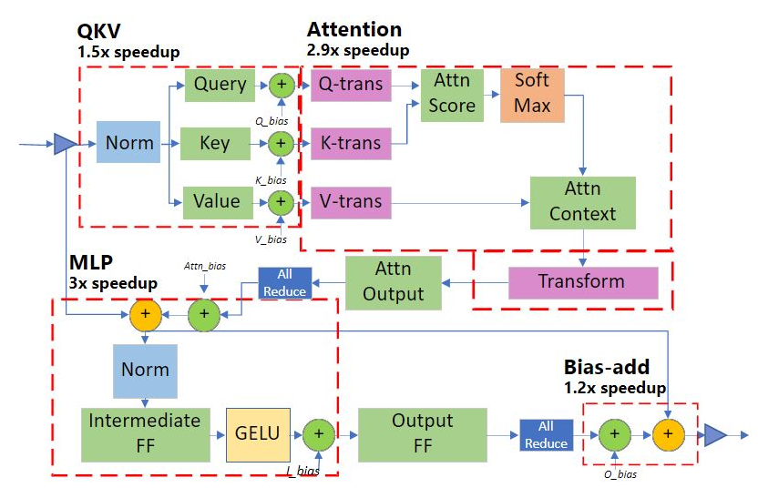
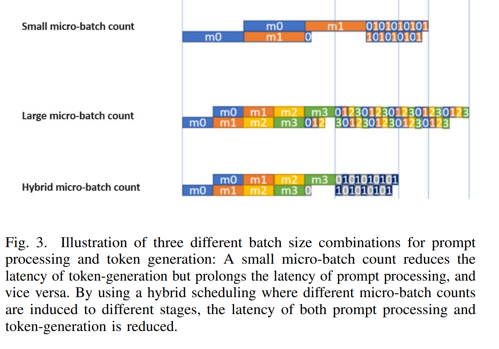

- posts:
	- https://zhuanlan.zhihu.com/p/629085568
- ## Introduction
	- {{embed ((659de6c4-ea25-4a94-b89d-c051dbb97f1f))}}
	- #### DeepSpeed Transformer
		- 三层的系统架构：
			- 1. single GPU transformer kernel for latency sensitive scenarios
			- 2. multi-GPU dense transformer layer, tensor slicing and pipeline parallelism for throughput oriented scenarios
			- 3. massive-GPU sparse transformer for MOE
	- #### ZeRO-Inference
		- zero inference is based on GPU+CPU+NVMe。提供了一种offload存储到CPU和NVMe的方法，这样即使你的GPU资源很受限，也可以run 超大的LLM的inference。穷鬼救星。。。以有限的资源实现大规模模型推理
- ## Background:
	- Sparse Transformer Models: The success of scaling dense language models has motivated researchers and practitioners to further propose the Mixture-of-Experts (MoE) technique which introduces sparsity in transformer models. Typical transformer model architectures have transformer blocks that consist of two consecutive sub-layers, a self-attention sub-layer followed by a position-wise feed-forward (FF) block. **MoE models add conditional computation by replacing the feedforward blocks with a Position-wise MoE layer with a variable number of experts and a top-k gating function.** Increasing the number of experts allows scaling the MoE model size with only sublinear increase in computation cost, greatly reducing the training cost of the model. However, MoE models can be up to 8× larger than their quality-equivalent dense models, requiring much higher aggregate memory bandwidth to achieve comparable latency during inference.
	- System Technology for Memory and Performance Scaling:
		- Tensor Parallelism:
			- Split model layers horizontally. If the number of GPU increases, it incur two problems: 1) smaller local problem size might cause compute eff problem. 2) all-reduce communications in each layer to aggregate the output partial activations.
			- This method can be used in situations where the inter-connection is fairly fast like GPUs share the NV-Link.
			- This is hard to map to VPU, might be some cases the Bay series will face.
		- Pipeline Parallelism:
			- Split model vertically to pipeline stages.
		- Zero:
			- further reading on this
		- Expert parallelism:
			- Different expert to different devices.
- ## Inference Optimized Transformer Kernels:
	- ### Deep Fusion
		- Deep-Fusion tiles the computation-space along dimensions of the iteration space which incur no cross-tile data-dependencies and executes them in parallel across different thread-blocks. The dimensions of the computation-space which does contain data dependencies are not tiled, and instead processed by the same thread-block
		- Parallel across thread blocks in Nvidia GPU, reduce kernel launch time and data movement overhead.
		- 
	- ### Pipeline Parallelism + Tensor Parallelism
		- Challenges for LLM inference:
			- decoder 是自回归的，需要多 stage 间的高效调度
			- 自回归生成式模型有两个阶段
				- prompt processing phase，该阶段是 compute-bound 的， bubble 数量越少算力利用越充分
				- token generation phase，该阶段是 bandwidth-bound的，micro-batch 越少对带宽要求越低
			- pipeline 中多序列的 KV cache 会占用大量显存
		- Solutions:
			- Pipeline schedule to hide data dependencies
				- 
				- microbatch的数量等于pipeline的数量，也就是GPU的数量。无需等待所有的microbatch都inference完才开始下一个inference，只要对应的microbatch执行完了就可以开始下一段。
			- Hybrid batch size for prompt processing and token generation
				- {:height 533, :width 766}
			- Offload KVcache to CPU
				- KVcache放一部分到CPU内存，然后增加batch size，提高GPU的ultilization
			- Communication optimization
	- ## MOE inference optimization
	- https://www.microsoft.com/en-us/research/blog/deepspeed-advancing-moe-inference-and-training-to-power-next-generation-ai-scale/
	- ### MOE inference 的问题
		- 对于某一个token，只有一个expert会激活，这个时候的model size相对于整体的模型大小很小。
		- 而同时inference多个token的时候，最坏的情况可能会激活所有的expert。
	- ### Design goals for the DS-MoE inference system
		- 
		- 1) expert parallelism and expert-slicing on expert parameters
			- 把expert分到不同的device上。然后把用同一个expert进行运算的token group起来丢给其中一个expert。然后不同的expert就可以并行的处理自己的那部分token。这个就是expert parallelism。
			- 如果有更多的device，可以继续对expert进行slicing，其实就是tiling，这样可以进一步减少latency。
		- 2) data parallelism and tensor-slicing for non-expert parameters.
			- node之间用data parallelism 来处理不同的batch，不需要通信。
			- node内部有nvlink，所以可以tensor slicing，交互反正很快，其实就是tiling。
		- 通信优化 **Hierarchical All-to-All**：
			- 
			- We implement a hierarchical all-to-all as a two-step process with a data-layout transformation, followed by an intra-node all-to-all, followed by a second data-layout transformation and a final inter-node all-to-all. This reduces the communication hops from O (p) to O (G+p/G), where G is the number of GPUs in a node and p is the total number of GPU devices.
		- **Parallelism Coordinated Communication Optimization:**
			- 如图所示，因为MP的两个GPU的activation是duplicate的，所以All to all 只要在同一个rank内部发生就可以。
			- 值得注意的是，对于MP，需要在alltoall之前重新排布一下数据，猜想可能是因为alltoall要求参与的数据必须连续。所以如果希望MP rank0的两个GPU相互alltoall，需要保证对方GPU需要的数据在对应的地址上。
			- 