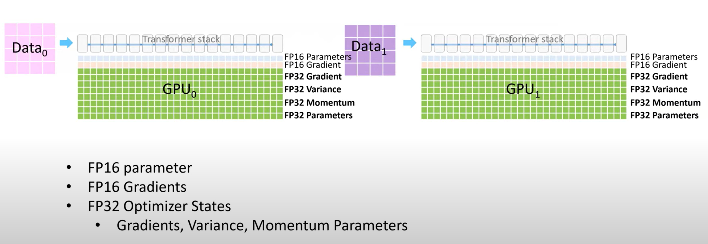

- Good posts:
	- https://zhuanlan.zhihu.com/p/663517415
	- https://basicv8vc.github.io/posts/zero/
- ## Related Work
- [[mixed precision training]]
- ### Data, Model and Pipeline Parallelism
	- [[parallelism in large scale training]]
- ### Non-parallelism based approach to reduce memory
	- [[gradient checkpointing]]
	- #### CPU Offload
		- offload model states to CPU memory, can be real slow
- ## Where Did All the Memory Go?
- ### Model States: Optimizer States, Gradients and Parameters
	- optimizer
		- SGD:
			- learning rate + gradient
		- Adam:
			- learning rate + gradient + momentum + variance
			- fp32 gradients + fp32 parameter if mixed precision (o2)
			- note that the variance and momentum is updated using gradient. So after gradient is computed, you can update the corresponding model states using only part of gradient, which makes the first state optimization of zero possible.
				- 
				- 
			- 
- ### Residual Memory Consumption
	- **activations**
		- can be reduced by [[gradient checkpointing]]
	- **Temporary buffers**
	- **Fragmentations**
- ## *ZeRO* : Insights and Overview
- ZeRO 有两组优化：ZeRO-DP 旨在减少模型状态的内存占用，ZeRO-R 旨在减少剩余内存消耗。
	- {:height 410, :width 720}
- ### Insights and Overview:   *ZeRO* -DP
	- 为什么用DP而不用MP：
		- *a)* DP has better scaling efficiency than MP because MP reduces the granularity of the computation while also increasing the communication overhead. Beyond a certain point, lower computational granularity reduces the efficiency per GPU, while the increased communication overhead, hiders the scalability across GPUs, especially when crossing node boundaries. On the contrary, DP has both ==higher computational granularity and lower communication volume==, allowing for much higher efficiency.
		- *c)* Both DP and MP keep all the model states needed over the entire training process, but not everything is required all the time. For example, ==parameters corresponding to each layer is only needed during the forward propagation and backward propagation of the layer.==
- ### Insights and Overview:   *ZeRO* -R
	- #### Reducing Activation Memory
- ## Deep Dive into  *ZeRO* -DP
- 
- Zero DP 的三个阶段
- ### Pos: Optimizer State Partitioning
- 
	- 对于data parallel degree是n的training场景，每个device都只保留1/n的model state
	- step by step:
		- 先forward，然后backward拿到所有的gradient，然后GPU0把后半部分的gradient传输到GPU1，GPU1把前半部分的graident传输到GPU0。
		- 然后每个GPU都有了自己那部分的所有的数据的gradient，然后求平均得到在所有batch上的gradient。
		- 然后更新parameter和model states。
- ### Pg: Gradient Partitioning
	- 因为每个GPU都只负责一部分parameter的更新，所以在反向传播的过程中，并不需要保存所有的gradient，GPU0算完后面一半的gradient之后就可以当场release那部分的memory，只要在之前传播给GPU1就可以。同样，对于GPU1，只需要在计算完前一部分的gradient之后传递给GPU0就可以release那部分的gradient。
	- [[Bucket reduce]]
- ### Pp: Parameter Partitioning
	- https://engineering.fb.com/2021/07/15/open-source/fsdp/
	- 只保留需要更新的weight，在forward和backward需要其他部分的weight的时候，从别的device通过broadcast来获取。
	- {:height 922, :width 822}
	-
- Overall process:
	- {{video https://www.youtube.com/watch?v=y4_bCiAsIAk&t=765s&ab_channel=KDD2020Virtual}}
	- Each GPU only holds 1/4 parameters/gradients/model states
		- https://www.youtube.com/watch?v=lQCG4zUCYao&t=6s&ab_channel=MicrosoftResearch
		- {:height 309, :width 678}
	- The GPU that holds the corresponding parameter need to Broadcast parameter partitions and compute forward pass on the corresponding layers
		- GPU0 hold first 1/4 parameters and broadcast that to other GPUs
			- {:height 322, :width 680}
		- GPU1 hold the next 1/4 broadcast
			- {:height 327, :width 683}
		- Same for GPU2 and GPU3 and that completes the forward pass
			- {:height 324, :width 684}
	- For backward pass:
		- Need to broadcast weight for the corresponding gradient calculation, after the gradient is calculated, need to pass the corresponding gradient to the GPU that holds that part of gradient and reduce.
		- {:height 295, :width 687}
	- After gradient is updated, update model state and apply change to model parameters:
		- {:height 305, :width 690}
- Communication overhead analysis:
	- Traditionally, we need to perform reducescatter and allgather. 传输的数据量应该都是Ψ。所以加起来就是2Ψ。
	- 对于Pos，只有model state是每个显卡一份，先用reducescatter把梯度reduce到不同的显卡上，每个显卡都有自己的那部分的gradient的平均值，然后更新参数，然后通过allgather去把更新之后的parameter分发到其他显卡上。
	- 对于Pos+g，跟Pos是一样的，因为其实Pos里面gradient传递的时候也没有传递完整的gradient，只是某个device需要的那一部分分区。
	- 对于Pos+g+p，每个device都只有一部分的paramter，所以在前向和后向的过程中，一定会有两个Ψ的traffic来分发weight(broadcast)，但是因为每个上面只需要有一份weight，只要reduce scatter之后拿到gradient就有全部需要的数据更新自己的那部分weight，所以不需要原来的allgather更新weight的过程。所以通信量是3Ψ。
	- 可视化分析：
		- 
- ## Zero-R
- ### Partitioned Activation checkpointing
	- motivations:
		- MP 对模型状态进行分区，但通常需要复制 Activations Memory。例如，如果我们垂直分割线性层的参数并在两个 GPU 上并行计算它们，则每个 GPU 需要整个 Activations 来计算其分区。
		- 对于 GPT-2 或更大的模型，算术密度（每次迭代的计算量与 Activation Checkpoints 数量之比）非常大（ ≥10K ），这也意味着使用 Activation Checkpointing 会带来极大的计算开销，并且这些计算开销随着隐藏维度线性增加。这导致，**在带宽很低的情况下，保存 Activations 而非重新计算它们会更 Cheap。**
	- Overview:
		- 
		- 每个device保存一部分的activations。直到反向传播时候再次需要这部分的activation来算gradient。这个时候通过allgather来获取完整的activation。
		- 这个只对model parallelism有效，因为这些情况下，activation是duplicate的。
		- 只要有duplicate，scaling的factor就不好，所以要通过别的方式来消除这些duplicate的memory，然后达到通信或计算与GPU数量线性的效果。
		- Pa and Pa+cpu: Pa: duplicate activation partition. Pa+cpu: activation offload to CPU.
- ### Constant size buffers
	- ZeRO-R 使用恒定大小的缓冲区来避免临时缓冲区随着模型大小的增加而爆炸，同时使缓冲区足够大以保持效率。**速度慢是可以接受的，无法训练是难以接受的**。
	- {:height 264, :width 1106}
- ### Memory Defragmentation
	- 由于在memory中long life and short life tensor interleave。这里主要是activation checkpointing和activation gradient。
	- 
	- ZeRO-R 通过为 Checkpoints 和 Gradient 预先分配连续的内存块（**如图所示，蓝色色块被聚合在一起代表 Checkpoint 放在连续内存中**）
- ### ZeRO-R Communication Analysis
	-