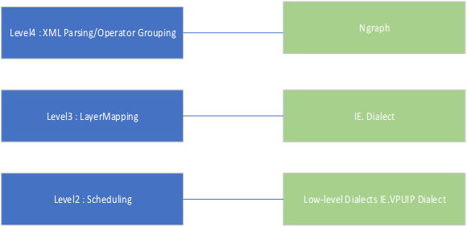

- ```
  IE Dialect --> VPU Dialect --> VPUIP Dialect 
  IE → VPU lowering --> VPU → VPUIP lowering
  ```
- 
- IE dialect
	- ```
	  The IE Dialect represents InferenceEngine/nGraph IR in terms of MLIR framework.
	  
	  It has the following properties:
	  
	  * Describes network topology without HW details (memory hierarchy, memory allocation, scheduling).
	  * Represents the latest nGraph opset and in addition some portion of legacy IE opset (for convenience).
	  * Works with MLIR Tensor Types as atomic Values (no memory effects), all operations are pure.
	  * Performs high level transformations/optimizations, that doesn't need low level details (memory buffers, scheduling).
	  
	  ```
- VPU Dialect
	- ```
	  The VPU Dialect represents an extension over the IE dialect that brings hardware-specific information to the IR.
	  ```
- IE → VPU lowering
	- ```
	  Now that the IE and VPU definitions of the operation are created, the logic that performs the IE->VPU lowering for it should follow.
	  
	  Generally, it will be enough to add the lowering logic in [convert_layers_to_VPU.td](../tblgen/vpux/compiler/conversion/rewriters/convert_layers_to_VPU.td):
	  
	  ```
- VPUIP Dialect
	- ```
	  The VPUIP Dialect represents bufferized version of the VPU Dialect, with platform-specific variants of some operations. For example, hardware operations are all represented as `VPUIP::NCEClusterTaskOp`. Software operations for VPUX30XX have UPA tasks representing the SHAVE kernels, while the software operations for VPUX37XX use `VPUIP::SWKernelOp`. We will be creating the UPA operation for the new layer. It is worth mentioning that in some cases, multiple VPU operations can be lowered to the same UPA task; e.g. `VPU.AddOp` & `VPU.MultiplyOp` both get lowered to `VPUIP.EltwiseUPAOp`.
	  
	  This dialect no longer works with tensor data. Instead, buffers are utilized by making use of `MemRefType`.
	  
	  Documentation
	  * VPUIP dialect: [chapters/generated/dialect/_VPUIP.md](chapters/generated/dialect/_VPUIP.md#L1)
	  * Passes: [chapters/generated/dialect/VPUIP/_passes.md](chapters/generated/dialect/VPUIP/_passes.md#L1)
	  * Op interfaces: [chapters/generated/dialect/VPUIP/_ops_interfaces.md](chapters/generated/dialect/VPUIP/_ops_interfaces.md#L1)
	  * About assembly format: [https://mlir.llvm.org/docs/OpDefinitions/#declarative-assembly-format](https://mlir.llvm.org/docs/OpDefinitions/#declarative-assembly-format)
	  
	  ```
- VPU → VPUIP lowering
	- ```
	  Convert previous representation of a layer in VPU dialect down to the VPUIP dialect.
	  
	  ```
- IERT Dialect
	- Currently, it is ==not== utilized in the compilation pipelines.