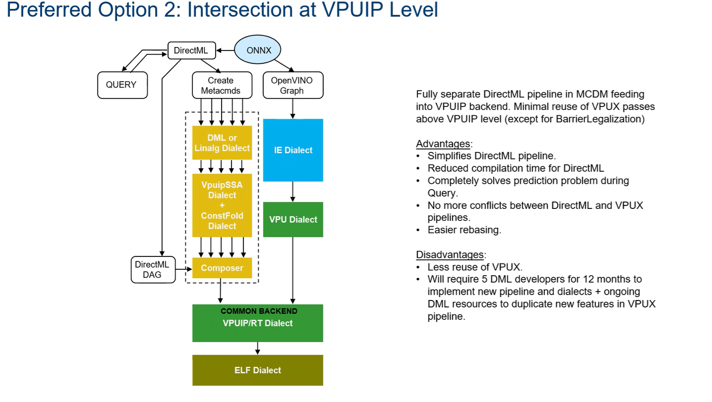
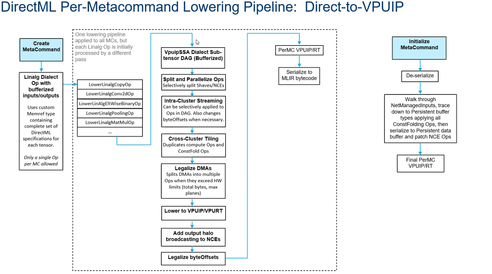
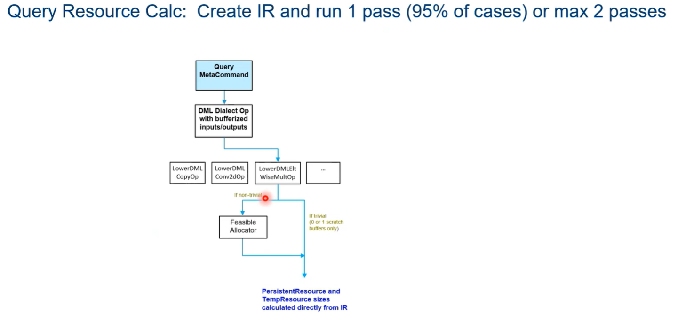
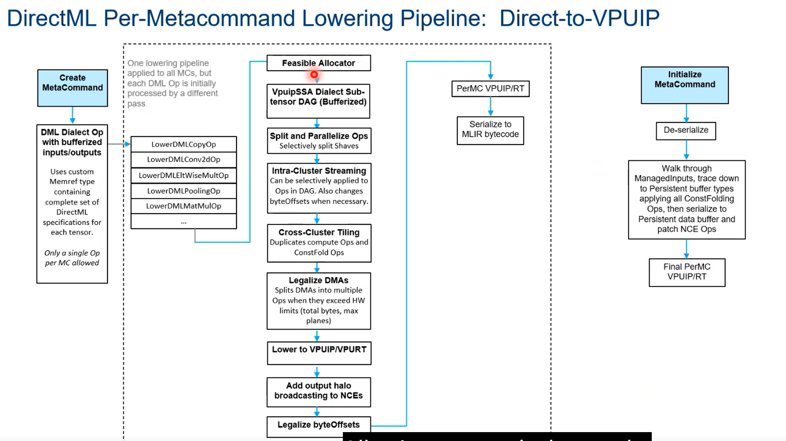
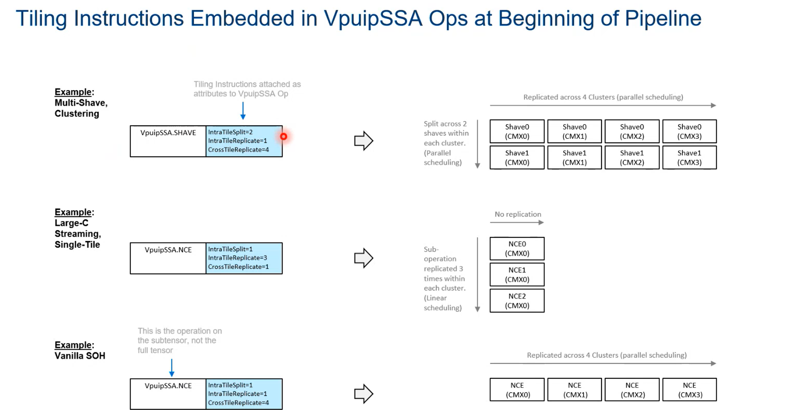
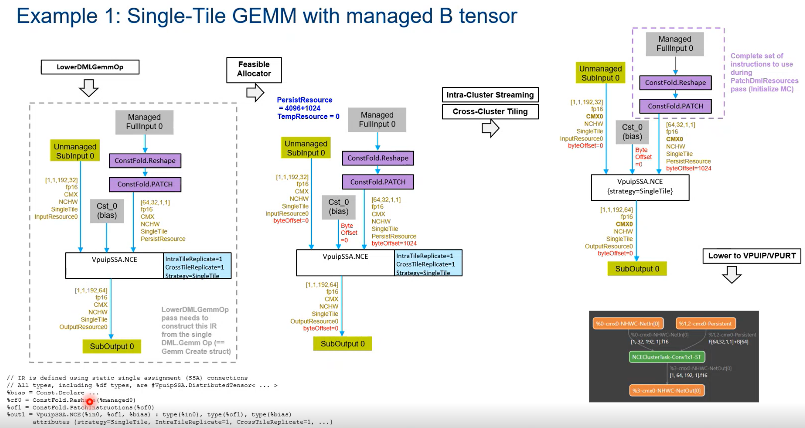
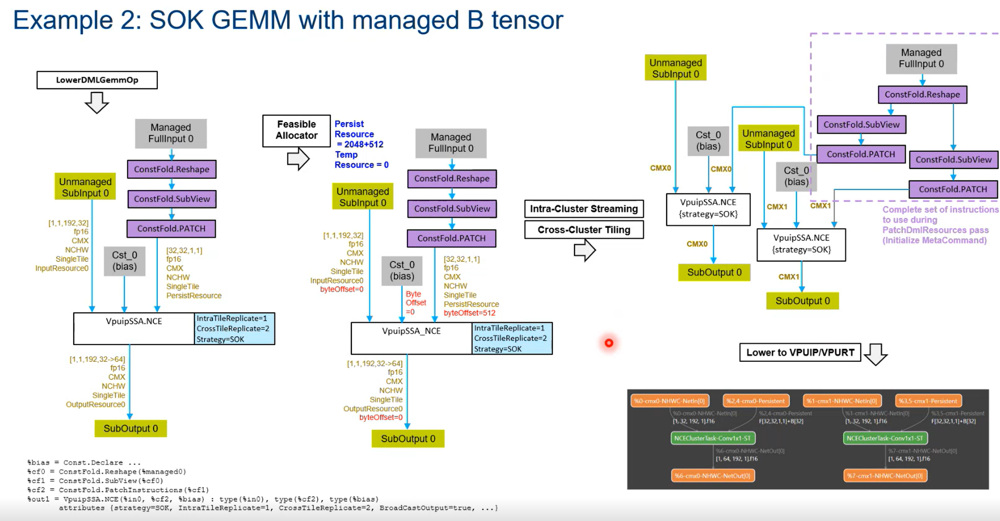
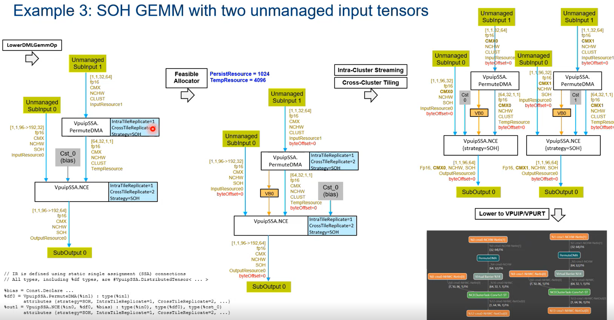

- 
- 
- What is the composer?
	-
- https://docs.intel.com/documents/MovidiusInternal/vpu27/Common/SW/HLD/DML_Compiler.html
- # DirectML API Selective Overview
	- In the query return struct, the DML Compiler is allowed to set per-metacommand memory locales for the persistent and temporary resources, but in the current API this can only be specified once for all command lists referencing that metacommand.
- DirectML re-design
	- Query design
		- 
		- Single pass for every metacommand and basically run that pass
		- feasible allocation is selective in query
	- lowering:
		- 
- Tiling:
	- 
- Example:
	- 
		- constfold.reshape and constfold.patch is for directml
	- 
	- 