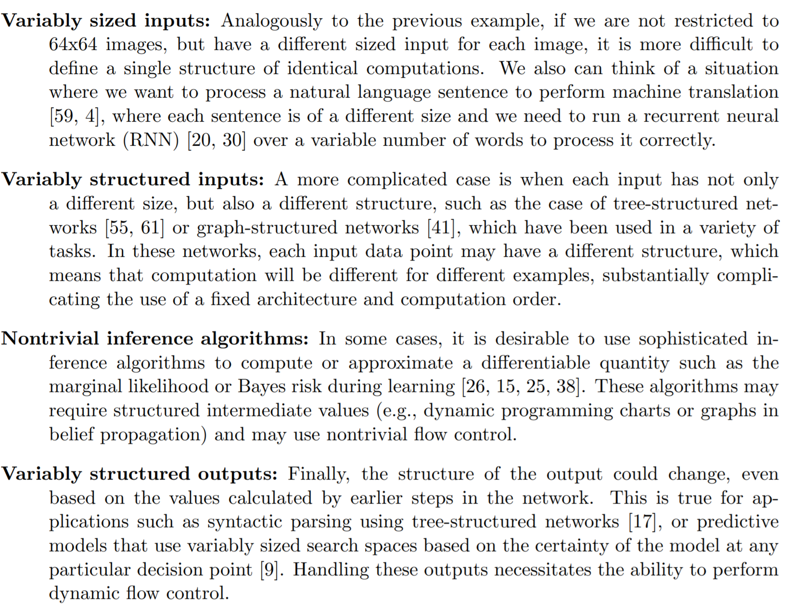

- [Nimba in TVM](https://arxiv.org/pdf/2006.03031.pdf)
	 - Background
		 - Dynamism in modern networks
			 - 
			 - NLP tasks with control flow (Hochreiter &Schmidhuber, 1997; Sutskever et al., 2014), dynamic data structures (Tai et al., 2015; Liang et al., 2016), and dynamic shapes (Devlin et al., 2018). [[BERT]]
			 - Computer vision tasks
				 - classification, max pooling before full-connected layers (previously, people flatten the input before full-connected which require the shape to be constant)
				 - object detection, [[SSD]]and [[YOLO]]don't require the input shape to be constant, [[NMS]] is a dynamic operation though
				 - super resolution usually can accept different resolution
		 - Problem along with dynamism
			 - breaking existing system assumptions and invalidating optimizations designed for purely static data flow graphs
			 - currently, most frameworks represent a neural network as a static dataflow graph. these static dataflow graphs can be well optimized since the dataflow is fixed in the graph.
		 - Current solution
			 - recent years have seen an increase in the popularity of frameworks based on dynamic declaration, which declare a different dataflow graph per sample.
				 - Dynet framework
					 - propose a light weight graph creation framework that can create the computation graph for the next sample on the fly when the current sample is being processed.
					 - creating and optimizing computation graphs can be expensive, so dynet is super lightweight
				 - advantages
					 - easy for users
				 - drawback
					 - compilation overhead
					 - hard for batching
	 - Proposed method
		 - Runtime comparison, Nimba has a light-weight runtime
			 - For efficiency purpose, the runtime of static models could be simply designed as a sequential executor that traverses the input data flow graph in the topological order to invoke operators one by one.
			 - The execution path of dynamic models may only be known at runtime and the kernels for certain operators must be dispatched according to the data shape determined at runtime, making a simple graph-traversing runtime insufficient.
		 - uniform and dynamic representation, an 'ANY' symbol for unknow dimensions
- [[Operator fusion]]
	 - {{embed  ((23365e47-484c-40e6-8092-481f0f60d1d1))}}