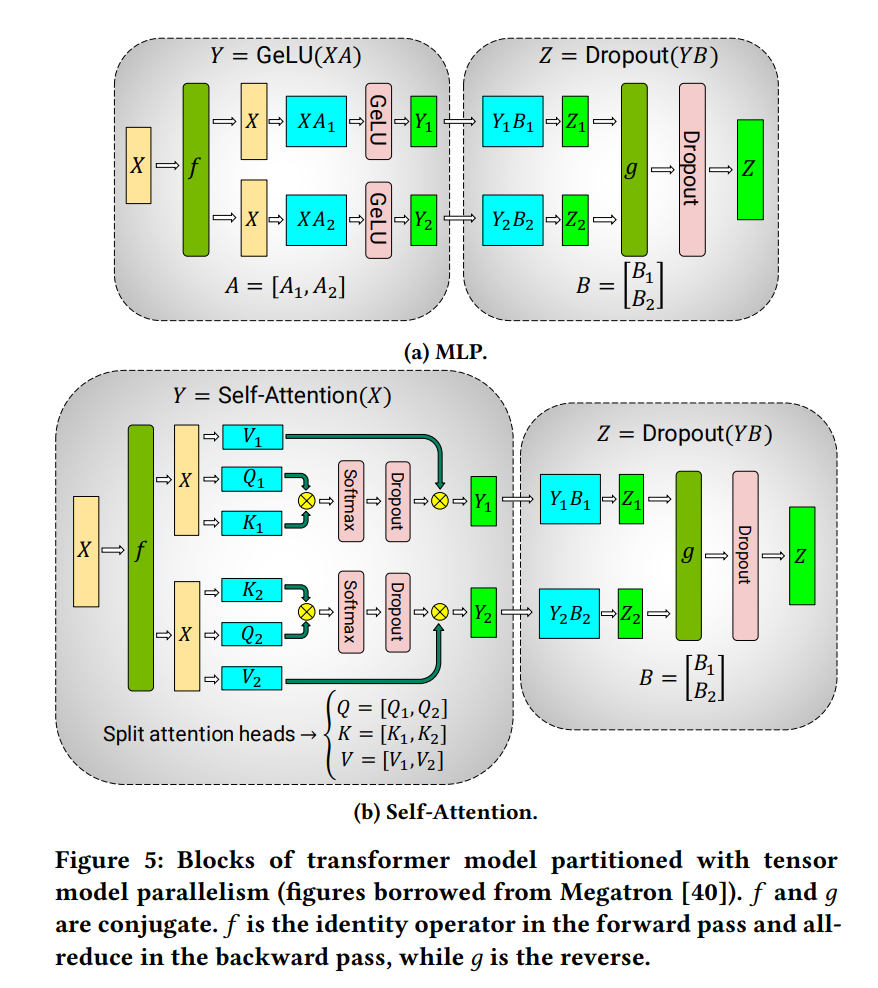
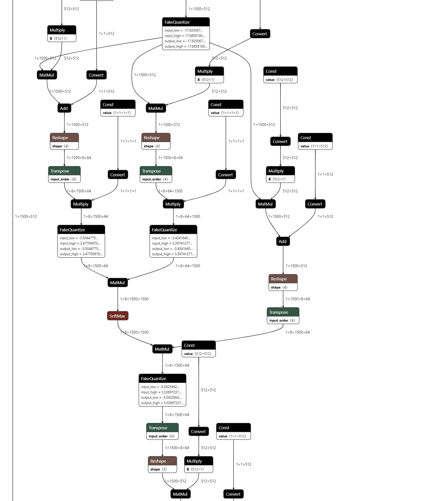

- [[Efficient Large-Scale Language Model Training on GPU Clusters]]
  id:: 65994b36-c00f-4021-9295-e99c7d2c620b
	- Short summary: 在 Tensor Parallelism 中，每个 GPU 只处理张量的一个切片，只有在后续的操作需要完整的切片的时候才会aggregate。
	- Details:
		- {:height 707, :width 627}
		- For MLP:
			- Split on first matmul output channel and next matmul input channel. The activation input to this kernel block is the full activation and the output of this block is the full activation output.
		- For self-attention:
			- Cut on the 8 which is the head, this is the output channel for Q/K/V and input channel for output embedding matmul.
			- 
		- f is identity in the forward pass and all-reduce in the backward pass
			- in the forward pass, f is identity which is straightforward
			- in the backward pass, f need to consider the gradient from both paths
		- g is all reduce in the forward pass and identity in the backward pass
			- in the forward pass, g is concat
			- in the backward pass, g is identity, which passes the gradient without any change
		- {:height 357, :width 743}
		- Combine the tensor parallelism with model parallelism
		- 自己的理解：
		  id:: 6599577e-6a83-47c6-b045-1531839ae9d0
			- 2x2x2: 8个GPU，其中4个是0-3层网络，后4个是4-7层网络。并且，对于相同层的4个GPU，其中各2个是相同的micro-batch。对于相同micro-batch和网络的2个GPU，有不同的tensor切分。
			-