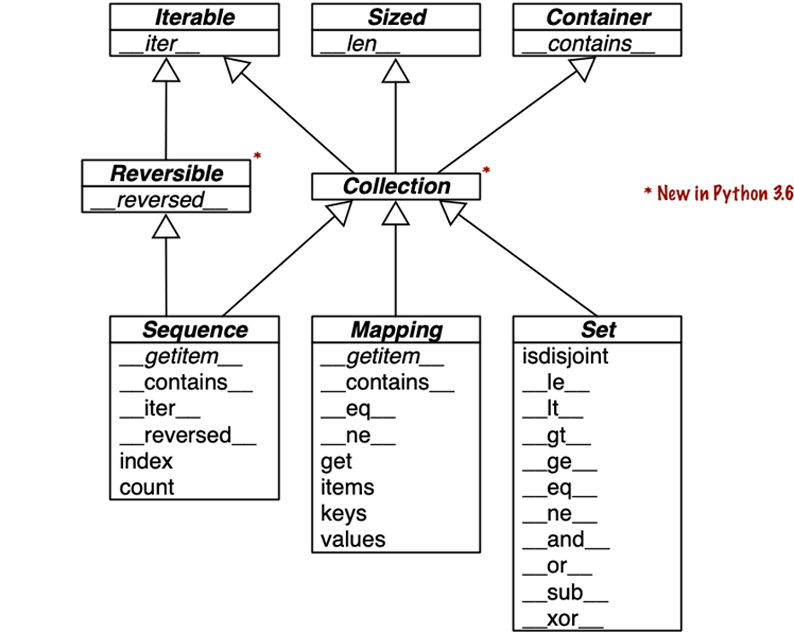

title:: Fluent Python Chapter1: The python data model
- # Chapter 1. The python data model
- ## A Pythonic Card Deck
- ```python
  import collections
  
  Card = collections.namedtuple('Card', ['rank', 'suit'])
  
  class FrenchDeck:
      ranks = [str(n) for n in range(2, 11)] + list('JQKA')
      suits = 'spades diamonds clubs hearts'.split()
  
      def __init__(self):
          self._cards = [Card(rank, suit) for suit in self.suits
                                          for rank in self.ranks]
  
      def __len__(self):
          return len(self._cards)
  
      def __getitem__(self, position):
          return self._cards[position]
  ```
- ### Data model method used in the upper example:
	- [[namedtuple]]
		- `collections.namedtuple` to construct a simple class to represent individual cards. We use namedtuple to build classes of objects that are just bundles of attributes with no custom methods, like a database record. In the example, we use it to provide a nice representation for the cards in the deck, as shown in the console session:
	- [[__getitem__]]
		- get item with specific index from the class
	- [[__len__]]
		- define so that we can get the length of frechdeck with `len()` method
	- [[random.choice]]
		- ```python
		  >>> from random import choice
		  >>> choice(deck)
		  Card(rank='3', suit='hearts')
		  >>> choice(deck)
		  Card(rank='K', suit='spades')
		  >>> choice(deck)
		  Card(rank='2', suit='clubs')
		  ```
	- [[doctest]]
		- https://docs.python.org/3/library/doctest.html
		- test in the comment of the python function
		- `# doctest: +ELLIPSIS`
			- This can be used when the output was too long in the doctest
	- [[__contains__]]
		- if `__contains__` is not defined in a collection, the `in` operator does a sequential scan
			- ```python
			  >>> Card('Q', 'hearts') in deck
			  True
			  >>> Card('7', 'beasts') in deck
			  False
			  ```
	- [[dict]]
		- ```python
		  suit_values = dict(spades=3, hearts=2, diamonds=1, clubs=0)
		  >>> suit_values
		  {'spades': 3, 'hearts': 2, 'diamonds': 1, 'clubs': 0}
		  ```
	- [[sorted]]
		- ```python
		  suit_values = dict(spades=3, hearts=2, diamonds=1, clubs=0)
		  
		  def spades_high(card):
		      rank_value = FrenchDeck.ranks.index(card.rank)
		      return rank_value * len(suit_values) + suit_values[card.suit]
		  
		  sorted(deck, key=spades_high)
		  ```
	-
- ### Advantage of using python data model
	- Users of your classes don’t have to memorize arbitrary method names for standard operations. (“How to get the number of items? Is it .size(), .length(), or what?”)
	- It’s easier to benefit from the rich Python standard library and avoid reinventing the wheel, like the random.choice function.
-
- ## How Special Methods Are Used
- The first thing to know about special methods is that they are meant to be called by the Python interpreter, and not by you.
- You don’t write `my_object.__len__()`. You write`len(my_object)`  and, if `my_object` is an instance of a user-defined class, then Python calls the `__len__` method you implemented.
- If you need to invoke a special method, it is usually better to call the related built-in function (e.g., `len` , `iter` , `str` , etc.).
- ### Emulating Numeric Types
- ```python
  """
  vector2d.py: a simplistic class demonstrating some special methods
  
  It is simplistic for didactic reasons. It lacks proper error handling,
  especially in the ``__add__`` and ``__mul__`` methods.
  
  This example is greatly expanded later in the book.
  
  Addition::
  
      >>> v1 = Vector(2, 4)
      >>> v2 = Vector(2, 1)
      >>> v1 + v2
      Vector(4, 5)
  
  Absolute value::
  
      >>> v = Vector(3, 4)
      >>> abs(v)
      5.0
  
  Scalar multiplication::
  
      >>> v * 3
      Vector(9, 12)
      >>> abs(v * 3)
      15.0
  
  """
  
  
  import math
  
  class Vector:
  
      def __init__(self, x=0, y=0):
          self.x = x
          self.y = y
  
      def __repr__(self):
          return f'Vector({self.x!r}, {self.y!r})'
  
      def __abs__(self):
          return math.hypot(self.x, self.y)
  
      def __bool__(self):
          return bool(abs(self))
  
      def __add__(self, other):
          x = self.x + other.x
          y = self.y + other.y
          return Vector(x, y)
  
      def __mul__(self, scalar):
          return Vector(self.x * scalar, self.y * scalar)
  ```
- ### Sepcial method used in the upper example:
	- We implemented five special methods in addition to the familiar `__init__` . Note that none of them is directly called within the class or in the typical usage of the class illustrated by the doctests. As mentioned before, the Python interpreter is the only frequent caller of most special methods.
	- [[__repr__]]
		- The `__repr__` special method is called by the `repr` built-in to get the string representation of the object for inspection. Without a custom `__repr__` , Python’s console would display a `Vector` instance `<Vector object at 0x10e100070>` .
		- ==The interactive console and debugger call `repr` on the results of the expressions evaluated.==
	- Difference between `__str__` and `__repr__` inPython:
		- https://stackoverflow.com/questions/1436703/what-is-the-difference-between-str-and-repr
		- The string returned by `__repr__` should be unambiguous and, if possible, match the source code necessary to re-create the represented object. That is why our `Vector` representation looks like calling the constructor of the class (e.g., `Vector(3, 4)` ).
		- Incontrast, `__str__` is called by the `str()` built-in and implicitly used by the `print` function. It should return a string suitable for display to end users.
			- `__repr__` : representation of python object usually eval will convert it back to that object
			- `__str__` : is whatever you think is that object in text form
		- 如果你只想实现这两个特殊方法中的一个， `__repr__` 是更好的选择，因为如果一个对象没有 `__str__` 函数， 而 Python 又需要调用它的时候， 解释器会用 `__repr__` 作为替代。
			- ```python
			  >>> class Sic(object): 
			  ...   def __repr__(self): return 'foo'
			  ... 
			  >>> print(str(Sic()))
			  foo
			  >>> print(repr(Sic()))
			  foo
			  >>> class Sic(object):
			  ...   def __str__(self): return 'foo'
			  ... 
			  >>> print(str(Sic()))
			  foo
			  >>> print(repr(Sic()))
			  <__main__.Sic object at 0x2617f0>
			  >>> 
			  ```
- ### Boolean Value of a Custom Type
	- By default, instances of user-defined classes are considered truthy, unless either `__bool__` or `__len__` is implemented. Basically, `bool(x)` calls `x.__bool__()` and uses the result. If `__bool__` is not implemented, Python tries to invoke `x.__len__()` , and if that returns zero, `bool` returns `False` . Otherwise `bool` returns `True` .
- ## Collection API
- 
-