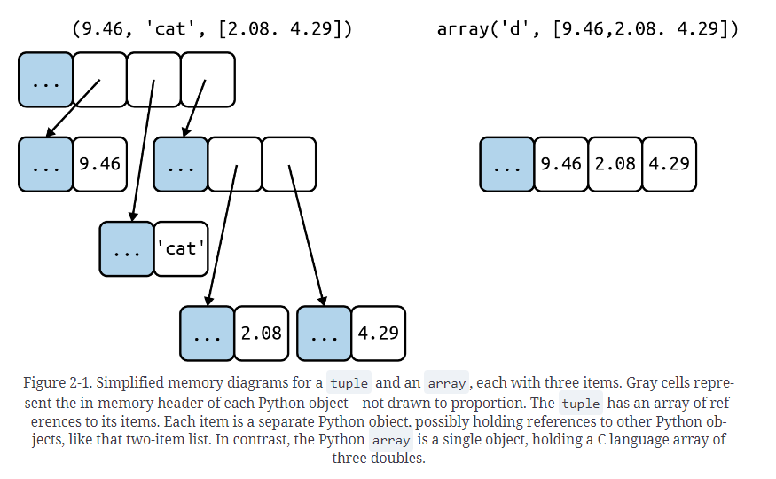
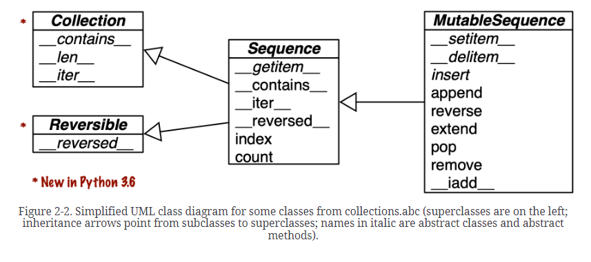
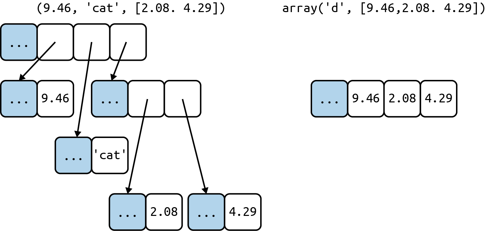

title:: Fluent Python Chapter2: An Array of Sequences

- # Chapter 2. An Array of Sequences
- ## Overview of Built-In Sequences
- Container vs Flat:
	- *Container sequences*
		- types:
			- `list`
			- `tuple`
			- `collections.deque`
		- ==Container holds reference to the objects it contains==
	- *Flat sequences*
		- types:
			- `str`
			- `bytes`
			- `array.array`
		- Stores the values of its contents. So the memory is more compact, but they are limited to holding primitive machine values like bytes, integers, and floats.
	- 
	- Python object memory has header with metadata, for example float has two meta data filed:
		- `ob_refcnt` : the object’s reference count
		- `ob_type` : a pointer to the object’s type
		- `ob_fval` : a C `double` holding the value of the `float`
	-
- Mutable and immutable sequences
	- *Mutable Sequences*
		- `list`
		- `bytearrray`
		- `array.array`
		- `collection.deque`
	- *Immutable Sequences*
		- `tuple`
		- `str`
		- `bytes`
	-
	- 
- ## List Comprehensions and Generator Expressions
- short for:
	- list comprehension --> listcomps
	- generator expression --> genexps
-
- ### List Comprehensions and Readability
	- what is list comprehension? #card
	  card-last-interval:: 4.75
	  card-repeats:: 1
	  card-ease-factor:: 2.36
	  card-next-schedule:: 2023-02-08T03:13:53.605Z
	  card-last-reviewed:: 2023-02-03T09:13:53.605Z
	  card-last-score:: 3
		- Do
			- ```python
			  >>> symbols = '$¢£¥€¤'
			  >>> codes = [ord(symbol) for symbol in symbols]
			  >>> codes
			  [36, 162, 163, 165, 8364, 164]
			  ```
		- Instead of:
			- ```python
			  >>> symbols = '$¢£¥€¤'
			  >>> codes = []
			  >>> for symbol in symbols:
			  ...     codes.append(ord(symbol))
			  ...
			  >>> codes
			  [36, 162, 163, 165, 8364, 164]
			  ```
	- Syntax tip:
		- In Python code, **line breaks are ignored inside pairs of `[]` , `{}` , or `()`** . So you can build multiline lists, listcomps, tuples, dictionaries, etc., without using the `\` line continuation escape, which doesn’t work if you accidentally type a space after it.
		- Also, when those delimiter pairs are used to define a literal with a comma-separated series of items, a trailing comma will be ignored. So, for example, when coding a multiline list literal, it is **thoughtful to put a comma after the last item**, making it a little easier for the next coder to add one more item to that list, and reducing noise when reading diffs.
	- What is walrus operator? #card
	  card-last-interval:: -1
	  card-repeats:: 1
	  card-ease-factor:: 2.5
	  card-next-schedule:: 2023-02-03T16:00:00.000Z
	  card-last-reviewed:: 2023-02-03T09:09:19.812Z
	  card-last-score:: 1
		- `:=`
			- `print(num := 15)# 15`
			- `print(num = 15)# TypeError`
			- nicely explained:
				- https://towardsdatascience.com/the-walrus-operator-in-python-a315e4f84583
	- Local scope within comprehensions and generator expressions
		- ```python
		  >>> x = 'ABC'
		  >>> codes = [ord(x) for x in x]
		  >>> x
		  'ABC'
		  >>> codes
		  [65, 66, 67]
		  >>> codes = [last := ord(c) for c in x]
		  >>> last
		  67
		  >>> c
		  Traceback (most recent call last):
		    File "<stdin>", line 1, in <module>
		  NameError: name 'c' is not defined
		  ```
- ### Listcomps Versus map and filter
	- Same functionality achieved by map and filter vs list comp
		- ```python
		  >>> symbols = '$¢£¥€¤'
		  >>> beyond_ascii = [ord(s) for s in symbols if ord(s) > 127]
		  >>> beyond_ascii
		  [162, 163, 165, 8364, 164]
		  >>> beyond_ascii = list(filter(lambda c: c > 127, map(ord, symbols)))
		  >>> beyond_ascii
		  [162, 163, 165, 8364, 164]
		  ```
	- What is map in python? #card
	  card-last-interval:: 4.75
	  card-repeats:: 1
	  card-ease-factor:: 2.36
	  card-next-schedule:: 2023-02-08T03:09:57.562Z
	  card-last-reviewed:: 2023-02-03T09:09:57.563Z
	  card-last-score:: 3
		- **map()** function returns a map object(which is an iterator) of the results after applying the given function to each item of a given iterable (list, tuple etc.)
		- ```python
		  # Python program to demonstrate working
		  # of map.
		  
		  # Return double of n
		  def addition(n):
		  	return n + n
		  
		  # case1
		  # We double all numbers using map()
		  numbers = (1, 2, 3, 4)
		  result = map(addition, numbers)
		  print(list(result))
		  >>> [2, 4, 6, 8]
		  
		  # case2
		  # Double all numbers using map and lambda
		  numbers = (1, 2, 3, 4)
		  result = map(lambda x: x + x, numbers)
		  print(list(result))
		  >>> [2, 4, 6, 8]
		  
		  # case3
		  # List of strings
		  l = ['sat', 'bat', 'cat', 'mat']
		    
		  # map() can listify the list of strings individually
		  test = list(map(list, l))
		  print(test)
		  >>> [['s', 'a', 't'], ['b', 'a', 't'], ['c', 'a', 't'], ['m', 'a', 't']]
		  ```
	- What is filter in python? #card
	  card-last-interval:: 4.75
	  card-repeats:: 1
	  card-ease-factor:: 2.36
	  card-next-schedule:: 2023-02-08T03:03:00.202Z
	  card-last-reviewed:: 2023-02-03T09:03:00.202Z
	  card-last-score:: 3
		- The filter() method filters the given sequence with the help of a function that tests each element in the sequence to be true or not.
		- ```python
		  # a list contains both even and odd numbers.
		  seq = [0, 1, 2, 3, 5, 8, 13]
		  
		  # result contains odd numbers of the list
		  result = filter(lambda x: x % 2 != 0, seq)
		  print(list(result))
		  
		  # result contains even numbers of the list
		  result = filter(lambda x: x % 2 == 0, seq)
		  print(list(result))
		  >>> [1, 3, 5, 13]
		  >>> [0, 2, 8]
		  ```
- ### Cartesian Products 笛卡尔积
	- ```python
	  >>> colors = ['black', 'white']
	  >>> sizes = ['S', 'M', 'L']
	  >>> tshirts = [(color, size) for color in colors for size in sizes]
	  >>> tshirts
	  [('black', 'S'), ('black', 'M'), ('black', 'L'), ('white', 'S'),
	   ('white', 'M'), ('white', 'L')]
	  >>> for color in colors:
	  ...     for size in sizes:
	  ...         print((color, size))
	  ...
	  ('black', 'S')
	  ('black', 'M')
	  ('black', 'L')
	  ('white', 'S')
	  ('white', 'M')
	  ('white', 'L')
	  >>> tshirts = [(color, size) for size in sizes
	  ...                          for color in colors]
	  >>> tshirts
	  [('black', 'S'), ('white', 'S'), ('black', 'M'), ('white', 'M'),
	   ('black', 'L'), ('white', 'L')]
	  ```
- ### Generator Expressions
  id:: 63d53216-ed96-4f95-b47f-27593cf325b4
	- ==Potentially save memory especially when the sequence is super huge.==
	- To initialize tuples, arrays, and other types of sequences, you could also start from a listcomp, but a genexp (generator expression) saves memory because it **yields items one by one using the iterator protocol instead of building a whole list just to feed another constructor.**
	- What is generator expression using tuple? #card
	  card-last-interval:: 4.75
	  card-repeats:: 2
	  card-ease-factor:: 2.36
	  card-next-schedule:: 2023-02-08T03:16:36.479Z
	  card-last-reviewed:: 2023-02-03T09:16:36.479Z
	  card-last-score:: 3
		- ((63d53216-ed96-4f95-b47f-27593cf325b4))
	- #### Example 2-5. Initializing a tuple and an array from a generator expression
		- ```python
		  >>> symbols = '$¢£¥€¤'
		  >>> tuple(ord(symbol) for symbol in symbols) 
		  (36, 162, 163, 165, 8364, 164)
		  >>> import array
		  >>> array.array('I', (ord(symbol) for symbol in symbols))
		  array('I', [36, 162, 163, 165, 8364, 164])
		  ```
	- #### Example 2-6. Cartesian product 笛卡尔积 in a generator expression
		- ```python
		  >>> colors = ['black', 'white']
		  >>> sizes = ['S', 'M', 'L']
		  >>> for tshirt in (f'{c} {s}' for c in colors for s in sizes):  
		  ...     print(tshirt)
		  ...
		  black S
		  black M
		  black L
		  white S
		  white M
		  white L
		  ```
		- The generator expression yields items one by one; a list with all six T-shirt variations is never produced in this example.
- ## Tuples Are Not Just Immutable Lists
- ### Tuples as Records
	- Tuple can be used as records.
	- _ can be used as a dummy variable. This is just a strange but valid variable name.
	- When should we use _ in python? #card
	  card-last-interval:: 4.75
	  card-repeats:: 2
	  card-ease-factor:: 2.36
	  card-next-schedule:: 2023-02-08T03:17:10.863Z
	  card-last-reviewed:: 2023-02-03T09:17:10.863Z
	  card-last-score:: 3
		- In general, using `_` as a dummy variable is just a convention. It’s just a strange but valid variable name. However, in a `match/case` statement, `_` is a wildcard that matches any value but is not bound to a value. See[“Pattern Matching with Sequences”](https://learning.oreilly.com/library/view/fluent-python-2nd/9781492056348/ch02.html#sequence_patterns_sec). And in the Python console, the result of the preceding command is assigned to `_` —unless the result is `None` .
		- ```
		  >>> 5
		  5
		  >>> _
		  5
		  ```
	-
- ### Tuples as Immutable Lists
	- tuple instead of list, two benefit:
		- Clarity:
			- When you see a `tuple` in code, you know its length will never change.
		- Performance:
			- A `tuple` uses less memory than a `list` of the same length, and it allows Python to do some optimizations.
			- Why is tuple use less memory than list? #card
			  card-last-interval:: 4.75
			  card-repeats:: 2
			  card-ease-factor:: 2.36
			  card-next-schedule:: 2023-02-08T03:17:53.219Z
			  card-last-reviewed:: 2023-02-03T09:17:53.219Z
			  card-last-score:: 3
				- > In Python, tuples are allocated large blocks of memory with lower overhead, since they are immutable; whereas for lists, small memory blocks are allocated. Between the two, tuples have smaller memory. This helps in making tuples faster than lists when there are a large number of elements.
				- https://www.upgrad.com/blog/list-vs-tuple/#:~:text=algorithms%20free%20course!-,Size,a%20large%20number%20of%20elements.
	- The content of the tuple is immutable, but that only means the reference held by the tuple will always point to  the same object. But if one of the referenced objects is mutable. The content might change.
		- ```python
		  >>> a = (10, 'alpha', [1, 2])
		  >>> b = (10, 'alpha', [1, 2])
		  >>> a == b
		  True
		  >>> b[-1].append(99)
		  >>> a == b
		  False
		  >>> b
		  (10, 'alpha', [1, 2, 99])
		  ```
	- We can not convert tuple to hash if tuple contains mutable objects:
		- ```python
		  >>> def fixed(o):
		  ...     try:
		  ...         hash(o)
		  ...     except TypeError:
		  ...         return False
		  ...     return True
		  ...
		  >>> tf = (10, 'alpha', (1, 2))
		  >>> tm = (10, 'alpha', [1, 2])
		  >>> fixed(tf)
		  True
		  >>> fixed(tm)
		  False
		  ```
		- Can we change the tuple element when it contains mutable element like a list? #card
		  card-last-interval:: 4.75
		  card-repeats:: 2
		  card-ease-factor:: 2.36
		  card-next-schedule:: 2023-02-08T03:17:47.158Z
		  card-last-reviewed:: 2023-02-03T09:17:47.159Z
		  card-last-score:: 3
			- Yes, we can. Tuple only contains the reference to the object. But this is a design issue with python and we shouldn't do this. This will also raise ValueError.
		- Are tuples more efficient than list in python? #card
		  card-last-interval:: -1
		  card-repeats:: 1
		  card-ease-factor:: 2.5
		  card-next-schedule:: 2023-02-03T16:00:00.000Z
		  card-last-reviewed:: 2023-02-03T09:09:50.665Z
		  card-last-score:: 1
			- To evaluate a tuple literal, the Python compiler generates bytecode for a tuple constant in one operation; but for a list literal, the generated bytecode pushes each element as a separate constant to the data stack, and then builds the list.
			- Given a tuple `t` , `tuple(t)` simply returns a reference to the same `t` . There’s no need to copy. In contrast, given a list `l` , the `list(l)` constructor must create a new copy of `l` .
			- Because of its fixed length, a `tuple` instance is allocated the exact memory space it needs. Instances of `list` , on the other hand, are allocated with room to spare, to amortize the cost of future appends.
			- The references to the items in a tuple are stored in an array in the tuple struct, while a list holds a pointer to an array of references stored elsewhere. The indirection is necessary because when a list grows beyond the space currently allocated, Python needs to reallocate the array of references to make room. The extra indirection makes CPU caches less effective.
- ### Comparing Tuple and List Methods
	- `tuple` supports all `list` methods that do not involve adding or removing items, with one exception— `tuple` lacks the `__reversed__` method. However, that is just for optimization; `reversed(my_tuple)` works without it.
	- What does python `reversed` or `__reversed__` method do? #card
	  card-last-interval:: 4.75
	  card-repeats:: 1
	  card-ease-factor:: 2.36
	  card-next-schedule:: 2023-02-08T03:11:24.356Z
	  card-last-reviewed:: 2023-02-03T09:11:24.356Z
	  card-last-score:: 3
		- The `reversed()` method computes the reverse of a given sequence object and returns it in the form of a list.
		- reversed actually return the build-in object of type list, so we still need to use list() to get the value
		- ```python
		  seq_string = 'Python'
		  
		  # reverse of a string
		  print(list(reversed(seq_string)))
		  
		  # Output: ['n', 'o', 'h', 't', 'y', 'P']
		  ```
- ## Unpacking Sequences and Iterables
	- unpacking works with any iterable object as the data source—including iterators, which don’t support index notation ([])
	- How is * used in unpacking iterable? #card
	  card-last-interval:: 4.14
	  card-repeats:: 1
	  card-ease-factor:: 2.6
	  card-next-schedule:: 2023-02-07T12:07:08.413Z
	  card-last-reviewed:: 2023-02-03T09:07:08.413Z
	  card-last-score:: 5
		- ```python
		  >>> divmod(20, 8)
		  (2, 4)
		  >>> t = (20, 8)
		  >>> divmod(*t)
		  (2, 4)
		  >>> quotient, remainder = divmod(*t)
		  >>> quotient, remainder
		  (2, 4)
		  ```
	- What can we get from the code below:
	  card-last-interval:: 4.14
	  card-repeats:: 1
	  card-ease-factor:: 2.6
	  card-next-schedule:: 2023-02-07T12:11:02.058Z
	  card-last-reviewed:: 2023-02-03T09:11:02.058Z
	  card-last-score:: 5
	  ```python
	  >>> import os
	  >>> _, filename = os.path.split('/home/luciano/.ssh/id_rsa.pub')
	  >>> filename
	  ``` 
	  #card
		- ```
		  'id_rsa.pub'
		  ```
		- `os.path.split` would split the filename and the preceding path before the filename
- ### Using * to Grab Excess Items
	- How is * used in grad excess items? #card
	  card-last-interval:: 4.75
	  card-repeats:: 1
	  card-ease-factor:: 2.36
	  card-next-schedule:: 2023-02-08T03:12:22.759Z
	  card-last-reviewed:: 2023-02-03T09:12:22.760Z
	  card-last-score:: 3
		- How is * used in unpacking iterable? #card
		  card-last-interval:: 4.75
		  card-repeats:: 1
		  card-ease-factor:: 2.36
		  card-next-schedule:: 2023-02-08T03:08:04.038Z
		  card-last-reviewed:: 2023-02-03T09:08:04.042Z
		  card-last-score:: 3
			- ```python
			  >>> a, b, *rest = range(5)
			  >>> a, b, rest
			  (0, 1, [2, 3, 4])
			  >>> a, b, *rest = range(3)
			  >>> a, b, rest
			  (0, 1, [2])
			  >>> a, b, *rest = range(2)
			  >>> a, b, rest
			  (0, 1, [])
			  ```
			- * can appear in any position of the parallel assignment
			  ```python
			  >>> a, *body, c, d = range(5)
			  >>> a, body, c, d
			  (0, [1, 2], 3, 4)
			  >>> *head, b, c, d = range(5)
			  >>> head, b, c, d
			  ([0, 1], 2, 3, 4)
			  ```
- ### Unpacking with * in Function Calls and Sequence Literals
	- * can be used to un-pack the iterable and used in function calls
	- What does the following code print? 
	  card-last-interval:: 4.75
	  card-repeats:: 1
	  card-ease-factor:: 2.36
	  card-next-schedule:: 2023-02-08T03:16:33.866Z
	  card-last-reviewed:: 2023-02-03T09:16:33.867Z
	  card-last-score:: 3
	  ```python
	  >>> def fun(a, b, c, d, *rest):
	  ...     return a, b, c, d, rest
	  ...
	  >>> fun(*[1, 2], 3, *range(4, 7))
	  ```
	  #card
		- ```python
		  (1, 2, 3, 4, (5, 6))
		  # see also
		  >>> *range(4), 4
		  (0, 1, 2, 3, 4)
		  >>> [*range(4), 4]
		  [0, 1, 2, 3, 4]
		  >>> {*range(4), 4, *(5, 6, 7)}
		  {0, 1, 2, 3, 4, 5, 6, 7}
		  ```
- ### Nested Unpacking
	- What is nested un-packing? #card
	  card-last-interval:: 4.75
	  card-repeats:: 1
	  card-ease-factor:: 2.36
	  card-next-schedule:: 2023-02-08T03:12:25.669Z
	  card-last-reviewed:: 2023-02-03T09:12:25.669Z
	  card-last-score:: 3
		- ```python
		  metro_areas = [
		      ('Tokyo', 'JP', 36.933, (35.689722, 139.691667)),
		      ('Delhi NCR', 'IN', 21.935, (28.613889, 77.208889)),
		      ('Mexico City', 'MX', 20.142, (19.433333, -99.133333)),
		      ('New York-Newark', 'US', 20.104, (40.808611, -74.020386)),
		      ('São Paulo', 'BR', 19.649, (-23.547778, -46.635833)),
		  ]
		  
		  def main():
		      print(f'{"":15} | {"latitude":>9} | {"longitude":>9}')
		      for name, _, _, (lat, lon) in metro_areas:
		          if lon <= 0:
		              print(f'{name:15} | {lat:9.4f} | {lon:9.4f}')
		  
		  if __name__ == '__main__':
		      main()
		  ```
- ## Pattern Matching with Sequences
- **Note: This feature is in python 3.10**
	- What is PEP stands for? #card
	  collapsed:: true
	  card-last-interval:: 4.75
	  card-repeats:: 1
	  card-ease-factor:: 2.36
	  card-next-schedule:: 2023-02-08T03:07:27.424Z
	  card-last-reviewed:: 2023-02-03T09:07:27.425Z
	  card-last-score:: 3
		- Python Enhancement Proposals:
			- This PEP contains the index of all Python Enhancement Proposals, known as PEPs. PEP numbers are[assigned](https://peps.python.org/pep-0001#pep-editors)by the PEP editors, and once assigned are never changed.
		- Famous PEP: PEP20, the zen of python
			- ```
			  Beautiful is better than ugly.
			  Explicit is better than implicit.
			  Simple is better than complex.
			  Complex is better than complicated.
			  Flat is better than nested.
			  Sparse is better than dense.
			  Readability counts.
			  Special cases aren't special enough to break the rules.
			  Although practicality beats purity.
			  Errors should never pass silently.
			  Unless explicitly silenced.
			  In the face of ambiguity, refuse the temptation to guess.
			  There should be one-- and preferably only one --obvious way to do it.
			  Although that way may not be obvious at first unless you're Dutch.
			  Now is better than never.
			  Although never is often better than *right* now.
			  If the implementation is hard to explain, it's a bad idea.
			  If the implementation is easy to explain, it may be a good idea.
			  Namespaces are one honking great idea -- let's do more of those!
			  ```
	- What is the core idea of the zen of python and how should this help me programming? #card
	  collapsed:: true
	  card-last-interval:: 4.75
	  card-repeats:: 1
	  card-ease-factor:: 2.36
	  card-next-schedule:: 2023-02-08T03:07:31.688Z
	  card-last-reviewed:: 2023-02-03T09:07:31.688Z
	  card-last-score:: 3
		- https://inventwithpython.com/blog/2018/08/17/the-zen-of-python-explained/
- ## Slicing
- Iterator and iterable in python
  collapsed:: true
	- What is the difference between iterable and iterator in python? #card
	  collapsed:: true
	  card-last-interval:: 4.75
	  card-repeats:: 1
	  card-ease-factor:: 2.36
	  card-next-schedule:: 2023-02-08T03:13:42.535Z
	  card-last-reviewed:: 2023-02-03T09:13:42.536Z
	  card-last-score:: 3
		- It will be easier to understand the concept of Python list generators if you get the idea of iterables and iterators.
		  Iterable is a “sequence”of data, you can iterate over using a loop. The easiest visible example of iterable can be a list of integers – [1, 2, 3, 4, 5, 6, 7]. However, it’s possible to iterate over other types of data like strings, dicts, tuples, sets, etc.
		  Basically, any object that has `iter()` method can be used as an iterable. You can check it using `hasattr()` function in the interpreter.
		  
		  ```
		  >>> hasattr(str, '__iter__')
		  True
		  >>> hasattr(bool, '__iter__')
		  False
		  ```
		  
		  Iterator protocol is implemented whenever you iterate over a sequence of data. For example, when you use a for loop the following is happening on a background:
		- first `iter()` method is called on the object to convert it to an iterator object.
		- `next()` method is called on the iterator object to get the next element of the sequence.
		- `StopIteration` exception is raised when there are no elements left to call.
		  
		  ```
		  >>> simple_list = [1, 2, 3]
		  >>> my_iterator = iter(simple_list)
		  >>> print(my_iterator)
		  <list_iterator object at 0x7f66b6288630>
		  >>> next(my_iterator)
		  1
		  >>> next(my_iterator)
		  2
		  >>> next(my_iterator)
		  3
		  >>> next(my_iterator)
		  Traceback (most recent call last):
		  File "<stdin>", line 1, in <module>
		  StopIteration
		  ```
	- Is range a iterator? #card
	  collapsed:: true
	  card-last-interval:: -1
	  card-repeats:: 1
	  card-ease-factor:: 2.5
	  card-next-schedule:: 2023-02-03T16:00:00.000Z
	  card-last-reviewed:: 2023-02-03T09:11:29.967Z
	  card-last-score:: 1
		- The range object is iterable. However, it's not an iterator.
	- Does filter return iterator? #card
	  collapsed:: true
	  card-last-interval:: 4.75
	  card-repeats:: 1
	  card-ease-factor:: 2.36
	  card-next-schedule:: 2023-02-08T03:12:16.796Z
	  card-last-reviewed:: 2023-02-03T09:12:16.796Z
	  card-last-score:: 3
		- Yes, `filter()` returns an iterator that yields items on demand just like a generator expression does. Python iterators are known to be memory efficient. That’s why `filter()` now returns an iterator instead of a list.
		- Also map return iterator.
		- ```python
		  >>> numbers = [1, 3, 10, 45, 6, 50]
		  >>> # Filtering function
		  >>> def is_even(x):
		  ...     return x % 2 == 0
		  ...
		  >>> # Use filter()
		  >>> even_numbers = filter(is_even, numbers)
		  >>> even_numbers
		  <filter object at 0x7f58691de4c0>
		  >>> list(even_numbers)
		  [10, 6, 50]
		  >>> # Use a generator expression
		  >>> even_numbers = (number for number in numbers if is_even(number))
		  >>> even_numbers
		  <generator object <genexpr> at 0x7f586ade04a0>
		  >>> list(even_numbers)
		  [10, 6, 50]
		  ```
	- Fastest way to get the values from a iterator? #card
	  collapsed:: true
	  card-last-interval:: 4.75
	  card-repeats:: 1
	  card-ease-factor:: 2.36
	  card-next-schedule:: 2023-02-08T03:08:17.209Z
	  card-last-reviewed:: 2023-02-03T09:08:17.209Z
	  card-last-score:: 3
		- by type constructor
		   `list(my_iterator)`
		- by unpacking
		   `[*my_iterator]`
		- using list comprehension
		   `[e for e in my_iterator]`
		-
- ### Why Slices and Ranges Exclude the Last Item #card
  card-last-interval:: 4.75
  card-repeats:: 1
  card-ease-factor:: 2.36
  card-next-schedule:: 2023-02-08T03:12:36.372Z
  card-last-reviewed:: 2023-02-03T09:12:36.372Z
  card-last-score:: 3
	- The Pythonic convention of excluding the last item in slices and ranges works well with the zero-based indexing used in Python
	- It’s easy to see the length of a slice or range when only the stop position is given: `range(3)` and `my_list[:3]` both produce three items.
	- It’s easy to compute the length of a slice or range when start and stop are given: just subtract `stop - start` .
	- It’s easy to split a sequence in two parts at any index `x` , without overlapping: simply get `my_list[:x]` and `my_list[x:]` . For example:
	  
	  ```
	  >>> l = [10, 20, 30, 40, 50, 60]
	  >>> l[:2]  # split at 2
	  [10, 20]
	  >>> l[2:]
	  [30, 40, 50, 60]
	  >>> l[:3]  # split at 3
	  [10, 20, 30]
	  >>> l[3:]
	  [40, 50, 60]
	  ```
- ### Slice Objects
	- What does a:b:c do when used in slicing objects? #card
	  card-last-interval:: 4.75
	  card-repeats:: 1
	  card-ease-factor:: 2.36
	  card-next-schedule:: 2023-02-08T03:11:59.628Z
	  card-last-reviewed:: 2023-02-03T09:11:59.628Z
	  card-last-score:: 3
		- `s[a:b:c]` can be used to specify a stride or step `c` , causing the resulting slice to skip items.
		- Special case, c=-1 to reverse iterate the iterable
		- ```python
		  >>> s = 'bicycle'
		  >>> s[::3]
		  'bye'
		  >>> s[::-1]
		  'elcycib'
		  >>> s[::-2]
		  'eccb'
		  ```
- ### Multidimensional Slicing and Ellipsis
	- The [] operator can take multiple indexes separated by comma. The `__getitem__` and `__setitem__` special methods that handle the `[]` operator simply receive the indices in `a[i, j]` as a tuple. In other words, to evaluate `a[i, j]` , Python calls `a.__getitem__((i, j))` .
	-
		- DONE Answer this question
		  :LOGBOOK:
		  CLOCK: [2023-01-31 Tue 16:08:37]
		  CLOCK: [2023-01-31 Tue 16:08:39]
		  :END:
	- What does the ellipsis stands for in python and where can we use it? #card
	  collapsed:: true
	  card-last-interval:: 4.75
	  card-repeats:: 1
	  card-ease-factor:: 2.36
	  card-next-schedule:: 2023-02-08T03:13:46.707Z
	  card-last-reviewed:: 2023-02-03T09:13:46.707Z
	  card-last-score:: 3
		- It is an alias to the `Ellipsis` object, the single instance of the `ellipsis` class.
		- [ellipsis explained by real python](https://realpython.com/python-ellipsis/#:~:text=In%20Short%3A%20Use%20the%20Ellipsis%20as%20a%20Placeholder%20in%20Python,-While%20you%20can&text=That%20means%20you%20can%20use,parts%20of%20your%20code%20online.)
		- 1. Used in slicing numpy array.
			- As such, it can be passed as an argument to functions and as part of a slice specification, as in `f(a, ..., z)` or `a[i:...]` . NumPy uses `...` as a shortcut when slicing arrays of many dimensions; for example, if `x` is a four-dimensional array, `x[i, ...]` is a shortcut for `x[i, :, :, :,]` .
			- ```
			  >>> arr[..., 0]
			  >>> arr[0,...,1]
			  ```
		- 2. As placeholder in python
			- Similar like pass
				- ```
				  # ellipsis_example.py
				  
				  def do_nothing():
				      ...
				  
				  do_nothing()
				  ```
		- 3. Used in type hint
			- ```python
			  # tuple_example.py
			  # this line got issue in python 3.9
			  numbers: tuple[int, ...]
			  
			  # Allowed:
			  numbers = ()
			  numbers = (1,)
			  numbers = (4, 5, 6, 99)
			  
			  # Not allowed:
			  numbers = (1, "a")
			  numbers = [1, 3]
			  ```
			- See also:
			- ```python
			  from typing import Callable
			  
			  def add_one(i: int) -> int:
			      return i + 1
			  
			  def multiply_with(x: int, y: int) -> int:
			      return x * y
			  
			  def as_pixels(i: int) -> str:
			      return f"{i}px"
			  
			  def calculate(i: int, action: Callable[..., int], *args: int) -> int:
			      return action(i, *args)
			  
			  # Works:
			  calculate(1, add_one)
			  calculate(1, multiply_with, 3)
			  
			  # Doesn't work:
			  calculate(1, 3)
			  # this won't trigger error but will have warning by the IDE
			  calculate(1, as_pixels)
			  ```
	- What will happen when using slice notation on the left side of the assignment statement? #card
	  card-last-interval:: 4.75
	  card-repeats:: 1
	  card-ease-factor:: 2.36
	  card-next-schedule:: 2023-02-08T03:11:37.985Z
	  card-last-reviewed:: 2023-02-03T09:11:37.985Z
	  card-last-score:: 3
		- ```python
		  >>> l = list(range(10))
		  >>> l
		  [0, 1, 2, 3, 4, 5, 6, 7, 8, 9]
		  >>> l[2:5] = [20, 30]
		  >>> l
		  >>> l[3::2] = [11, 22]
		  >>> l
		  [0, 1, 20, 11, 5, 22, 9]
		  ```
	- What is the requirement for the right hand object when the target of assignment is a slice? #card
	  card-last-interval:: 4.75
	  card-repeats:: 1
	  card-ease-factor:: 2.36
	  card-next-schedule:: 2023-02-08T03:16:30.475Z
	  card-last-reviewed:: 2023-02-03T09:16:30.475Z
	  card-last-score:: 3
	  ```python
	  [0, 1, 20, 11, 5, 22, 9]
	  >>> l[2:5] = 100
	  ```
	  and 
	  ```python
	  >>> l[2:5] = [100]
	  ```
		- ```python
		  Traceback (most recent call last):
		    File "<stdin>", line 1, in <module>
		  TypeError: can only assign an iterable
		  ```
		- and
		- ```python
		  >>> l
		  [0, 1, 100, 22, 9]
		  ```
	- What will happen when using slice as the target of del statement? #card
	  card-last-interval:: 4.75
	  card-repeats:: 1
	  card-ease-factor:: 2.36
	  card-next-schedule:: 2023-02-08T03:11:54.533Z
	  card-last-reviewed:: 2023-02-03T09:11:54.533Z
	  card-last-score:: 3
		- ```python
		  [0, 1, 20, 30, 5, 6, 7, 8, 9]
		  >>> del l[5:7]
		  >>> l
		  [0, 1, 20, 30, 5, 8, 9]
		  ```
- ## Using + and * with Sequences
	- What will happen if initialize by `my_list = [[]] * 3`? #card
	  card-last-interval:: 4.75
	  card-repeats:: 1
	  card-ease-factor:: 2.36
	  card-next-schedule:: 2023-02-08T03:02:42.972Z
	  card-last-reviewed:: 2023-02-03T09:02:42.973Z
	  card-last-score:: 3
		- ==Beware of expressions like `a * n` when `a` is a sequence containing mutable items, because the result may surprise you.==
		- That will result in a list with three references to the same inner list
		- DONE Any deeper reason to this
		  :LOGBOOK:
		  CLOCK: [2023-02-02 Thu 21:26:22]--[2023-02-02 Thu 21:31:11] =>  00:04:49
		  :END:
			- If either the problem or the solution in this section is not clear to you, relax.[Chapter 6](https://learning.oreilly.com/library/view/fluent-python-2nd/9781492056348/ch06.html#mutability_and_references)was written to clarify the mechanics and pitfalls of references and mutable objects.
		- ```python
		  >>> a = [[]] * 3 #same with 3*[[]]
		  >>> a[0].append(1)
		  >>> a
		  [[1],[1],[1]]
		  ```
	- DONE Checkout the pitfall of using [] for list initialization
	  :LOGBOOK:
	  CLOCK: [2023-02-02 Thu 20:50:40]
	  CLOCK: [2023-02-02 Thu 20:50:46]--[2025-01-07 Tue 15:38:28] =>  16914:47:42
	  :END:
- ### Building Lists of Lists
	- What is the best way to initialize a list of list? #card
	  card-last-interval:: 4.14
	  card-repeats:: 1
	  card-ease-factor:: 2.6
	  card-next-schedule:: 2023-02-07T12:05:35.131Z
	  card-last-reviewed:: 2023-02-03T09:05:35.132Z
	  card-last-score:: 5
		- By list comprehension
		- ```python
		  >>> board = [['_'] * 3 for i in range(3)]  1
		  >>> board
		  [['_', '_', '_'], ['_', '_', '_'], ['_', '_', '_']]
		  >>> board[1][2] = 'X'  2
		  >>> board
		  [['_', '_', '_'], ['_', '_', 'X'], ['_', '_', '_']]
		  ```
		- This is the same as:
			- ```python
			  >>> board = []
			  >>> for i in range(3):
			  ...     row = ['_'] * 3
			  ...     board.append(row)
			  ...
			  >>> board
			  [['_', '_', '_'], ['_', '_', '_'], ['_', '_', '_']]
			  >>> board[2][0] = 'X'
			  >>> board
			  [['_', '_', '_'], ['_', '_', '_'], ['X', '_', '_']]
			  ```
	- Why is equivilant for the following code: #card
	  card-last-interval:: 4.75
	  card-repeats:: 1
	  card-ease-factor:: 2.36
	  card-next-schedule:: 2023-02-08T03:14:06.876Z
	  card-last-reviewed:: 2023-02-03T09:14:06.877Z
	  card-last-score:: 3
	  ```python
	  >>> weird_board = [['_'] * 3] * 3
	  >>> weird_board
	  [['_', '_', '_'], ['_', '_', '_'], ['_', '_', '_']]
	  >>> weird_board[1][2] = 'O'
	  >>> weird_board
	  [['_', '_', 'O'], ['_', '_', 'O'], ['_', '_', 'O']]
	  ```
		-
			- ```python
			  row = ['_'] * 3
			  board = []
			  for i in range(3):
			      board.append(row)
			  ```
- ### Augmented Assignment with Sequences
	- What is the special method for `+=`? #card
	  card-last-interval:: -1
	  card-repeats:: 1
	  card-ease-factor:: 2.5
	  card-next-schedule:: 2023-02-03T16:00:00.000Z
	  card-last-reviewed:: 2023-02-03T09:03:06.852Z
	  card-last-score:: 1
		- ``__iadd__`` for inplace addition. However, if `__iadd__` is not implemented, Python falls back to calling `__add__` . Consider this simple expression:
	- What happens to `a` after calling `a+=b`? The change happen inplace or create new object? #card
	  card-last-interval:: 4.75
	  card-repeats:: 1
	  card-ease-factor:: 2.36
	  card-next-schedule:: 2023-02-08T03:12:10.040Z
	  card-last-reviewed:: 2023-02-03T09:12:10.040Z
	  card-last-score:: 3
		- one-liner:
			- Mutable sequence -> Inplace change
			- Immutable sequence -> same as `a=a+b`, evaluate `a+b` and assign to a as a new object
		- If `a` implements `__iadd__` , that will be called. In the case of mutable sequences (e.g., `list` , `bytearray` , `array.array` ), `a` will be changed in place (i.e., the effect will be similar to `a.extend(b)` ). However, when `a` does not implement `__iadd__` , the expression `a += b` has the same effect as `a = a + b` : the expression `a + b` is evaluated first, producing a new object, which is then bound to `a` . In other words, the identity ofthe objectbound to `a` may or may not change, depending on the availability of `__iadd__` .
		- A demonstration of the address of applying `+=` to different objects
		- ```python
		  >>> l = [1, 2, 3]
		  >>> id(l)
		  4311953800  1
		  >>> l *= 2
		  >>> l
		  [1, 2, 3, 1, 2, 3]
		  >>> id(l)
		  4311953800  2
		  >>> t = (1, 2, 3)
		  >>> id(t)
		  4312681568  3
		  >>> t *= 2
		  >>> id(t)
		  4301348296
		  ```
	- Why is `+=` for immutable sequences inefficient?
		- Because that would always trigger copy of the whole target to create new ones.
- ## A += Assignment Puzzler
	- Try to answer without using the console: what is the result of evaluating the two expressions in[Example 2-16](https://learning.oreilly.com/library/view/fluent-python-2nd/9781492056348/ch02.html#ex_aug_item_assign_question)? #card
	  card-last-interval:: 4.14
	  card-repeats:: 1
	  card-ease-factor:: 2.6
	  card-next-schedule:: 2023-02-07T12:06:20.803Z
	  card-last-reviewed:: 2023-02-03T09:06:20.804Z
	  card-last-score:: 5
	  ```
	  >>> t = (1, 2, [30, 40])
	  >>> t[2] += [50, 60]
	  ```
		- What happens next? Choose the best answer:
			- `t` becomes `(1, 2, [30, 40, 50, 60])` .
			- `TypeError` is raised with the message `'tuple' object does not support item assignment` .
			- Neither.
			- Both A and B.
		- The answer is D
			- ```
			  >>> t = (1, 2, [30, 40])
			  >>> t[2] += [50, 60]
			  Traceback (most recent call last):
			    File "<stdin>", line 1, in <module>
			  TypeError: 'tuple' object does not support item assignment
			  >>> t
			  (1, 2, [30, 40, 50, 60])
			  ```
- ## list.sort Versus the sorted Built-In
	- What would `list.sort` return after applied to a list?
		- one-liner:
			- None since it is in place modification
		- The `list.sort` method sorts a list in place—that is, without making a copy. It returns `None` to remind us that it changes the receiver and does not create a new list. This is an important Python API convention: functions or methods that change an object in place should return `None` to make it clear to the caller that the receiver was changed, and no new object was created.
	- What would built-in function `sorted` return?
		- Creates a new list and returns it regardless of the type of iterable given
- ## When a List Is Not the Answer
	- What data structure instead of `list` should you use when you have millions of floating point values? #card
	  card-last-interval:: 4.75
	  card-repeats:: 1
	  card-ease-factor:: 2.36
	  card-next-schedule:: 2023-02-08T03:07:42.153Z
	  card-last-reviewed:: 2023-02-03T09:07:42.153Z
	  card-last-score:: 3
		- `array`
	- What data structure instead of `list` should you use when constantly adding and removing item from the opposite end of the list? #card
	  card-last-interval:: 4.14
	  card-repeats:: 1
	  card-ease-factor:: 2.6
	  card-next-schedule:: 2023-02-07T12:11:09.792Z
	  card-last-reviewed:: 2023-02-03T09:11:09.792Z
	  card-last-score:: 5
		- using `deque` for more efficient FIFO structure.
	- What data structure instead of list should you use when constantly checking if item is present in a collection? e.g. `item in my_collection` #card
	  card-last-interval:: 4.14
	  card-repeats:: 1
	  card-ease-factor:: 2.6
	  card-next-schedule:: 2023-02-07T12:13:27.216Z
	  card-last-reviewed:: 2023-02-03T09:13:27.216Z
	  card-last-score:: 5
		- `set`. iterable but not sequences since the order is unspecified.
- ### Arrays
	- What is a python array? #card
	  card-last-interval:: 4.75
	  card-repeats:: 1
	  card-ease-factor:: 2.36
	  card-next-schedule:: 2023-02-08T03:07:20.223Z
	  card-last-reviewed:: 2023-02-03T09:07:20.224Z
	  card-last-score:: 3
		- one-liner:
			- Array is single object holding the packed bytes representing their machine values
			- Array is ==fast.==
		- 
		- Simplified memory diagrams for a `tuple` and an `array`, each with three items. Gray cells represent the in-memory header of each Python object—not drawn to proportion. The `tuple` has an array of references to its items. Each item is a separate Python object, possibly holding references to other Python objects, like that two-item list. In contrast, the Python `array` is a single object, holding a C language array of three doubles.
		- ```python
		  >>> from array import array
		  >>> from random import random
		  >>> floats = array('d', (random() for i in range(10**7)))
		  >>> floats[-1]
		  0.07802343889111107
		  >>> fp = open('floats.bin', 'wb')
		  >>> floats.tofile(fp)
		  >>> fp.close()
		  >>> floats2 = array('d')
		  >>> fp = open('floats.bin', 'rb')
		  >>> floats2.fromfile(fp, 10**7)
		  >>> fp.close()
		  >>> floats2[-1]
		  0.07802343889111107
		  >>> floats2 == floats
		  True
		  ```
- ## Memory Views
	- When should a `memoryview` be used? #card
	  card-last-interval:: 4.75
	  card-repeats:: 1
	  card-ease-factor:: 2.36
	  card-next-schedule:: 2023-02-08T03:11:47.409Z
	  card-last-reviewed:: 2023-02-03T09:11:47.409Z
	  card-last-score:: 3
		- > A memoryview is essentially a generalized NumPy array structure in Python itself (without the math). It allows you to share memory between data-structures (things like PIL images, SQLite databases, NumPy arrays, etc.) without first copying. This is very important for large data sets.
	- What does `memoryview.cast` do? #card
	  card-last-interval:: 4.75
	  card-repeats:: 1
	  card-ease-factor:: 2.36
	  card-next-schedule:: 2023-02-08T03:03:13.618Z
	  card-last-reviewed:: 2023-02-03T09:03:13.618Z
	  card-last-score:: 3
		- `memoryview.cast` method lets you change the way multiple bytes are read or written as units without moving bits around. `memoryview.cast` returns yet another `memoryview` object, always sharing the same memory.
		- ```python
		  >>> from array import array
		  >>> octets = array('B', range(6))
		  >>> m1 = memoryview(octets)
		  >>> m1.tolist()
		  [0, 1, 2, 3, 4, 5]
		  >>> m2 = m1.cast('B', [2, 3]) 
		  >>> m2.tolist()
		  [[0, 1, 2], [3, 4, 5]]
		  >>> m3 = m1.cast('B', [3, 2]) 
		  >>> m3.tolist()
		  [[0, 1], [2, 3], [4, 5]]
		  >>> m2[1,1] = 22
		  >>> m3[1,1] = 33
		  >>> octets
		  array('B', [0, 1, 2, 33, 22, 5])
		  ```
		- `memory.cast` can also be used to corrupt
		- ```python
		  >>> numbers = array.array('h', [-2, -1, 0, 1, 2])
		  >>> memv = memoryview(numbers) 
		  >>> len(memv)
		  5
		  >>> memv[0] 
		  -2
		  >>> memv_oct = memv.cast('B') 
		  >>> memv_oct.tolist() 
		  [254, 255, 255, 255, 0, 0, 1, 0, 2, 0]
		  >>> memv_oct[5] = 4
		  >>> numbers
		  array('h', [-2, -1, 1024, 1, 2])
		  ```
	-
- ### Deques and Other Queues
	- Why is `list` `.pop(0)` is not that efficient? #card
	  card-last-interval:: 4.75
	  card-repeats:: 1
	  card-ease-factor:: 2.36
	  card-next-schedule:: 2023-02-08T03:13:16.044Z
	  card-last-reviewed:: 2023-02-03T09:13:16.045Z
	  card-last-score:: 3
		- Inserting and removing from the head of a list (the 0-index end) is costly because the entire list must be shifted in memory.
	- What is `collections.deque`in python? #card
	  card-last-interval:: 4.75
	  card-repeats:: 1
	  card-ease-factor:: 2.36
	  card-next-schedule:: 2023-02-08T03:12:28.761Z
	  card-last-reviewed:: 2023-02-03T09:12:28.762Z
	  card-last-score:: 3
		- The class `collections.deque` is a thread-safe double-ended queue designed for fast inserting and removing from both ends.
		- `deque` can create a sequence with fixed max length.
		- ```python
		  >>> from collections import deque
		  >>> dq = deque(range(10), maxlen=10)
		  >>> dq
		  deque([0, 1, 2, 3, 4, 5, 6, 7, 8, 9], maxlen=10)
		  >>> dq.rotate(3)
		  >>> dq
		  deque([7, 8, 9, 0, 1, 2, 3, 4, 5, 6], maxlen=10)
		  >>> dq.rotate(-4)
		  >>> dq
		  deque([1, 2, 3, 4, 5, 6, 7, 8, 9, 0], maxlen=10)
		  >>> dq.appendleft(-1)
		  >>> dq
		  deque([-1, 1, 2, 3, 4, 5, 6, 7, 8, 9], maxlen=10)
		  >>> dq.extend([11, 22, 33])
		  >>> dq
		  deque([3, 4, 5, 6, 7, 8, 9, 11, 22, 33], maxlen=10)
		  >>> dq.extendleft([10, 20, 30, 40])
		  >>> dq
		  deque([40, 30, 20, 10, 3, 4, 5, 6, 7, 8], maxlen=10)
		  ```
- ## Summary
	- What is a quick way to check if a `tuple` contains mutable objects? #card
	  card-last-interval:: 4.75
	  card-repeats:: 1
	  card-ease-factor:: 2.36
	  card-next-schedule:: 2023-02-08T03:08:41.950Z
	  card-last-reviewed:: 2023-02-03T09:08:41.951Z
	  card-last-score:: 3
		- Calling `hash(t)` on a `tuple` is a quick way to assert that its value is fixed. A `TypeError` will be raised if t contains mutable items.
	-