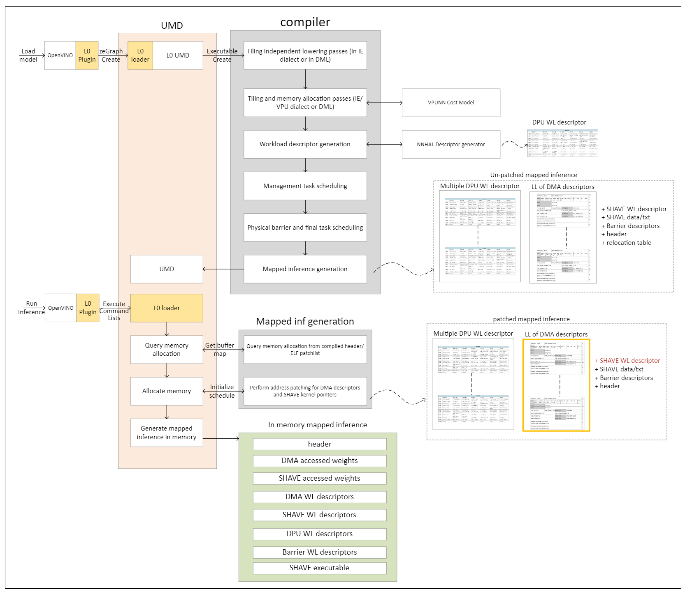
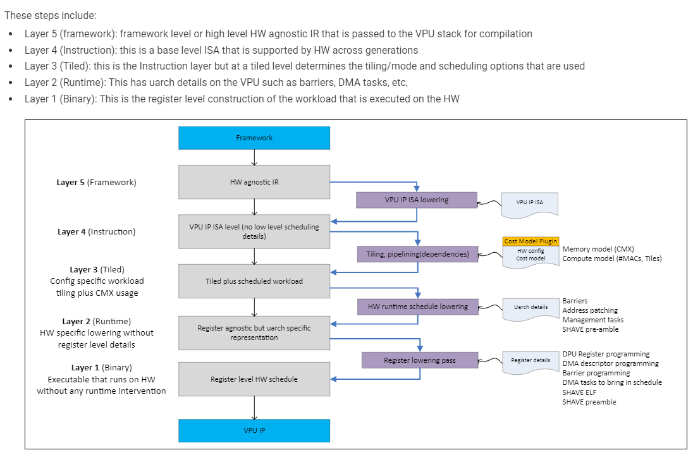
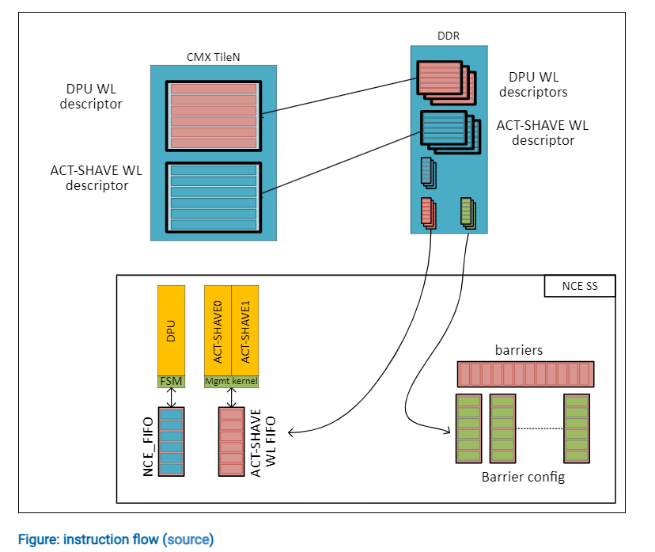
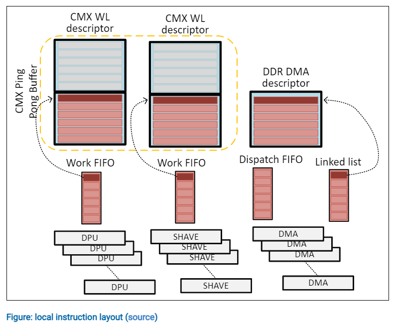
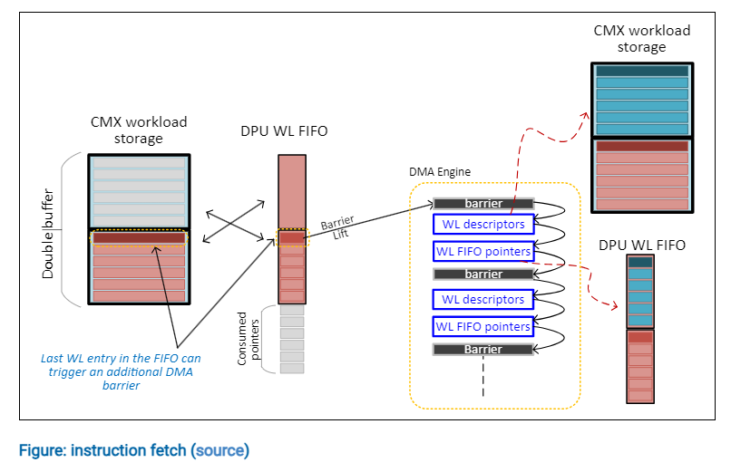
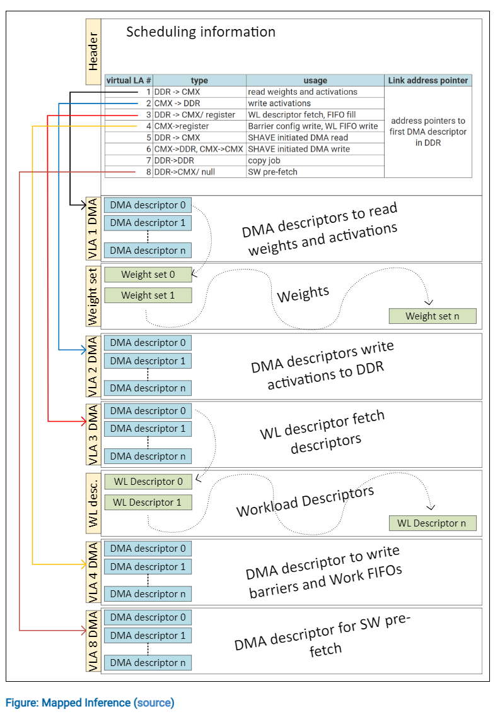

- 
- 
- 最终在VPU上执行的图的结构有两种表示，一种是在Disk上的表示，一种是在DDR上的表示。
	- Disk上的表示是ELF的格式，是一个单个的binary文件。
		- **Graph header**
			- 一些必要的信息，跟nbperf类似
		- **Layer 2-4 High-Level ISA**
			- 硬件无关的抽象，map to l4/l3 in Nbperf
		- **SHAVE Kernel ELF(s)**
			- 编译完成的可执行文件，可以给到VPU的shave执行
		- **Weights**
			- Might be compressed, relayed out, re-ordered. Shave can sometimes directly access that.
	- In memory 的表示是为了submit到VPU的一种格式。
- ### Compiler Lowering steps
	- 
	- #### Layer 5 - Framework
		- ##### 'IE' Dialect
	- #### Layer 4 - Instruction
		- The Instruction/VPU ISA is meant to be a cross generational instruction set that represents the operations and fusions that have HW acceleration supported. A simple example is Conv + Bias + ReLU + quantize are supported in a single pipeline in the DPU plus PPE. This level of ISA is not expected to be able to map directly how it would run on HW.
		- 
		- ##### Layer 4 passes
			- convert average pool to DW convolution
			- convert scale shift to DW convolution
			- fuse ReLU and PReLU with convolution (fuse post ops)
			- fuse quantize and dequantize with convolution and elementwise add
			- convert matmul to convolution
			- fuse permute and transpose with convolution and elementwise add
			- fuse gather with convolution
			- implicit concat
		- ##### Low precision pipeline
	- #### Layer 3 - Tiled
		- ##### layer 3 passes
			- Scheduling and tiling specific operations:
				- split strategy
				- weight and activation streaming
				- weight pre-fetch
				- SHAVE and DPU pipelining
				- vertical fusion
				- weight sparsity
				- activation sparsity
				- BTC compression
		- ##### Weight and activation swizzling
			- 
	- #### Layer 2: Low level workload scheduling ([[workload management]] [[management tasks]] )
		- The VPU isn't able to autonomously do instruction fetch in the HW, and therefore these functions need to be scheduled. This portion of the compilation step covers how the workload will actually run on the VPU. This will perform such operations as instruction fetch (WL management), barrier assignment, etc.
		- **instruction fetch**
			- In order to execute instructions on the DPU, SHAVE and DMA, instructions need to be fetched from DDR. The way those instructions are consumed depends on the unit they are mapped to:
			- 
			- The following scheduling tasks are expected to be executed from the compiler:
				- allocate ping pong buffers in CMX for SHAVE WL descriptors and DPU WL descriptors
				- ==generate DMA tasks to bring in WLs from DDR into CMX for DPU and SHAVE==
				- ==generate DMA tasks to bring in WL FIFO pointers from DDR into the FIFO==
					- {:height 411, :width 761}
			- 基本上就是通过DMA的task把workload搬到CMX，然后把WL fifo pointer搬到FIFO。
			- 
			- Workload和Workload Fifo的对应关系，其中DPU和Shave的workload descriptor是通过DMA搬运到CMX的，而DMA和barrier的descriptor是直接从DDR读到FIFOs/registers。
			- {:height 666, :width 791}
			- 对于DPU/Shave的Instruction或者workload 是怎么被fetch到CMX的呢？
			- 
			- Runtime workload management
			  id:: 664df44c-c864-4e05-b364-1e6cf309ffbb
				- 流程是：
					- 先有一个DMA task去搬运meta data到CMX （这里用的是dedicated [[link agents]]）
					- 触发DMA ISR中断，然后Runtime lift barrier
					- 然后Runtime enqueue workload pointer到对应的WL FIFO。
		- **Instruction dispatch**
			- 
			- DPU 用Shave nn 从WL FIFO中获取WL ptr。
			- DMA是linked agent。
	- #### Layer 1 Binary: Immutable [[Mapped Inference]]
		- The machine ISA/Immutable mapped inference is a compiler generated schedule that can execute a network on the VPU with no additional processing by either the Compiler or within the FW. It is expected to contain DMA descriptor programming, ACT-SHAVE runtime instructions and DPU register level details to be programmed in by SHAVENN/DPU FSM. The in-memory representation will only be accessed by the DMA engine (except for the header) and therefore is only required to be within the 38 bit address space.
		- **Mapped Inference Includes**: To be read by and executed by the nnRT:
			- program DMA engine with linked DMA descriptor to program the barriers
			- program the DMA engine linked list with descriptor pointers to the start of the linked list
			- for the weights/activation DMA LA program the DMA dispatch FIFO with links to the input DMA LL, pointer to LL of DMA operations to bring in weights and activations, pointer to LL of operations to write out the outputs
		- 
		- ##### DPU Workload descriptor definition [[variants and invariants]]
			- 
-