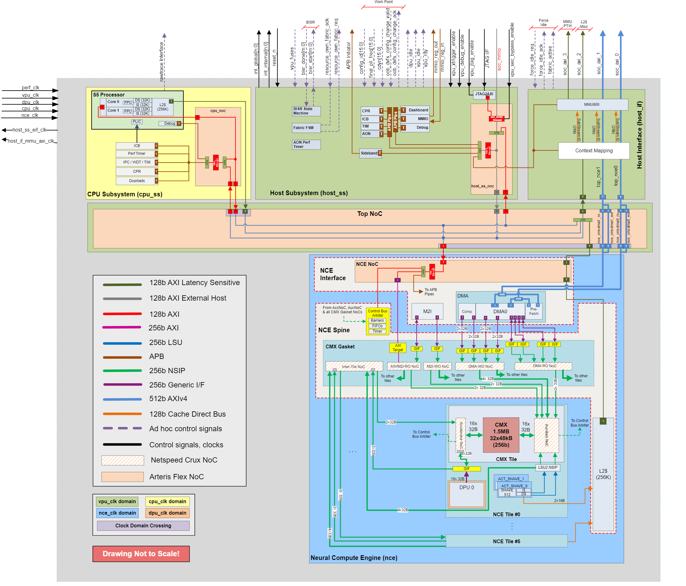
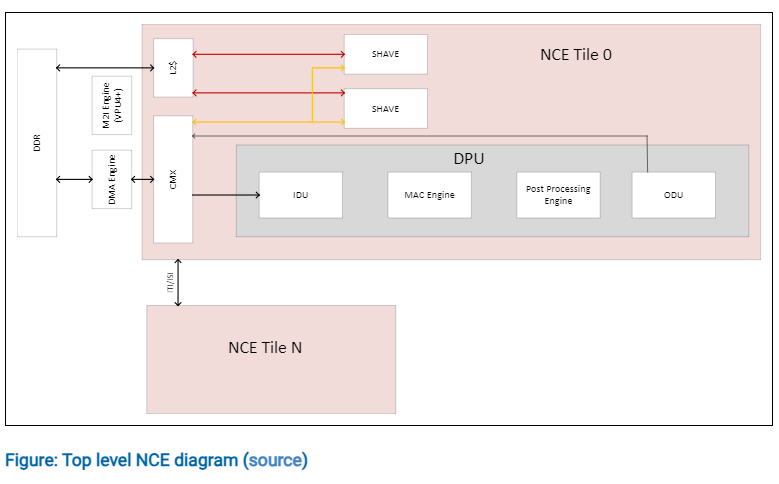
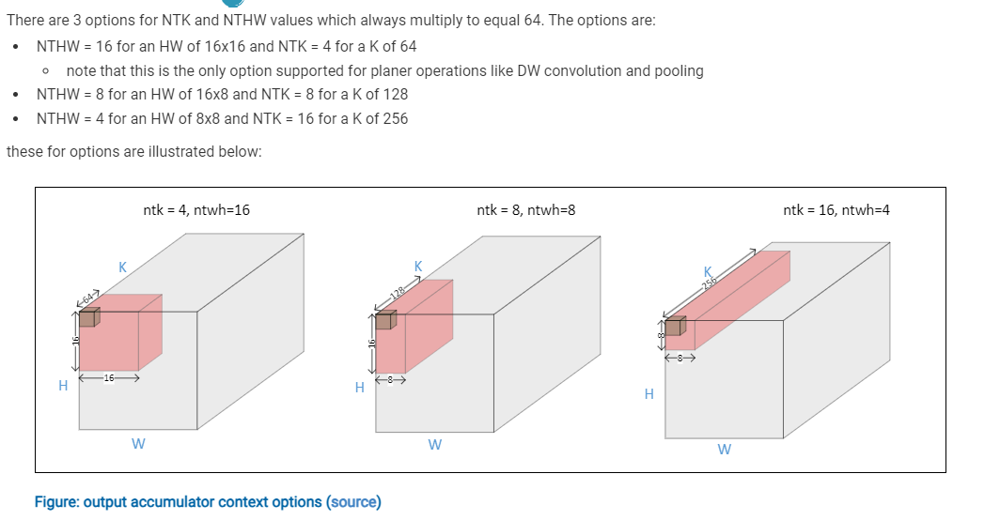
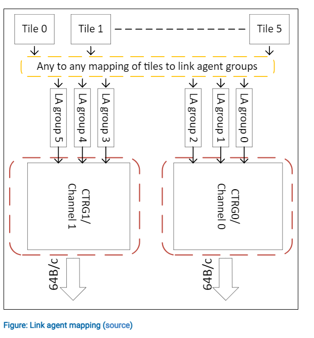
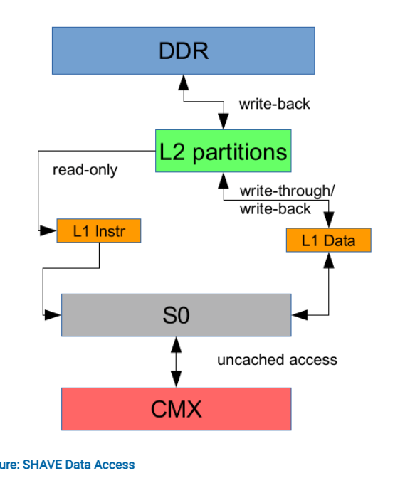
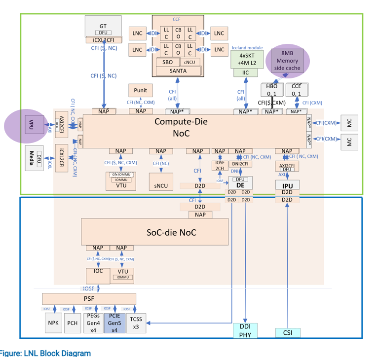

- {:height 630, :width 633}
- {:height 673, :width 778}
- ### NCE Compute Architecture
	- 
-
- ### VPU4 DPU
	- #### main changes:
		- [[SHAVENN]] has been replaced with a Finite state machine ([[FSM]])
		- reading from adjacent tiles is not supported anymore due to the NoC latency increase (2->6 tiles)
		- CMX per tile is reduced from 2MB to 1.5MB
		- Splitting now supports SoH (split over height) and SoW (split over width)
	- #### DPU compute stencil
		- Add 8 input adder tree in the C dimension on top of KMB, results in 8x speed up in compute
		- In VPU2.7 this was increased to 2048 MAC/c for int8 and 1024 Mac/c for FP16.
		- MTL/LNL int8 stencil hwkc= 4x4x16x8 with 64 accumulator contexts (4x16, 8x8, 16x4)
	- #### [[Accumulator contexts]]
		- [reduce accumulator context analysis for VPU5](https://intel-my.sharepoint.com/:p:/r/personal/xu_qian_intel_com/Documents/Reducing%20accumulator%20Context%20Analysis%20for%20VPU5.pptx?d=w14b2efeeab724bfbbc2fa213570d0705&csf=1&web=1&e=bWp4Uv)
		- 
	- #### [[Convolution continue]]
		- keep the accumulator context in accumulator and run multiple workloads (OFRF of PPE?)
		- Note:
			- a workload size cannot exceed the accumulator sizes listed above
		- scenarios:
			- when the kernel size or channel size exceeds what is supported by the HW (11x11 kernel size, 8192 channel size).
	- #### VPU4 DPU [[FSM]]
		- [[ShaveNN]] 在VPU4里面是一个[[Finite state machine]]。主要起到的作用是：
			- 从workload [[FIFO]]里面对应的workload的指针，其中这些指针指到CMX上的某一个workload descriptor。
			- 从CMX里面读workload descriptor，注意这里的顺序，是先读workload ptr，然后从指针的位置读workload的descriptor。然后检查对应的workload的barrier。
			- 如果barrier计数已经满足，那么把workload descriptor里面的variant 和invariant的ptr读出来，并且根据这些数值填写对应的DPU的register。
			- 在这个workload执行完成之后，写对应的barrier。让producer是当前workload的barrier技术减一。
			- 另外还有一些对于[[preemption]]的处理。。
	- #### VPU4 [[DPU registers]] [[variants and invariants]]
		- 其实就对应了workload descriptor里面的一些参数。workload size，workload start xyz，odu te xyz，还有一些addr/ppe的设置等等。
		- 
		- 
		- 
- ### M2I
- ### CMX [[DMA Engine]]
	- CMX的DMA engine就在CMX和NOC之间。支持下面几种数据传输的模式：
		- Copy weights and activations from DDR -> CMX
		- Copy activations from CMX -> DDR
		- Fetch [[WL descriptor]]s from DDR into CMX
		- ==Fetch [[FIFO]] entries from DDR and program into FIFO registers==
		- perform reshape operations
		- convert from tile to planar format
		- perform scatter/gather operations
		- perform data conversion (such as FP32 to FP16, etc)
		- Erase memory
		- page table pre-fetch into MMU TLB
	- #### DMA descriptor
	  id:: 663b0a87-fe80-46bb-b796-1abfe1bd168f
		- Job Descriptors are stored in memory and [[CDMA]] is provided with an address pointer to them. Multiple Descriptors can by chained together to form a Job Linked-List. ==CDMA will go through the list one descriptor at time and fetch, process and execute all descriptors in the linked list.==
		- FW will use the link agents FIFOs in order to submit jobs to the DMA engine.
	- #### [[Link Agents]]
		- Link Agents (LA) are the means by which software can initiate a DMA transaction.
		- Each LA ==implements a FIFO, 8 entries deep.== This allows software to queue up jobs one after another.
			- A linked list of descriptors if pushed will be fully completed before the next in the FIFO is executed.
			- Each entry in the FIFO can belong to different contexts.
	- #### DMA engine feature support
		- Summarizing the link agent support between VPU2.7 and VPU4:
			- in VPU2.7 there are 9 link agents per DMA engine for a total of 18 link agents
			- From VPU4 there is only a single DMA engine but there are 6 link agents per tile plus a pre-fetch link agent
		- VPU4 [[link agents]]:
			- Link agent 接受一个指向一个link list的pointer，然后DMA engine就发起一个read去获取descriptor，以及descriptor相关的数据。在获取整个descriptor之后，看有没有barrier block当前的任务，如果没有，就把当前的任务发送到对应的channel。然后读取下一个descriptor。
			- 
			  id:: 663755b4-a753-441a-b351-903483f65f98
		- ##### DMA engine performance
			- In order to get full 128B/clk throughput, 2 parallel jobs need to be scheduled, one in each of the DMA CTRGs.
			- 这个0和3应该就对应了nbperf+vpuem中的port number，因为要用满，所以不在同一个CTRG 中。
			- 
		- {{embed ((65acce80-ccec-45a0-afcc-f7deeec17541))}}
		- [[CMX DMA Controller]]
		- ##### 6D Addressing
		  collapsed:: true
			- ```
			  offset<5,4,3,2,1,0> = 0;
			  for(i5=0;i5<=DESCRIPTOR.SRC_DIM_SIZE[5];i5++) {
			      offset4 = 0
			      for(i4=0;i4<=DESCRIPTOR.RC_DIM_SIZE[4];i4++) {
			          offset3 = 0
			          for(i3=0;i3<=DESCRIPTOR.SRC_DIM_SIZE[3];i3++) {
			              offset2 = 0
			              for(i2=0;i2<=DESCRIPTOR.SRC_DIM_SIZE[2];i2++) {
			                  offset1 = 0
			                  for(i1=0;i1<=DESCRIPTOR.SRC_DIM_SIZE[1];i1++) {
			                      offset0 = 0
			                      for(i0=0;i0<=DESCRIPTOR.SRC_WIDTH;i0++) {
			                          Do_memory_access(SRC_ADDR + sum(offset<5,4,3,2,1,0>));
			                          offset0 ++;
			                      }
			                      offset1 += DESCRIPTOR.SRC_STRIDE[1]
			                  }
			                  offset2 += DESCRIPTOR.SRC_STRIDE[2]
			              }
			              offset3 += DESCRIPTOR.SRC_STRIDE[3]
			          }
			          offset4 += DESCRIPTOR.SRC_STRIDE[4]
			      }
			      offset5 += DESCRIPTOR.SRC_STRIDE[5]
			  }
			  ```
- ### Bit Compactor
- ### NN CMX
	- CMX is a SW managed cache local to the NCE
	- [[weight and activation swizzling]]
	- It also contains a small amount of space dedicated to instructions for DPU and SHAVE
- ### HW Execution [[Barriers]]
	- 用于同步task，每一个barrier支持最多256个producers和consumers。因为barrier的硬件资源有限，并且对于复杂网络，barrier的数量显然不足以表示所有的同步信息。所以barrier在inference过程中必须要复用。并且barrier是否被release没有硬件的检查，所以需要compiler或者runtime去保证barrier是safe的。
	- 每个barrier包括：
		- A producer count.
		- A consumer count.
		- A producer count zero hit status.
		- A consumer count zero hit status.
	- barrier的使用过程如下：
		- barrier的producer和consumer数量需要在使用之前从fifo中load。
		- 如果producer的dependency满足，那么就producer count --。
		- 如果producer count到0了，就通知所有的consumer，producer的count到0了。
		- 每个consumer执行的时候把这个barrier的consumer count减一。
		- 当consumer和producer的count都到0了，那么就可以reuse这个barrier。然后从barrier中reload 下一个barrier的config。
	- ##### Barrier FIFO
		- 这个vpu4才加入。原来需要通过DMA或者scheduler来配置。vpu4里面可以提前把barrier load到fifo中。
- ### Activation [[SHAVE]]
	- vpu2p7 vector width: 128 bits
	- vpu4p0 vector width: 512 bits
	- Shave data access:
		- Each SHAVE processor has an L1 cache assigned (separate instruction and data), and share a common L2 cache which can be partitioned. ==L2 and L1 instruction caches accesses to DDR memory only (not CMX)==, while L1 Data caches both DDR and CMX addresses outside of the SHAVE's CMX slice. The L2 cache can be bypassed.
		- 
- ### [[Doorbell]]s and [[Contexts]]
  id:: 65b1b066-80f1-4e93-a24c-e74e39306777
	- Context isolation is a requirement for [[MCDM]] to be able to isolate different contexts from each other. The context isolation is achieved with a combination of HW and SW. ==the [[MMU]] provides context isolation into the DDR.== And within the VPU there will be at a minimum of a single user context and a single global context.
	- doorbell寄存器，用于在有新的job需要submit时候中断VPU。然后保存当前的context，这个是为了多任务的时候preemption使用的。
	- In order to have jobs submitted to the VPU, there will be doorbell registers to interrupt the VPU when a new job is available. The VPU supports up to up to 256 contexts that are queued through the HW doorbells, ==out of which at any given time 2 contexts can run on the NN engine and 1 context on the [[Copy engine]].==
	- To support these contexts ==there is a doorbell assigned to each context==, and the doorbell can be rung directly into the device from the UMD in the case of HW scheduling or the KMD in the case of OS scheduling. ==The doorbell exists as a register in the [[MMIO]] space that is exposed==. In order to support direct HW submission from the Host, a method must be supported to grant and revoke contexts. To support this, a doorbell/context mapping will be implemented.
- ### CPU subsystem
	- #### [[Scheduler CPU]]
		- riskv scheduler similar to previous generation [[LeonRT]]
		- VPU4的 [[Firmware in VPU]] 在一颗risc-v的processor上运行。主要功能包括：
			- Managing the schedule of multiple requests coming from application processes
			- Managing the security requirements for application requests
			- Run-time scheduling of neural inference acceleration
			- Managing the VPU resources
			- Managing the power and performance of VPU HW blocks
			- Handling the exceptions that might occur
			- Profiling, tracing and logging the VPU workloads
		- ##### Interrupts
			- 
- ### Host subsystem
- ### Host interface subsystem
	- #### [[MMU]]
		- MMU: 用于将翻译虚拟地址到主存的实际地址
		- TLB：用于加速虚拟地址到物理地址的转换。TLB存储了最近使用的地址映射，可以在地址转换时快速查找。如果TLB hit，那么直接返回物理地址，如果miss，那么还需要进行更慢的内存操作（到内存中页表检索实际地址）。一种可能的优化时TLB预取，就是基于先前的访问模式，可以主动加载某些地址到TLB中。如果多个MMU的操作对应了一块连续的地址，可以prefetch。
	- #### [[Context]] Mapping Block
		- The ARM MMU and [[IOMMU]] (in VPU4) require a 20 bit [[PASID]] on all addresses to perform process specific address translations. The use of the PASID comes from the PCIe Specification which defines a ==20 bit Process Address Space ID (PASID)==, which uniquely identifies a process address space. The PCIe interface carries the PASID label on all traffic spawned by a given process. Since the VPU cannot execute 2^20 processes simultaneously, there is no need to carry the 20-bit PASID on every transaction within the VPU. Within the VPU the 5 bit VPUSubstreamID is carried, but when presented either to the MMU or IOMMU this ==5-bit VPUSubstream ID needs to be converted to a 20 bit PASID==. This is where the Context mapping block comes into play where it performs the 5 bit to 20 bit conversion.
- ### [[IPC]] and Work [[FIFO]]s
	- There are 4 FIFO blocks in the NCE Subsystem:
		- NCE FIFO block \#0: DPU Descriptors pointers. It can be divided into upto 8 FIFOs (256 entries x 16-bit)
		- NCE FIFO block \#1: Unused. It can be divided unto upto 8 FIFOs (64 entries x 16-bit)
		- NCE FIFO block \#2: Act-Shave IPC FIFO (not recommended). It is by divided into 16 FIFOs (16 entries x 32-bit)
		- NCE FIFO block \#3: Act-Shave workload pointers. It can divided into upto 16 FIFOs (128 entries x 16-bit)
	- DPU和Shave会从FIFO中读下一个执行的descriptor的ptr。写FIFO有两种选项，一种是通过Risk-v，一种是DMA。
- ### [[NoC]] and IP interconnect
	- NoC is a bus that interconnects hardware modules to each other. It is implemented on hardware level and operates autonomously without driver support.
- ### [[Memory Side Cache]]
	- Memory side cache has a total of 8 MB of cache memory, spread across 16 cache ways with each way having 512 KB. Each cache set is of 64 B with a total of 8192 sets, which are addressed bits [19:6] (13 bits) to get 512 KB per way. Of the total 16 ways, certain ways can be reserved for specific IP's. Memory side cache also provides options to share these ways across multiple IPs.
	- 