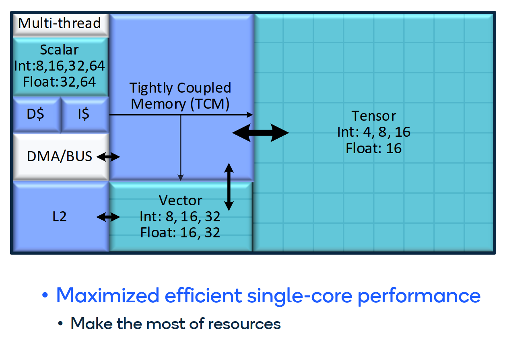
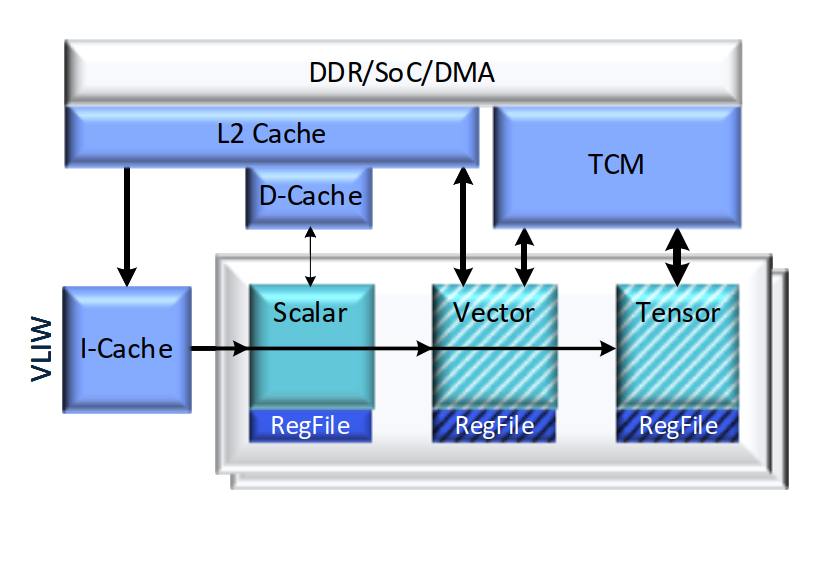
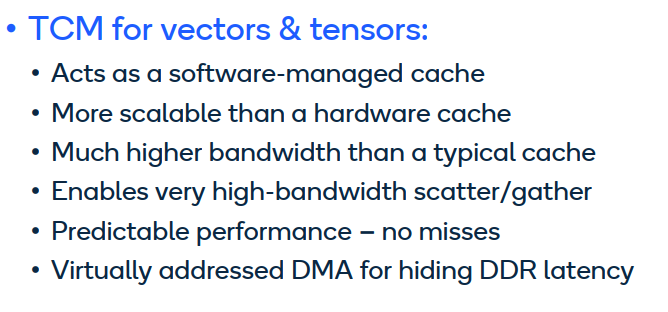
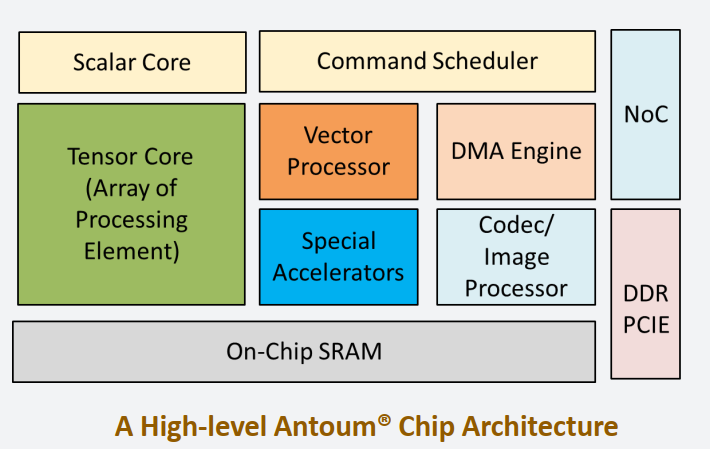
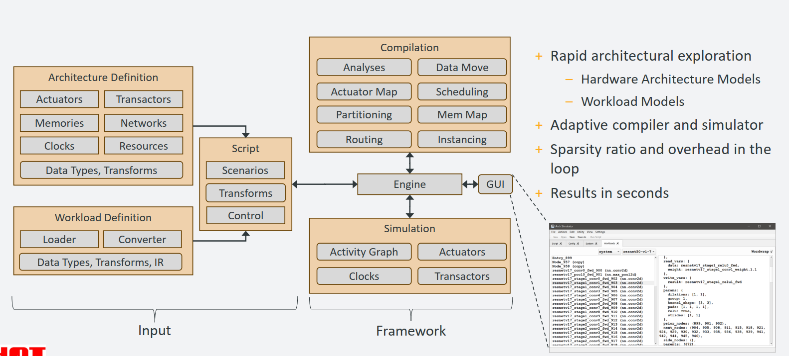
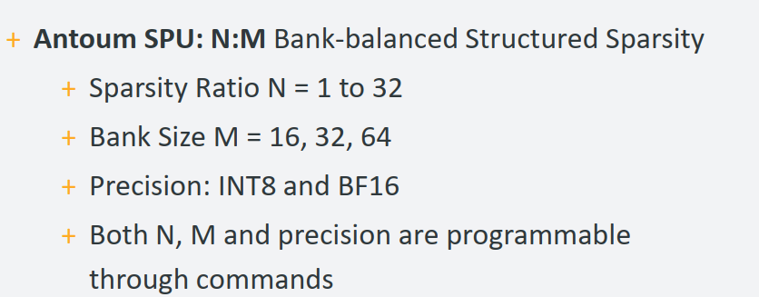
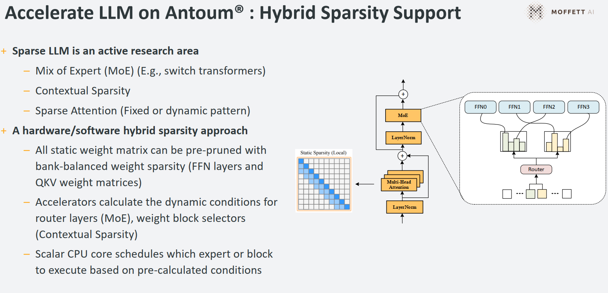
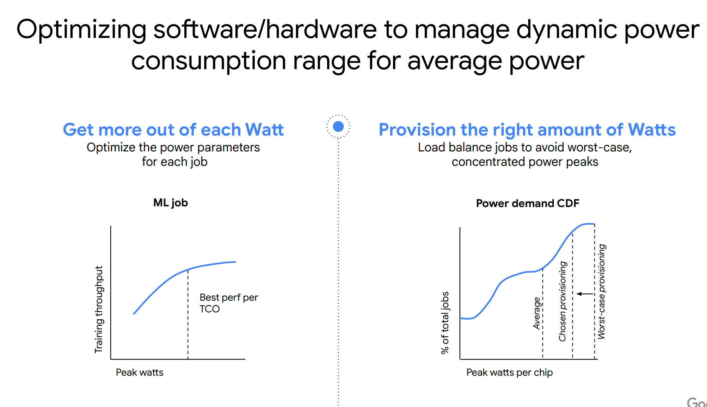

- Hexagon NPU:
  collapsed:: true
	- Key takeaways:
		- Dedicated Scalar instruction set for control flow and general purpose
		- Tensor is the DPU part, Vector is the DSP part, TCM is CMX
			- 
		- Memory model:
			- 
			- 
- Moffett Antoum:
  collapsed:: true
	- 
	- Architecture simulator:
		- {:height 346, :width 807}
		- Sparsity acceleration:
			- The sparsity ratio and bank size is programable
			- 
	- Memory:
		- larger MRM and CMX size than DPU
	- LLM sparsity support in Moffett:
		- 
- Presentation from Jeff Dean
  collapsed:: true
	- Compiler for power of VPU:
		- replace VPUNN cost model with Power cost model, so we know the best selection power wise
			- Tiling strategy
			- Multi-cluster strategy
			- Scheduling
			- *Number of tiles used
	- {:height 437, :width 776}
- Videos:
	- {{video https://www.youtube.com/watch?v=rsxCZAE8QNA&ab_channel=hotchipsvideos}}