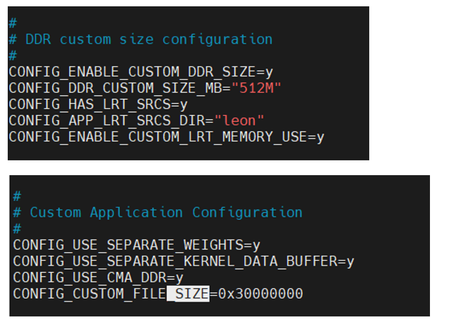

- system preparation
	- ```
	  sudo apt-get install autoconf
	  sudo apt-get install autoconf-archive
	  sudo apt-get install automake
	  sudo apt-get install pkg-config
	  sudo apt-get install autoconf-archive libtool
	  sudo apt-get install flex
	  sudo apt-get install bison
	  ```
- Steps:
	- 1. export GIT_LFS_SKIP_SMUDGE=1 if you don't want git lfs
	  :LOGBOOK:
	  CLOCK: [2024-02-21 Wed 16:06:01]
	  :END:
		- a. If you want git lfs Need to update .lfsconfig following: https://af01p-ir.devtools.intel.com/ui/packages
	- 2. git clone firmware https://github.com/intel-innersource/firmware.vpu.client
	- 3. check vpux-plugin/artifacts/vpuip_2/revisions.json get firmware version. check out to the commit
	- 4. export MV_TOOLS_VERSION='24.02.0-internal' the version is also from vpux-plugin/artifacts/vpuip_2/revisions.json
	- 5. cd ~/WORK/firmware.vpu.client/vpu2/application/vpuFirmware/FW_bootLoader && make getTools
	- 6. rm -rf ./mvbuild
	- 7. git submodule update --init --recursive
	- 8. cd ~/WORK/firmware.vpu.client/vpu2/application/demo/InferenceManagerDemo
	- 9. cp [your_model].blob ~/WORK/firmware.vpu.client/vpu2/application/demo/InferenceManagerDemo/test.blob
	- 10. make run CONFIG_FILE=.config_3720xx.perf srvIP=IRL-MTL-NUC-[Fill IP Number].ger.corp.intel.com srvPort=[30001] -j20
- If you want to run big models:
	- ```rm -rf ./mvbuild
	  make run CONFIG_FILE=.config_3720xx.perf srvIP=IRL-MTL-NUC-230.ger.corp.intel.com srvPort=30201 CONFIG_LOOP_COUNT_OV=20 CUSTOM_RAM_SIZE=0x80000000 CUSTOM_FILE_SIZE=0x20000000
	  ```
	- {:height 461, :width 643}