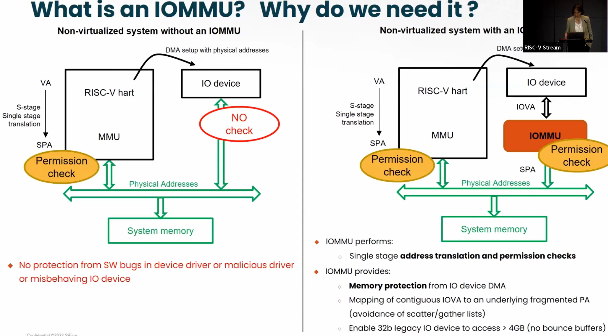
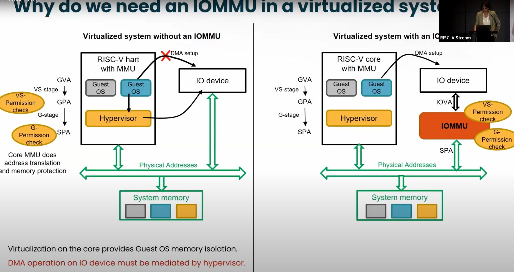

- What is IOMMU and why do we need it?
	- 
- Why do we need an IOMMU in a virtualized system?
	- 
- Answer from Quora:
	- https://www.quora.com/How-does-a-GPU-share-memory-with-a-CPU-How-can-they-access-it-at-the-same-time
	- Recent CPUs with integrated GPUs from both Intel and AMD does support a shared virtual memory address space with hardware enforced coherency across.
	- *For discrete GPUs , this may not be the case and* *I dont know how it is done.*
	- On Intel CPUs with integrated GPUs, they call the concept as “**Shared Virtual Memory**” while AMD calls similar concept as **HUMA (Heterogeneous Unified Memory Architecture**)
	- Prior to this , my understanding is that memory buffers need to be copied back and forth between CPU and GPU memories which were separate by the Graphics driver. With shared memory, this is no longer needed and just pointers to same memory need to be shared by CPU and GPU.
	- 
- ChatGPT explaination:
	- IOMMU stands for Input-Output Memory Management Unit. It's a hardware component used in computer systems that allows the operating system to manage the memory used by input/output (I/O) devices more efficiently and securely. Here’s how it works:
	- **Memory Isolation:** IOMMU provides memory protection and isolation capabilities for the system. It helps prevent malicious or malfunctioning I/O devices from accessing the system memory outside their allocated ranges. This isolation is crucial for ensuring the stability and security of the system.
	- **Address Translation:** Similar to how a CPU's memory management unit (MMU) translates virtual addresses to physical addresses, the IOMMU translates device-visible virtual addresses to physical memory addresses. This capability is especially important when devices need to interact with the memory without CPU intervention.
	- **Support for Virtualization:** IOMMUs are particularly valuable in virtualized environments. They allow virtual machines to access hardware directly in a controlled and isolated manner. This hardware assistance helps in achieving near-native performance for I/O operations in virtualized systems.
	- **DMA (Direct Memory Access) Handling:** IOMMU can control and manage DMA operations, where devices transfer data to and from memory without involving the CPU. By managing DMA through the IOMMU, the system can ensure that devices do not exceed their granted memory access limits.
	- > Overall, the IOMMU enhances the security, stability, and performance of systems, particularly in complex and virtualized environments.
- IOMMU from Microsoft definition:
	- https://learn.microsoft.com/en-us/windows-hardware/drivers/display/iommu-model
- IOMMU introduction:
	- https://terenceli.github.io/%E6%8A%80%E6%9C%AF/2019/08/04/iommu-introduction
	- MMU is used by CPU to translate a virtual address to physical address. The virtual address of MMU is in CPU's view.
	- IOMMU in contrast is used by device to translate another virtual address called IOVA(IO virtual address) to physical address.
	- Following show the basic idea of IOMMU.
		- 
	-