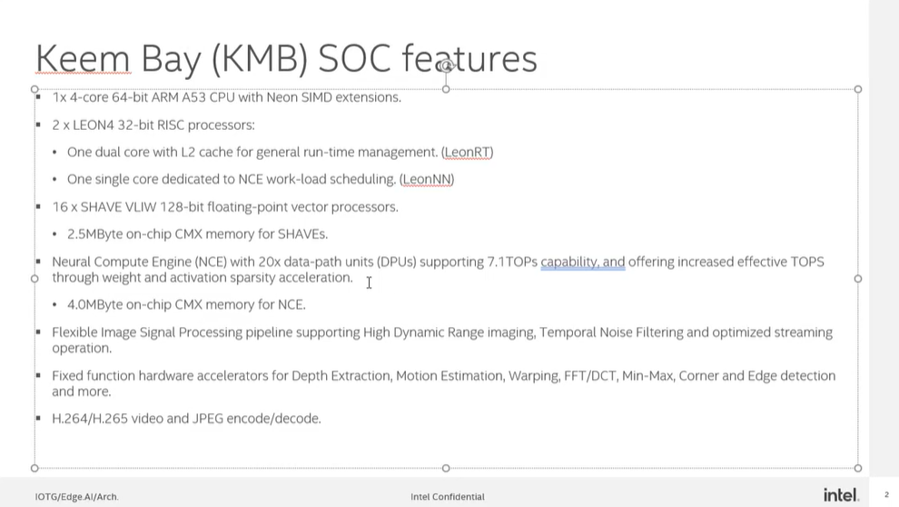
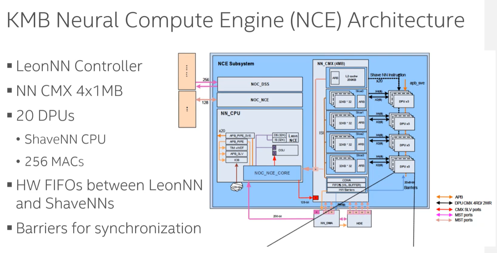
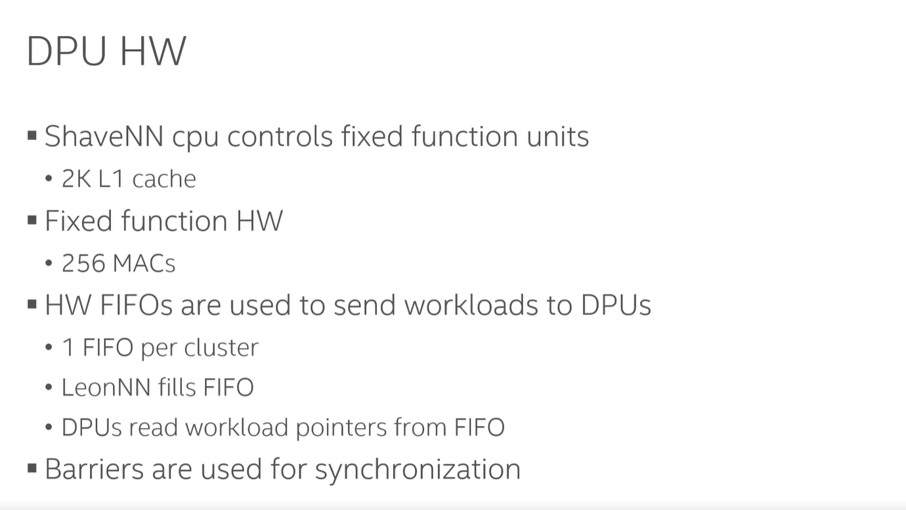
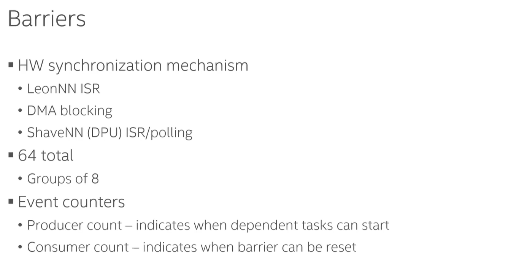
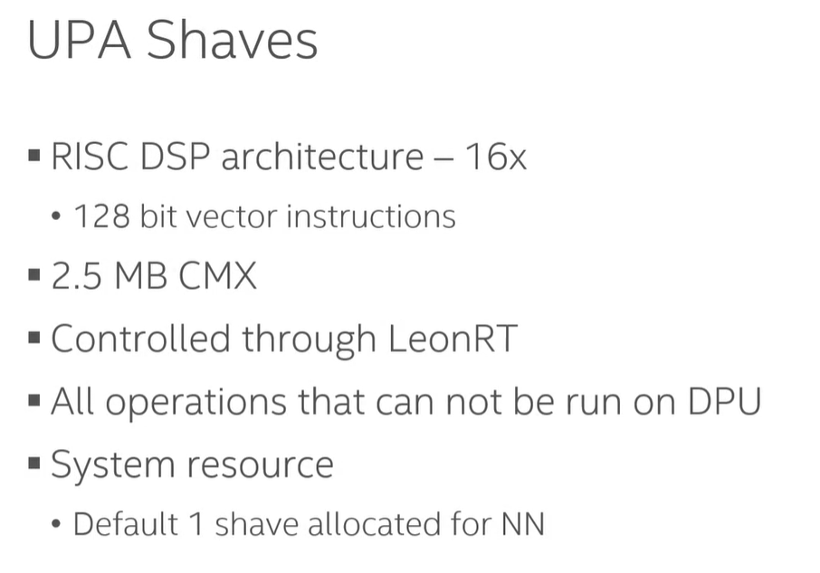
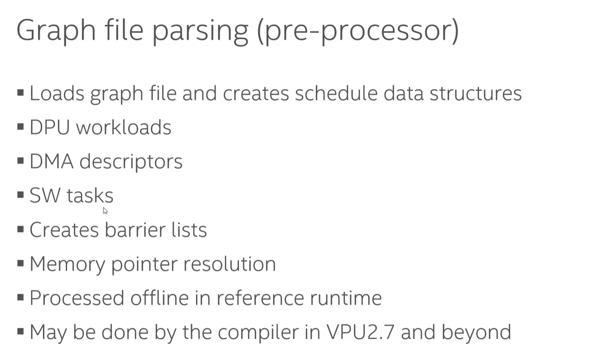
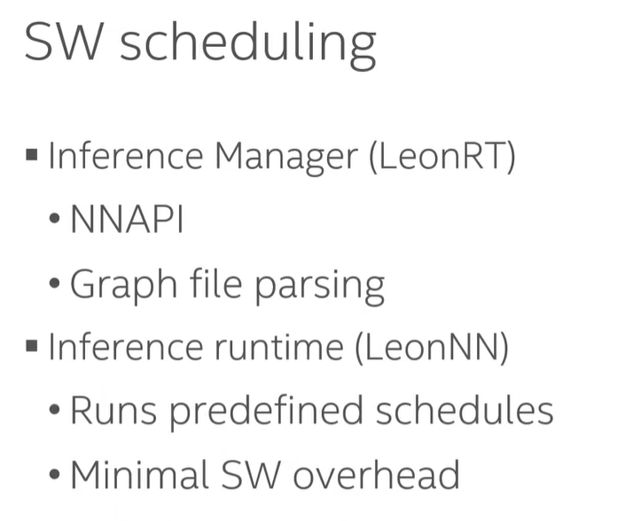

- KMB SOC features
	- Two LEON RISC processors
		- one dual core with L2 cache for general runtime managerment ([[LeonRT]])
		- one single core dedicated to NCE workload scheduling ([[LeonNN]])
	- 
- NCE arch
	- [[LeonNN]] and [[ShaveNN]] would talk with each other to schedule workload on DPU
	- [[ShaveNN]] is simple microcontroller, replaced with FSM in vpu4
	- 
- DPU HW
	- [[ShaveNN]]:
		- same functionality as FSM
	- [[Shadow registers]]
		- ?
	- 
- [[Barriers]]
	- HW synchronization mechanism
		- [[LeonNN]] ISR (sets and resets barrier)
	- 
- Shave scheduling
	- [[LeonRT]] controlled the launch of UPA Shave
	- {:height 434, :width 617}
- SW scheduling
	- [[Inference manager]] runs on [[LeonRT]]
		- [[Graph file parsing]]
			- {:height 544, :width 883}
	- [[Inference Runtime]] runs on [[LeonNN]]
		- runs predefined schedules, reset barriers...
		- minimal SW overhead
	- {:height 412, :width 489}