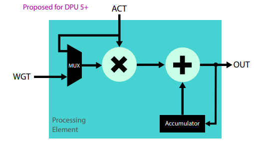
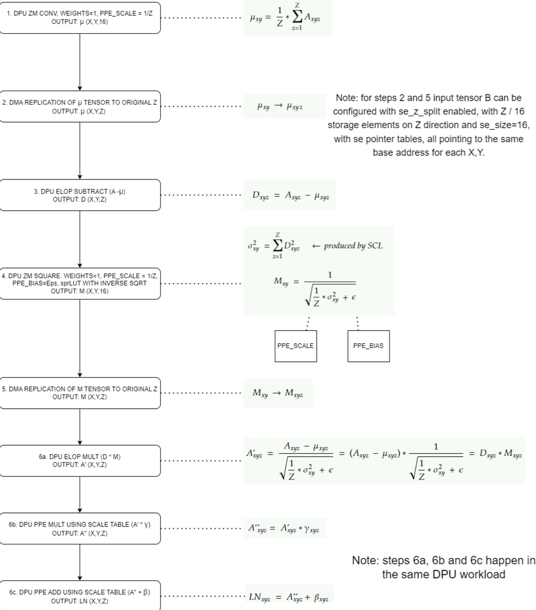

- #vpu5tr
- 
- https://github.com/intel-innersource/frameworks.vpu.models.vpu-em/blob/main/docs/VPU5%20LayerNorm%20Modeling.md#vpu5-dpu-hw-enhancement
- Should the previous output be dequantize to fp16 or not?
- Layernorm mapping from Darren:
	- 
	- Without SE-pointer:
		- 1--> DPU ZM Conv; 2--> DMA; 3-->DPU Subtract 4. DPU ZM Square 5. DMA 6. DPU MULT
	- With Sep:
		- 1--> DPU ZM Conv; 2, 3-->DPU Subtract 4. DPU ZM Square 5. DPU MULT
	- For the channel duplicate from 1 to 16:
		- Here is how it should work:
			- DPU will calculate 16 output channels in all cases so 16 channels of duplicated data is available internally in the DPU
			- the new feature to output less channels would just not write out those duplicated channels
			- so if we set the output as 1 channel it would just discard those extra duplicated data points
			- if we set to 16 channels it will just generate the duplicated output
	- From Darren SAS:
		- https://docs.intel.com/documents/MovidiusExternal/vpu5/common/SW/VPU5SAS.html#layernorm