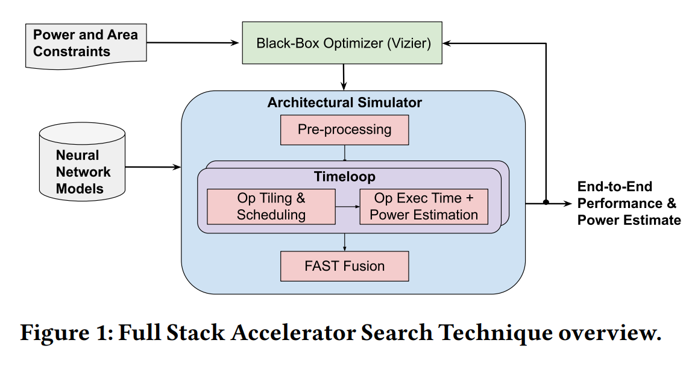
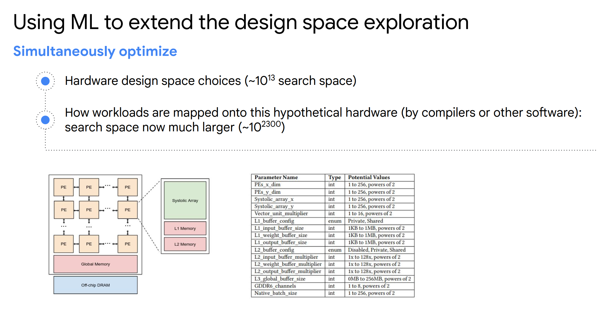
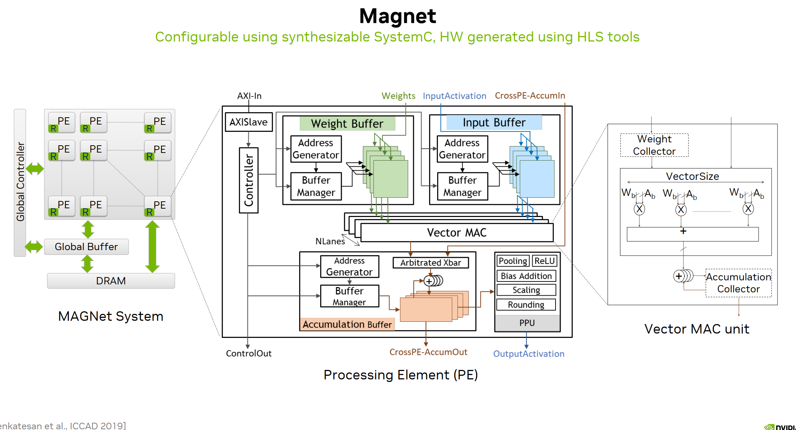
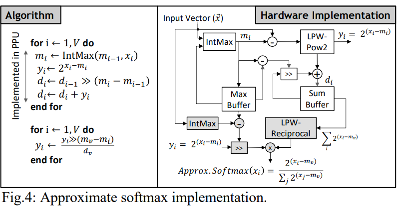
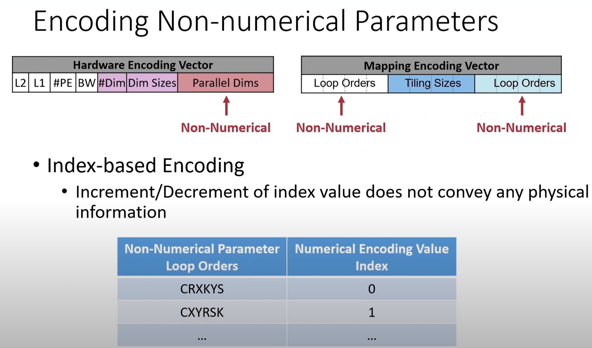

- Related github repos:
	- Gemmini:
		- > The Gemmini project is developing a full-system, full-stack DNN hardware exploration and evaluation platform. Gemmini enables architects to make useful insights into how different components of the system and software stack (outside of just the accelerator itself) interact to affect overall DNN performance.
		- {:height 456, :width 791}
	- https://github.com/ucb-bar/gemmini
- Presentation by Jeff Dean:
	- Related publish:
		- Simulation:
			- https://github.com/NVlabs/timeloop
		- https://arxiv.org/abs/2105.12842
		- A Full-Stack Search Technique for Domain Optimized Deep Learning Accelerators
			- More on this paper:
				- {:height 471, :width 897}
	- Search space:
		- 
- Presentation of Nvidia:
	- Magnet for hardware software co-design:
		- https://people.eecs.berkeley.edu/~ysshao/assets/papers/magnet2019-iccad.pdf
		- Nvidia use that for LLM:
			- https://ieeexplore.ieee.org/stamp/stamp.jsp?tp=&arnumber=9830277
	- Search space:
		- 
	- Search for hardware for LLM:
		- 
- Post by Qualcomm:
	- https://www.qualcomm.com/news/onq/2023/01/solving-unsolvable-combinatorial-problems-with-ai
	- #### Combinatorial optimization with AI for chip design
		- Bayes Optimization to address the large search space of chip design:
			- The challenges in chip placement are complex:
				- Placing standard cells and macros (memories) optimally
				- Satisfying the design constraints
				- Evaluating PPA efficiently
	- #### Combinatorial optimization with AI for hardware-specific compilers
		- [[ML for AI compiler]]
- MIT-HAN lab:
	- NAAS: Neural Accelerator Architecture Search
	- https://arxiv.org/pdf/2105.13258.pdf
	- {{video https://www.youtube.com/watch?v=NYEwiWnqWaA}}
		- Design space:
			- accelerator
				- local buffer size
				- global buffer size
				- number of PEs
				- Compute array size
				- PE connectivity
			- compiler
				- loop orders
				- loop tiling size
				- data flow
			- neural networks
				- ...
		- Encoding of the loop ordering and parallel dimensions
			- 