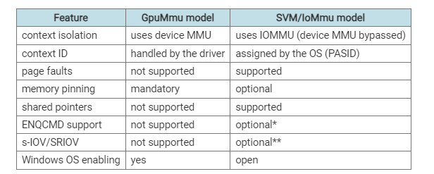
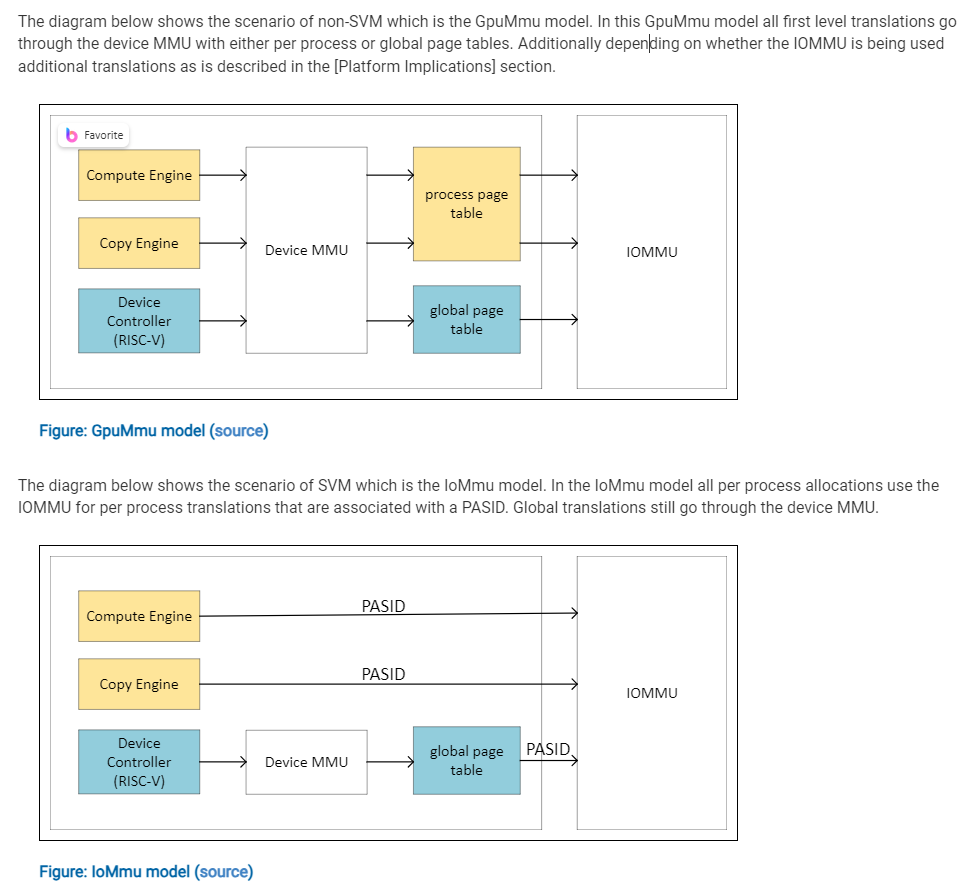
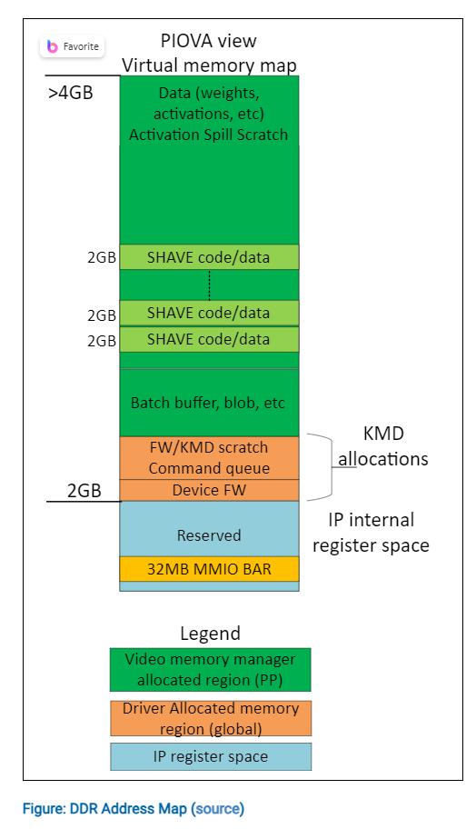
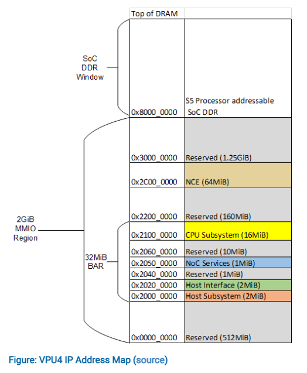
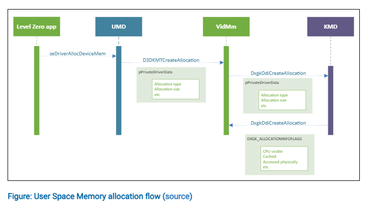
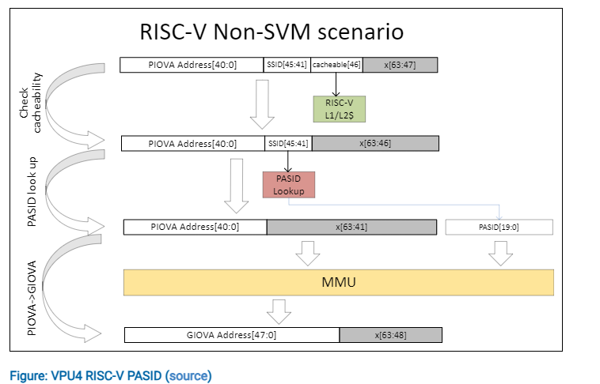
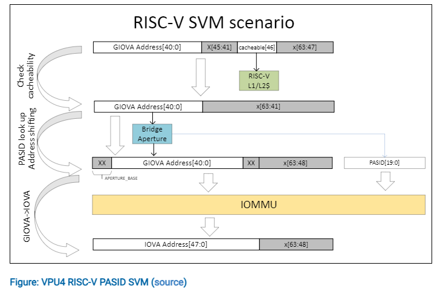

- VPU4 changes:
	- RISC-V address space increase to 41 bit from 32 bit for [[LeonRT]]
- ### [[Shared Virtual Memory]] ([[SVM]])
	- in MTL although [[unified memory architecture]] ([[UMA]]) was supported, the VPU would have different virtual addresses than CPU or other IPs in the system. In WDDM terminology this is referred to as the [GpuMmu model](https://docs.microsoft.com/en-us/windows-hardware/drivers/display/gpummu-model). In the VPU4 integration into LNL, Shared Virtual Memory is supported. In WDDM terminilogy this is referred to as [IoMmu model](https://docs.microsoft.com/en-us/windows-hardware/drivers/display/iommu-model)
	- Difference btw [[GpuMMU model]] and [[IOMMU model]]
		- 
	- #### Windows OS support for SVM
		- *In the IoMmu model each process has a single virtual address space that is shared between the CPU and graphics processing unit (GPU) and is managed by the OS memory manager.*
		- *To access memory, the GPU sends a data request to a compliant IoMmu. The request includes a shared virtual address and a process address space identifier (PASID). The IoMmu unit performs the address translation using the shared page table.*
	- #### SVM vs non-SVM addressing [[IOMMU vs GPUMMU]]
		- 
	- ### VPU4 Addressing
		- [[PIOVA]] view virtual memory map:
		- PIOVA（Process I/O Virtual Address）
		- 
	- #### VPU IP address map
		- 
	- #### Level0 memory allocation
		- 
		- **Level Zero Application**: the Level Zero allocation will generally request memory using the function zeDriverAllocDeviceMem or zeDriverAllocSharedMem.
	- #### Address range and access to user space from RISC-V
		- non-svm addressing
			- 
		- SVM case
			- 
	- ### Address Translation
	- ### MMIO Access
	-