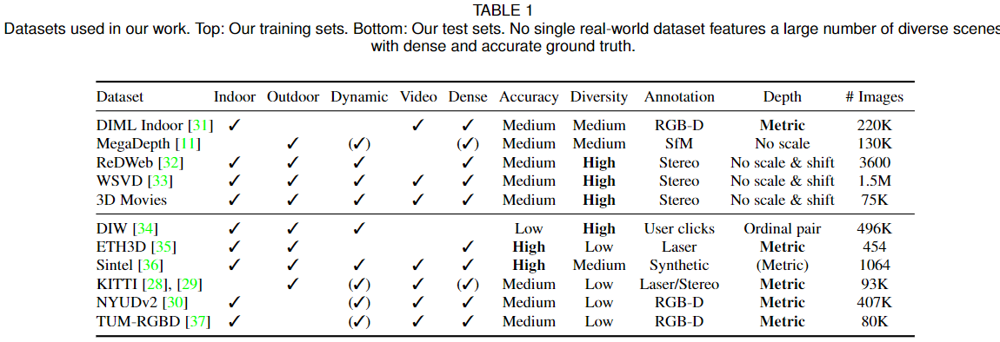

- 
- 
- https://docs.openvino.ai/latest/omz_models_model_midasnet.html
- ## Intro
- The dataset is very hard to collect for depth estimation
- On the whole, none of the existing datasets is sufficiently rich to support the training of a model that works robustly on real images of diverse scenes. At present, we are faced with multiple datasets that may ==usefully complement each other, but are individually biased and incomplete.==
- Innovation:
	- Novel loss functions that are invariant to the major sources of incompatibility between datasets
	- Optimal strategy to mix datasets during training:
		- Multi-objective optimization leads to better results
- ## Dataset
- ((62752208-e780-4005-a93a-9ece899d8ace))
	- This paper is mainly about ==mixing dataset==
- ((627ca737-fda3-4428-9b1f-9976f7c1d954))
	- Dataset differ in many ways.
- ((627520e5-5b36-49ef-adef-62c9f93ca4b9))
- Training and testing on totally different datasets
- Training on :
	- 
- Testing on: (zero shot data transfer)
	- 
- {:height 402, :width 1150}
- ((62752133-b3f1-4462-a465-39ade71b2d3e))
- To  benchmark  the  generalization  performance  of monocular depth estimation models, we chose six datasets based on diversity and accuracy of their ground truth. Note that we never fine-tune models on any of these datasets. We refer to this experimental procedure as ==zero-shot cross-dataset transfer==.
- ## Training and diverse data
- ((627ca895-0180-4919-af8d-04b5fdd9737c))
- 1)  Inherently  different representations of depth: direct vs. inverse depth representations.
- 2) Scale ambiguity: for some data sources, depth is only given up to  an  unknown  scale.
- 3)  Shift  ambiguity:  some  datasets  provide disparity only up to an unknown scale and global disparity shift that is a function of the unknown baseline and a horizontal shift of the principal points due to post-processing
- ((627ca8bf-910a-4f81-8b31-1d73154d17b6))
	- 
		- where $$\hat{d}$$ and $$\hat{d^*}$$ are scaled and shifted versions of the ground truth, and $$\rho$$ defined the specific type of loss function
	- Final loss function for a training set:
		- 
		- 
		- where $$N_l$$ is the training set size and $$\alpha$$ is set to 0.5
	-
- ## Network Architecture
- From spreadsheet benchmarking:
	- [midasnet_kpi.xlsx](../assets/midasnet_kpi_1651644010705_0.xlsx)
- Slides written by me
	- https://intel-my.sharepoint.com/:p:/p/xu_qian/EevwUDq7aPFOh4j9A6T-my8B63Swrhl0aos6rZoPZb8rww
- ((62767c36-58ad-4ce0-afe8-5e501c9311fa))
	- The encoder backbone (efficientnet_lite3) take about 427.12 us, and the decoder stage take about 1,558.81 us
		- This is mainly because of the high resolution featuremap for latter layers
			- DONE need pie chart to show this
			  :LOGBOOK:
			  CLOCK: [2022-05-07 Sat 22:10:31]--[2022-05-09 Mon 11:55:31] =>  37:45:00
			  :END:
			- DONE also, spread sheet analysis direct change from KMB to MTL missing the mpe-mode support for MTL, might be for the best if we can use nbperf on this
			  :LOGBOOK:
			  CLOCK: [2022-05-07 Sat 22:10:44]--[2022-05-08 Sun 21:57:26] =>  23:46:42
			  :END:
				- Interpolate profiling support in nbperf
				- dma support (prefetching, non-prefetching)
				- DONE validate the implementation
				  :LOGBOOK:
				  CLOCK: [2022-05-08 Sun 21:57:40]--[2022-05-09 Mon 08:37:06] =>  10:39:26
				  :END:
		- Decoder analysis
			- 3x3 convolution might be able to replace with 3x3 dw conv + 1x1 pointwise conv
				- DONE find our experiment on NAS of SISS regarding this change
				  :LOGBOOK:
				  CLOCK: [2022-05-07 Sat 22:08:31]--[2022-05-09 Mon 12:59:56] =>  38:51:25
				  :END:
			- upsampling might convert to more efficient upsampling method
				- DONE find what methods might outperform the current bilinear interpolate
				  :LOGBOOK:
				  CLOCK: [2022-05-07 Sat 22:09:02]--[2022-05-09 Mon 13:01:57] =>  38:52:55
				  :END:
				- already good enough
		- Encoder analysis
			- replace backbone with more efficient network from once for all for MTL
				- DONE Most doable, but not able to measure the influence, only 1/3 of the time spend on backbone
				  :LOGBOOK:
				  CLOCK: [2022-05-07 Sat 22:09:43]--[2022-05-09 Mon 13:02:01] =>  38:52:18
				  :END:
- ((62767c52-b8d3-422e-a7c4-5a565b921c7e))
	- Encoder:
		- Similar with resnet101_wsl backbone
	- Decoder:
		- Similar structure wise as small version, channels are different
- ## Evaluation metric
	- mida_v21
	  id:: 62767c52-b8d3-422e-a7c4-5a565b921c7e
	- midas_v21_small
	  id:: 62767c36-58ad-4ce0-afe8-5e501c9311fa
		- Pretrained:
			- 在midas中去除了最后的分类层 （conv_head-->classifier）
			- ```python
			  def _make_efficientnet_backbone(effnet):
			      pretrained = nn.Module()
			  
			      pretrained.layer1 = nn.Sequential(
			          effnet.conv_stem, effnet.bn1, effnet.act1, *effnet.blocks[0:2]
			      )
			      pretrained.layer2 = nn.Sequential(*effnet.blocks[2:3])
			      pretrained.layer3 = nn.Sequential(*effnet.blocks[3:5])
			      pretrained.layer4 = nn.Sequential(*effnet.blocks[5:9])
			  ```
			- efficientnet_lite3
			  collapsed:: true
				- ```
				  GenEfficientNet(
				    (conv_stem): Conv2dSameExport(3, 32, kernel_size=(3, 3), stride=(2, 2), bias=False)
				    (bn1): BatchNorm2d(32, eps=0.001, momentum=0.1, affine=True, track_running_stats=True)
				    (act1): ReLU6(inplace=True)
				    (blocks): Sequential(
				      (0): Sequential(
				        (0): DepthwiseSeparableConv(
				          (conv_dw): Conv2d(32, 32, kernel_size=(3, 3), stride=(1, 1), padding=(1, 1), groups=32, bias=False)
				          (bn1): BatchNorm2d(32, eps=0.001, momentum=0.1, affine=True, track_running_stats=True)
				          (act1): ReLU6(inplace=True)
				          (se): Identity()
				          (conv_pw): Conv2d(32, 24, kernel_size=(1, 1), stride=(1, 1), bias=False)
				          (bn2): BatchNorm2d(24, eps=0.001, momentum=0.1, affine=True, track_running_stats=True)
				          (act2): Identity()
				        )
				      )
				      (1): Sequential(
				        (0): InvertedResidual(
				          (conv_pw): Conv2d(24, 144, kernel_size=(1, 1), stride=(1, 1), bias=False)
				          (bn1): BatchNorm2d(144, eps=0.001, momentum=0.1, affine=True, track_running_stats=True)
				          (act1): ReLU6(inplace=True)
				          (conv_dw): Conv2dSameExport(144, 144, kernel_size=(3, 3), stride=(2, 2), groups=144, bias=False)
				          (bn2): BatchNorm2d(144, eps=0.001, momentum=0.1, affine=True, track_running_stats=True)
				          (act2): ReLU6(inplace=True)
				          (se): Identity()
				          (conv_pwl): Conv2d(144, 32, kernel_size=(1, 1), stride=(1, 1), bias=False)
				          (bn3): BatchNorm2d(32, eps=0.001, momentum=0.1, affine=True, track_running_stats=True)
				        )
				        (1): InvertedResidual(
				          (conv_pw): Conv2d(32, 192, kernel_size=(1, 1), stride=(1, 1), bias=False)
				          (bn1): BatchNorm2d(192, eps=0.001, momentum=0.1, affine=True, track_running_stats=True)
				          (act1): ReLU6(inplace=True)
				          (conv_dw): Conv2d(192, 192, kernel_size=(3, 3), stride=(1, 1), padding=(1, 1), groups=192, bias=False)
				          (bn2): BatchNorm2d(192, eps=0.001, momentum=0.1, affine=True, track_running_stats=True)
				          (act2): ReLU6(inplace=True)
				          (se): Identity()
				          (conv_pwl): Conv2d(192, 32, kernel_size=(1, 1), stride=(1, 1), bias=False)
				          (bn3): BatchNorm2d(32, eps=0.001, momentum=0.1, affine=True, track_running_stats=True)
				        )
				        (2): InvertedResidual(
				          (conv_pw): Conv2d(32, 192, kernel_size=(1, 1), stride=(1, 1), bias=False)
				          (bn1): BatchNorm2d(192, eps=0.001, momentum=0.1, affine=True, track_running_stats=True)
				          (act1): ReLU6(inplace=True)
				          (conv_dw): Conv2d(192, 192, kernel_size=(3, 3), stride=(1, 1), padding=(1, 1), groups=192, bias=False)
				          (bn2): BatchNorm2d(192, eps=0.001, momentum=0.1, affine=True, track_running_stats=True)
				          (act2): ReLU6(inplace=True)
				          (se): Identity()
				          (conv_pwl): Conv2d(192, 32, kernel_size=(1, 1), stride=(1, 1), bias=False)
				          (bn3): BatchNorm2d(32, eps=0.001, momentum=0.1, affine=True, track_running_stats=True)
				        )
				      )
				      (2): Sequential(
				        (0): InvertedResidual(
				          (conv_pw): Conv2d(32, 192, kernel_size=(1, 1), stride=(1, 1), bias=False)
				          (bn1): BatchNorm2d(192, eps=0.001, momentum=0.1, affine=True, track_running_stats=True)
				          (act1): ReLU6(inplace=True)
				          (conv_dw): Conv2dSameExport(192, 192, kernel_size=(5, 5), stride=(2, 2), groups=192, bias=False)
				          (bn2): BatchNorm2d(192, eps=0.001, momentum=0.1, affine=True, track_running_stats=True)
				          (act2): ReLU6(inplace=True)
				          (se): Identity()
				          (conv_pwl): Conv2d(192, 48, kernel_size=(1, 1), stride=(1, 1), bias=False)
				          (bn3): BatchNorm2d(48, eps=0.001, momentum=0.1, affine=True, track_running_stats=True)
				        )
				        (1): InvertedResidual(
				          (conv_pw): Conv2d(48, 288, kernel_size=(1, 1), stride=(1, 1), bias=False)
				          (bn1): BatchNorm2d(288, eps=0.001, momentum=0.1, affine=True, track_running_stats=True)
				          (act1): ReLU6(inplace=True)
				          (conv_dw): Conv2d(288, 288, kernel_size=(5, 5), stride=(1, 1), padding=(2, 2), groups=288, bias=False)
				          (bn2): BatchNorm2d(288, eps=0.001, momentum=0.1, affine=True, track_running_stats=True)
				          (act2): ReLU6(inplace=True)
				          (se): Identity()
				          (conv_pwl): Conv2d(288, 48, kernel_size=(1, 1), stride=(1, 1), bias=False)
				          (bn3): BatchNorm2d(48, eps=0.001, momentum=0.1, affine=True, track_running_stats=True)
				        )
				        (2): InvertedResidual(
				          (conv_pw): Conv2d(48, 288, kernel_size=(1, 1), stride=(1, 1), bias=False)
				          (bn1): BatchNorm2d(288, eps=0.001, momentum=0.1, affine=True, track_running_stats=True)
				          (act1): ReLU6(inplace=True)
				          (conv_dw): Conv2d(288, 288, kernel_size=(5, 5), stride=(1, 1), padding=(2, 2), groups=288, bias=False)
				          (bn2): BatchNorm2d(288, eps=0.001, momentum=0.1, affine=True, track_running_stats=True)
				          (act2): ReLU6(inplace=True)
				          (se): Identity()
				          (conv_pwl): Conv2d(288, 48, kernel_size=(1, 1), stride=(1, 1), bias=False)
				          (bn3): BatchNorm2d(48, eps=0.001, momentum=0.1, affine=True, track_running_stats=True)
				        )
				      )
				      (3): Sequential(
				        (0): InvertedResidual(
				          (conv_pw): Conv2d(48, 288, kernel_size=(1, 1), stride=(1, 1), bias=False)
				          (bn1): BatchNorm2d(288, eps=0.001, momentum=0.1, affine=True, track_running_stats=True)
				          (act1): ReLU6(inplace=True)
				          (conv_dw): Conv2dSameExport(288, 288, kernel_size=(3, 3), stride=(2, 2), groups=288, bias=False)
				          (bn2): BatchNorm2d(288, eps=0.001, momentum=0.1, affine=True, track_running_stats=True)
				          (act2): ReLU6(inplace=True)
				          (se): Identity()
				          (conv_pwl): Conv2d(288, 96, kernel_size=(1, 1), stride=(1, 1), bias=False)
				          (bn3): BatchNorm2d(96, eps=0.001, momentum=0.1, affine=True, track_running_stats=True)
				        )
				        (1): InvertedResidual(
				          (conv_pw): Conv2d(96, 576, kernel_size=(1, 1), stride=(1, 1), bias=False)
				          (bn1): BatchNorm2d(576, eps=0.001, momentum=0.1, affine=True, track_running_stats=True)
				          (act1): ReLU6(inplace=True)
				          (conv_dw): Conv2d(576, 576, kernel_size=(3, 3), stride=(1, 1), padding=(1, 1), groups=576, bias=False)
				          (bn2): BatchNorm2d(576, eps=0.001, momentum=0.1, affine=True, track_running_stats=True)
				          (act2): ReLU6(inplace=True)
				          (se): Identity()
				          (conv_pwl): Conv2d(576, 96, kernel_size=(1, 1), stride=(1, 1), bias=False)
				          (bn3): BatchNorm2d(96, eps=0.001, momentum=0.1, affine=True, track_running_stats=True)
				        )
				        (2): InvertedResidual(
				          (conv_pw): Conv2d(96, 576, kernel_size=(1, 1), stride=(1, 1), bias=False)
				          (bn1): BatchNorm2d(576, eps=0.001, momentum=0.1, affine=True, track_running_stats=True)
				          (act1): ReLU6(inplace=True)
				          (conv_dw): Conv2d(576, 576, kernel_size=(3, 3), stride=(1, 1), padding=(1, 1), groups=576, bias=False)
				          (bn2): BatchNorm2d(576, eps=0.001, momentum=0.1, affine=True, track_running_stats=True)
				          (act2): ReLU6(inplace=True)
				          (se): Identity()
				          (conv_pwl): Conv2d(576, 96, kernel_size=(1, 1), stride=(1, 1), bias=False)
				          (bn3): BatchNorm2d(96, eps=0.001, momentum=0.1, affine=True, track_running_stats=True)
				        )
				        (3): InvertedResidual(
				          (conv_pw): Conv2d(96, 576, kernel_size=(1, 1), stride=(1, 1), bias=False)
				          (bn1): BatchNorm2d(576, eps=0.001, momentum=0.1, affine=True, track_running_stats=True)
				          (act1): ReLU6(inplace=True)
				          (conv_dw): Conv2d(576, 576, kernel_size=(3, 3), stride=(1, 1), padding=(1, 1), groups=576, bias=False)
				          (bn2): BatchNorm2d(576, eps=0.001, momentum=0.1, affine=True, track_running_stats=True)
				          (act2): ReLU6(inplace=True)
				          (se): Identity()
				          (conv_pwl): Conv2d(576, 96, kernel_size=(1, 1), stride=(1, 1), bias=False)
				          (bn3): BatchNorm2d(96, eps=0.001, momentum=0.1, affine=True, track_running_stats=True)
				        )
				        (4): InvertedResidual(
				          (conv_pw): Conv2d(96, 576, kernel_size=(1, 1), stride=(1, 1), bias=False)
				          (bn1): BatchNorm2d(576, eps=0.001, momentum=0.1, affine=True, track_running_stats=True)
				          (act1): ReLU6(inplace=True)
				          (conv_dw): Conv2d(576, 576, kernel_size=(3, 3), stride=(1, 1), padding=(1, 1), groups=576, bias=False)
				          (bn2): BatchNorm2d(576, eps=0.001, momentum=0.1, affine=True, track_running_stats=True)
				          (act2): ReLU6(inplace=True)
				          (se): Identity()
				          (conv_pwl): Conv2d(576, 96, kernel_size=(1, 1), stride=(1, 1), bias=False)
				          (bn3): BatchNorm2d(96, eps=0.001, momentum=0.1, affine=True, track_running_stats=True)
				        )
				      )
				      (4): Sequential(
				        (0): InvertedResidual(
				          (conv_pw): Conv2d(96, 576, kernel_size=(1, 1), stride=(1, 1), bias=False)
				          (bn1): BatchNorm2d(576, eps=0.001, momentum=0.1, affine=True, track_running_stats=True)
				          (act1): ReLU6(inplace=True)
				          (conv_dw): Conv2d(576, 576, kernel_size=(5, 5), stride=(1, 1), padding=(2, 2), groups=576, bias=False)
				          (bn2): BatchNorm2d(576, eps=0.001, momentum=0.1, affine=True, track_running_stats=True)
				          (act2): ReLU6(inplace=True)
				          (se): Identity()
				          (conv_pwl): Conv2d(576, 136, kernel_size=(1, 1), stride=(1, 1), bias=False)
				          (bn3): BatchNorm2d(136, eps=0.001, momentum=0.1, affine=True, track_running_stats=True)
				        )
				        (1): InvertedResidual(
				          (conv_pw): Conv2d(136, 816, kernel_size=(1, 1), stride=(1, 1), bias=False)
				          (bn1): BatchNorm2d(816, eps=0.001, momentum=0.1, affine=True, track_running_stats=True)
				          (act1): ReLU6(inplace=True)
				          (conv_dw): Conv2d(816, 816, kernel_size=(5, 5), stride=(1, 1), padding=(2, 2), groups=816, bias=False)
				          (bn2): BatchNorm2d(816, eps=0.001, momentum=0.1, affine=True, track_running_stats=True)
				          (act2): ReLU6(inplace=True)
				          (se): Identity()
				          (conv_pwl): Conv2d(816, 136, kernel_size=(1, 1), stride=(1, 1), bias=False)
				          (bn3): BatchNorm2d(136, eps=0.001, momentum=0.1, affine=True, track_running_stats=True)
				        )
				        (2): InvertedResidual(
				          (conv_pw): Conv2d(136, 816, kernel_size=(1, 1), stride=(1, 1), bias=False)
				          (bn1): BatchNorm2d(816, eps=0.001, momentum=0.1, affine=True, track_running_stats=True)
				          (act1): ReLU6(inplace=True)
				          (conv_dw): Conv2d(816, 816, kernel_size=(5, 5), stride=(1, 1), padding=(2, 2), groups=816, bias=False)
				          (bn2): BatchNorm2d(816, eps=0.001, momentum=0.1, affine=True, track_running_stats=True)
				          (act2): ReLU6(inplace=True)
				          (se): Identity()
				          (conv_pwl): Conv2d(816, 136, kernel_size=(1, 1), stride=(1, 1), bias=False)
				          (bn3): BatchNorm2d(136, eps=0.001, momentum=0.1, affine=True, track_running_stats=True)
				        )
				        (3): InvertedResidual(
				          (conv_pw): Conv2d(136, 816, kernel_size=(1, 1), stride=(1, 1), bias=False)
				          (bn1): BatchNorm2d(816, eps=0.001, momentum=0.1, affine=True, track_running_stats=True)
				          (act1): ReLU6(inplace=True)
				          (conv_dw): Conv2d(816, 816, kernel_size=(5, 5), stride=(1, 1), padding=(2, 2), groups=816, bias=False)
				          (bn2): BatchNorm2d(816, eps=0.001, momentum=0.1, affine=True, track_running_stats=True)
				          (act2): ReLU6(inplace=True)
				          (se): Identity()
				          (conv_pwl): Conv2d(816, 136, kernel_size=(1, 1), stride=(1, 1), bias=False)
				          (bn3): BatchNorm2d(136, eps=0.001, momentum=0.1, affine=True, track_running_stats=True)
				        )
				        (4): InvertedResidual(
				          (conv_pw): Conv2d(136, 816, kernel_size=(1, 1), stride=(1, 1), bias=False)
				          (bn1): BatchNorm2d(816, eps=0.001, momentum=0.1, affine=True, track_running_stats=True)
				          (act1): ReLU6(inplace=True)
				          (conv_dw): Conv2d(816, 816, kernel_size=(5, 5), stride=(1, 1), padding=(2, 2), groups=816, bias=False)
				          (bn2): BatchNorm2d(816, eps=0.001, momentum=0.1, affine=True, track_running_stats=True)
				          (act2): ReLU6(inplace=True)
				          (se): Identity()
				          (conv_pwl): Conv2d(816, 136, kernel_size=(1, 1), stride=(1, 1), bias=False)
				          (bn3): BatchNorm2d(136, eps=0.001, momentum=0.1, affine=True, track_running_stats=True)
				        )
				      )
				      (5): Sequential(
				        (0): InvertedResidual(
				          (conv_pw): Conv2d(136, 816, kernel_size=(1, 1), stride=(1, 1), bias=False)
				          (bn1): BatchNorm2d(816, eps=0.001, momentum=0.1, affine=True, track_running_stats=True)
				          (act1): ReLU6(inplace=True)
				          (conv_dw): Conv2dSameExport(816, 816, kernel_size=(5, 5), stride=(2, 2), groups=816, bias=False)
				          (bn2): BatchNorm2d(816, eps=0.001, momentum=0.1, affine=True, track_running_stats=True)
				          (act2): ReLU6(inplace=True)
				          (se): Identity()
				          (conv_pwl): Conv2d(816, 232, kernel_size=(1, 1), stride=(1, 1), bias=False)
				          (bn3): BatchNorm2d(232, eps=0.001, momentum=0.1, affine=True, track_running_stats=True)
				        )
				        (1): InvertedResidual(
				          (conv_pw): Conv2d(232, 1392, kernel_size=(1, 1), stride=(1, 1), bias=False)
				          (bn1): BatchNorm2d(1392, eps=0.001, momentum=0.1, affine=True, track_running_stats=True)
				          (act1): ReLU6(inplace=True)
				          (conv_dw): Conv2d(1392, 1392, kernel_size=(5, 5), stride=(1, 1), padding=(2, 2), groups=1392, bias=False)
				          (bn2): BatchNorm2d(1392, eps=0.001, momentum=0.1, affine=True, track_running_stats=True)
				          (act2): ReLU6(inplace=True)
				          (se): Identity()
				          (conv_pwl): Conv2d(1392, 232, kernel_size=(1, 1), stride=(1, 1), bias=False)
				          (bn3): BatchNorm2d(232, eps=0.001, momentum=0.1, affine=True, track_running_stats=True)
				        )
				        (2): InvertedResidual(
				          (conv_pw): Conv2d(232, 1392, kernel_size=(1, 1), stride=(1, 1), bias=False)
				          (bn1): BatchNorm2d(1392, eps=0.001, momentum=0.1, affine=True, track_running_stats=True)
				          (act1): ReLU6(inplace=True)
				          (conv_dw): Conv2d(1392, 1392, kernel_size=(5, 5), stride=(1, 1), padding=(2, 2), groups=1392, bias=False)
				          (bn2): BatchNorm2d(1392, eps=0.001, momentum=0.1, affine=True, track_running_stats=True)
				          (act2): ReLU6(inplace=True)
				          (se): Identity()
				          (conv_pwl): Conv2d(1392, 232, kernel_size=(1, 1), stride=(1, 1), bias=False)
				          (bn3): BatchNorm2d(232, eps=0.001, momentum=0.1, affine=True, track_running_stats=True)
				        )
				        (3): InvertedResidual(
				          (conv_pw): Conv2d(232, 1392, kernel_size=(1, 1), stride=(1, 1), bias=False)
				          (bn1): BatchNorm2d(1392, eps=0.001, momentum=0.1, affine=True, track_running_stats=True)
				          (act1): ReLU6(inplace=True)
				          (conv_dw): Conv2d(1392, 1392, kernel_size=(5, 5), stride=(1, 1), padding=(2, 2), groups=1392, bias=False)
				          (bn2): BatchNorm2d(1392, eps=0.001, momentum=0.1, affine=True, track_running_stats=True)
				          (act2): ReLU6(inplace=True)
				          (se): Identity()
				          (conv_pwl): Conv2d(1392, 232, kernel_size=(1, 1), stride=(1, 1), bias=False)
				          (bn3): BatchNorm2d(232, eps=0.001, momentum=0.1, affine=True, track_running_stats=True)
				        )
				        (4): InvertedResidual(
				          (conv_pw): Conv2d(232, 1392, kernel_size=(1, 1), stride=(1, 1), bias=False)
				          (bn1): BatchNorm2d(1392, eps=0.001, momentum=0.1, affine=True, track_running_stats=True)
				          (act1): ReLU6(inplace=True)
				          (conv_dw): Conv2d(1392, 1392, kernel_size=(5, 5), stride=(1, 1), padding=(2, 2), groups=1392, bias=False)
				          (bn2): BatchNorm2d(1392, eps=0.001, momentum=0.1, affine=True, track_running_stats=True)
				          (act2): ReLU6(inplace=True)
				          (se): Identity()
				          (conv_pwl): Conv2d(1392, 232, kernel_size=(1, 1), stride=(1, 1), bias=False)
				          (bn3): BatchNorm2d(232, eps=0.001, momentum=0.1, affine=True, track_running_stats=True)
				        )
				        (5): InvertedResidual(
				          (conv_pw): Conv2d(232, 1392, kernel_size=(1, 1), stride=(1, 1), bias=False)
				          (bn1): BatchNorm2d(1392, eps=0.001, momentum=0.1, affine=True, track_running_stats=True)
				          (act1): ReLU6(inplace=True)
				          (conv_dw): Conv2d(1392, 1392, kernel_size=(5, 5), stride=(1, 1), padding=(2, 2), groups=1392, bias=False)
				          (bn2): BatchNorm2d(1392, eps=0.001, momentum=0.1, affine=True, track_running_stats=True)
				          (act2): ReLU6(inplace=True)
				          (se): Identity()
				          (conv_pwl): Conv2d(1392, 232, kernel_size=(1, 1), stride=(1, 1), bias=False)
				          (bn3): BatchNorm2d(232, eps=0.001, momentum=0.1, affine=True, track_running_stats=True)
				        )
				      )
				      (6): Sequential(
				        (0): InvertedResidual(
				          (conv_pw): Conv2d(232, 1392, kernel_size=(1, 1), stride=(1, 1), bias=False)
				          (bn1): BatchNorm2d(1392, eps=0.001, momentum=0.1, affine=True, track_running_stats=True)
				          (act1): ReLU6(inplace=True)
				          (conv_dw): Conv2d(1392, 1392, kernel_size=(3, 3), stride=(1, 1), padding=(1, 1), groups=1392, bias=False)
				          (bn2): BatchNorm2d(1392, eps=0.001, momentum=0.1, affine=True, track_running_stats=True)
				          (act2): ReLU6(inplace=True)
				          (se): Identity()
				          (conv_pwl): Conv2d(1392, 384, kernel_size=(1, 1), stride=(1, 1), bias=False)
				          (bn3): BatchNorm2d(384, eps=0.001, momentum=0.1, affine=True, track_running_stats=True)
				        )
				      )
				    )
				    (conv_head): Conv2d(384, 1280, kernel_size=(1, 1), stride=(1, 1), bias=False)
				    (bn2): BatchNorm2d(1280, eps=0.001, momentum=0.1, affine=True, track_running_stats=True)
				    (act2): ReLU6(inplace=True)
				    (global_pool): AdaptiveAvgPool2d(output_size=1)
				    (classifier): Linear(in_features=1280, out_features=1000, bias=True)
				  )
				  ```
		- Scratch
			- ```
			  Module(
			    (layer1_rn): Conv2d(32, 64, kernel_size=(3, 3), stride=(1, 1), padding=(1, 1), bias=False)
			    (layer2_rn): Conv2d(48, 128, kernel_size=(3, 3), stride=(1, 1), padding=(1, 1), bias=False)
			    (layer3_rn): Conv2d(136, 256, kernel_size=(3, 3), stride=(1, 1), padding=(1, 1), bias=False)
			    (layer4_rn): Conv2d(384, 512, kernel_size=(3, 3), stride=(1, 1), padding=(1, 1), bias=False)
			  )
			  ```
			- layer4_rn --> 2 (3x3 convolution) + 1 interpolation + 1 (1x1 convolution)
				- 1 3x3 convolution (layer_rn):
					- 8x8x384->8x8x512
				- 2 3x3 convolution:
					- 8x8x512->8x8x512
					- 8x8x512->8x8x512
				- interpolation + 1x1 conv:
					- 8x8x512->16x16x512
					- 16x16x512-->16x16x256
			- layer3_rn --> 4 (3x3 convolution) + 1 interpolation + 1 (1x1 convolution)
				- 1 3x3 convolution (layer_rn):
					- 16x16x136->16x16x256
				- 4 3x3 convolution:
					- 16x16x256->16x16x256
					- 16x16x256->16x16x256
					- 16x16x256->16x16x256
					- 16x16x256->16x16x256
				- interpolation + 1x1 conv:
					- 16x16x256->32x32x256
					- 16x16x256->32x32x128
			- layer2_rn --> 4 (3x3 convolution) + 1 interpolation + 1 (1x1 convolution)
				- 1 3x3 convolution (layer_rn):
					- 32x32x48->32x32x128
				- 4 3x3 convolution:
					- 32x32x128->32x32x128
					- 32x32x128->32x32x128
					- 32x32x128->32x32x128
					- 32x32x128->32x32x128
				- interpolation + 1x1 conv:
					- 32x32x128->64x64x128
					- 64x64x128->64x64x64
			- layer1_rn --> 4 (3x3 convolution) + 1 interpolation + 1 (1x1 convolution)
				- 1 3x3 convolution (layer_rn):
					- 64x64x32->64x64x64
				- 4 3x3 convolution:
					- 64x64x64->64x64x64
					- 64x64x64->64x64x64
					- 64x64x64->64x64x64
					- 64x64x64->64x64x64
				- interpolation + 1x1 conv:
					- 64x64x64->128x128x64
					- 128x128x64->128x128x32
			- output_conv --> 1 (3x3 convolution) + 1 interpolation + 1 (3x3 convolution) + 1 (1x1 convolution):
				- 3x3 Conv:
					- 128x128x64->128x128x32
				- Interpolate:
					- 128x128x32->256x256x32
				- 3x3 Conv:
					- 256x256x32->256x256x32
				- 1x1 Conv:
					- 256x256x32->256x256x1
- ## Test dataset and metrics:
	- ((6279b2da-f73e-4efb-af96-c220ec6c5d4f))
	- WHDR
		- For DIW
		- Weighted Human Disagreement Rate (WHDR)
	- Root Mean Squared Error in [[disparity space]]
		- For MV, RW, MD
		- datasets that are based on relative depth
		- 
	- AbsRel
		- Mean absolute value of the relative error in depth space
			- 
		- For ETH3D, Sintel
		- Datasets that provide accurate absolute depth
	- Percentage of Pixels with
		- {:height 47, :width 244}
		- For KITTI, NYU and TUM
- ## Experiments
- Initialize encoder with pre-trained imagenet weights and initialize other layers randomly.
- Adam with learning rate of 1e-4 for random initialized layers and 1e-5 for pretrained layers
- exp decay rate:$$\beta1=0.9$$, $$\beta2=0.999$$
- Images augmentation:
	- flipped horizontally with 50% chance
	- randomly cropped and resized to 384x384
	- maintain the aspect ratio across different input images
	- No other augmentations used
- Batch size $$8L$$
	- 24 when mixing three datasets
- Epoch
	- processing 72,000 images one epoch
- Shift and scale the ground-truth disparity to range [0, 1] for all datasets