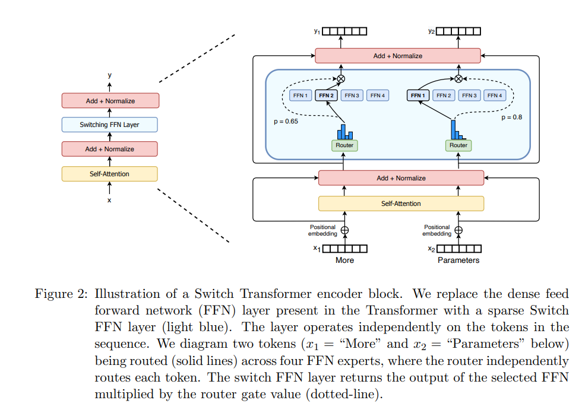

- Pytorch implementation of simple moe:
	- https://github.com/davidmrau/mixture-of-experts/blob/master/moe.py#L17
- Switch transformers:
	- https://huggingface.co/docs/transformers/model_doc/switch_transformers
	- SwinTransformersTop1Router:
		- ```python
		  class SwitchTransformersTop1Router(nn.Module):
		      """
		      Router using tokens choose top-1 experts assignment.
		  
		      This router uses the same mechanism as in Switch Transformer (https://arxiv.org/abs/2101.03961) and V-MoE
		      (https://arxiv.org/abs/2106.05974): tokens choose their top experts. Items are sorted by router_probs and then
		      routed to their choice of expert until the expert's expert_capacity is reached. **There is no guarantee that each
		      token is processed by an expert**, or that each expert receives at least one token.
		  
		      """
		  
		      def __init__(self, config: SwitchTransformersConfig):
		          super().__init__()
		          self.num_experts = config.num_experts
		          self.expert_capacity = config.expert_capacity
		          self.classifier = nn.Linear(config.hidden_size, self.num_experts, bias=config.router_bias)
		          self.jitter_noise = config.router_jitter_noise
		          self.ignore_padding_tokens = config.router_ignore_padding_tokens
		          self.dtype = getattr(torch, config.router_dtype)
		  
		      def forward(self, hidden_states: torch.Tensor) -> Tuple:
		          r"""
		          Generic forward function for every Router class. Each Router expects to have the same input hidden states
		          (`hidden_states`) corresponding to the hidden states for each token, the `expert_capacity` corresponding to the
		          number of tokens the Router will send to each expert, some Routers can send up to few tokens to each expert.
		  
		          Each Router works as the following: it expects the hidden states for each token, gets the `router_probs` and
		          `router_logits` from the `router_weights`. This will assign for each token, the raw probability to be assigned
		          to an expert. Then each Router class will have to define its own `_compute_routing_instructions`.
		  
		          Args:
		              hidden_states (`torch.Tensor`) :
		                  [num_groups, tokens_per_group, hidden_dim] inputs to send to experts.
		          Returns:
		              Tuple[`torch.Tensor`, `torch.Tensor`, `torch.Tensor`] Tuple containing the expert index, the router probs
		              and the router logits. The router probabilities and logits are required to compute the loss.
		          """
		          router_probs, router_logits = self._compute_router_probabilities(hidden_states)
		  
		          expert_index = torch.argmax(router_probs, dim=-1)
		          expert_index = torch.nn.functional.one_hot(expert_index, num_classes=self.num_experts)
		  
		          # Mask tokens outside expert capacity. Sum over each sequence
		          token_priority = torch.cumsum(expert_index, dim=-2)
		          # mask if the token routed to to the expert will overflow
		          expert_capacity_mask = token_priority <= self.expert_capacity
		          expert_index = expert_index * expert_capacity_mask
		  
		          router_probs = torch.max(router_probs, dim=-1).values.unsqueeze(-1)
		          return expert_index, router_probs, router_logits
		  ```
	- SwitchTransformersSparseMLP
		- ```python
		  class SwitchTransformersSparseMLP(nn.Module):
		      r"""
		      Implementation of the Switch Transformers Sparse MLP module.
		      """
		  
		      def __init__(self, config: SwitchTransformersConfig, expert_class: nn.Module = SwitchTransformersDenseActDense):
		          super().__init__()
		          # Step 1: Get the correct router according to its class
		          self.router = SwitchTransformersTop1Router(config)
		  
		          # Step 2: Get the experts
		          self.experts = nn.ModuleDict()
		          for idx in range(config.num_experts):
		              self.experts[f"expert_{idx}"] = expert_class(config)
		  
		      def forward(self, hidden_states):
		          r"""
		          Hold on, this will be slightly tricky to understand In the correct order, a MoE layer does the following:
		  
		          1- Gets the `router_mask` from the router. The shape of the mask is `(batch_size, sequence_length, num_expert)`
		          and corresponds to the argmax of the `router_probs`. The probabilities are needed in the computation of the
		          hidden states : they are broadcasted to the hidden states values (can be interpreted as a scaling factor).
		  
		          2- Dispatch the tokens to its associated experts. We do a classic for loop over the experts and assign for each
		          expert the corresponding hidden states.
		  
		          """
		          # Step 1: Get the router_mask from the router as wel as the probabilities
		          router_mask, router_probs, router_logits = self.router(hidden_states)
		          expert_index = torch.argmax(router_mask, dim=-1)
		  
		          # The routers introduced might not always map all the tokens, to a router, which means that some hidden states
		          # can be unchanged from one layer to another. That is why the hidden states are cloned before updating only the seleced ones.
		  
		          next_states = hidden_states.clone()
		          for idx, expert in enumerate(self.experts.values()):
		              token_indices = router_mask[:, :, idx].bool()
		              next_states[token_indices] = expert(hidden_states[token_indices])
		  
		          hidden_states = router_probs * next_states
		          return hidden_states, (router_logits, expert_index)
		  ```
	- https://github.com/huggingface/transformers/blob/v4.32.1/src/transformers/models/switch_transformers/modeling_switch_transformers.py#L319
	- {:height 562, :width 788}
	- Each token will route to one FFN expert.
	- So in total, number of experts * token FFN networks with token size == 1. (1xdff * dff * hidden, hidden * dff)
	- zhihu 简介：
		- https://zhuanlan.zhihu.com/p/344702054