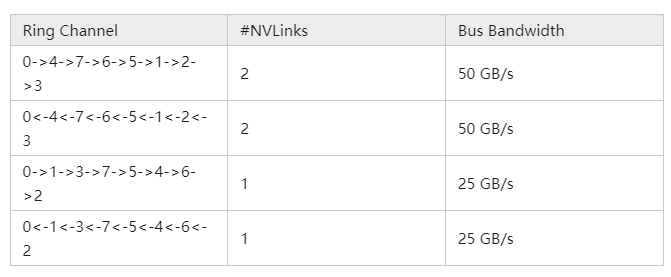
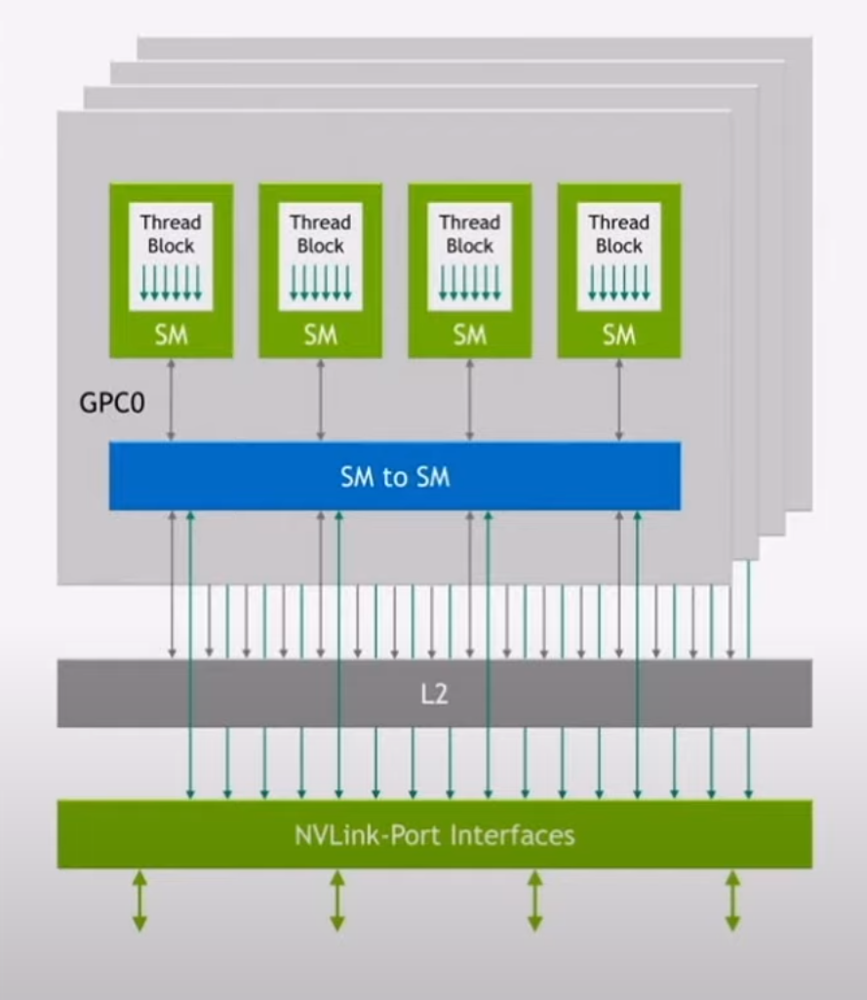
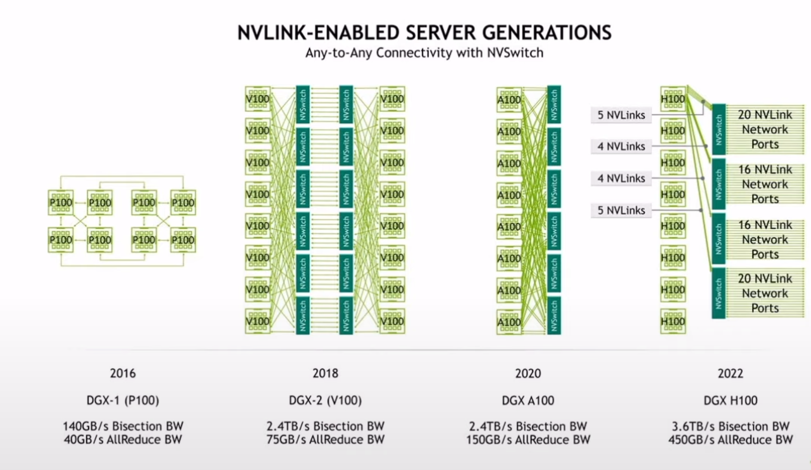

- From Zhihu:
  collapsed:: true
	- **1）communication primitive**
	  collapsed:: true
		- broadcast
		- gather
		- all-gather
		- scatter
		- reduce
		  collapsed:: true
			- 
		- all-reduce
		  collapsed:: true
			- 
		- reduce-scatter
		- all-to-all
	- **2） ring-base collectives**
		- 
		- latency:（K-1）N/B
		- 
		- S * (N/S/B) + (k-2) * (N/S/B) = N(S+K-2)/(SB) --> N/B
		- If S >> K, the upper equation stands, but if S not >> K, need to seek other methods like double binary tree
		- 单机4卡通过同一个PCIe switch挂载在一棵CPU的场景：
		  collapsed:: true
			- 
		- 单机8卡通过两个CPU下不同的PCIe switch挂载的场景：
		  collapsed:: true
			- 
		- [[pcie switch]]
	- **3）NCCL实现**
		- 下图所示，单机内多卡通过PCIe以及CPU socket通信，多机通过InfiniBand通信。
			- 
		- 多机多卡内部的通信环
			- 
			- 
			- 
		- 单机多卡下，All reduce不同架构下的速度：
			- 第一种，通过CPU之间的QPI socket连接，速度最慢，5G/s
			- 第二种，一部分通过Switch连接，速度提升
			- 第三种，完全通过Switch连接，速度10G/s
			- 第四种，
			- 
		- 多机多卡下，All reduce的速度：
			- 左边两机8卡，机器之间通过infiband通信，能达到单机的上限
			- 
		- NCCL的优势：
		  collapsed:: true
			- 
	- **4）DGX-1**
		- 
		- Use nvlink bw GPUs
		- 
		- 双工链路，所以可以创建下面的4种环路
			- 
		- 然后可以对数据进行切片，每一个链路负责部分的数据
	- **5）Double binary tree**
		- 
		- 
		- 
		- 每个节点表示一个GPU的device，两个互补的二叉树
		- 如何构建互补的二叉树?
		- 随着节点数量的增加，Ring算法所带来的latency是成线性增加的。而Double Binary Tree的latency是log(N)。
	- **6）collnet**
		- 简单来说，SHArP是一个软硬结合的通信协议，实现在了NVIDIA Quantum HDR Switch的ASIC里。它可以把从各个node收到的数据进行求和，并发送回去。再说的通俗一点，通过使用SHArP，我们把求和（聚合/Reduce，随便怎么叫）的操作交由交换机完成了。这种做法，业界叫做In-network Computing（在网计算）。用术语展开来讲，就是将计算卸载到网络中进行。
		- 
- Bandwidth analysis:
	- NVLINK:
		- {:height 424, :width 363}
	- single nvlink: 25 GB/s
	- 
		- All reduce is 450 GB/s for DGX H100
	- 
	- H100:
		- 18 link per GPU, 900 GB/s
		- 那么900GB/s是如何算出来的呢？每一个H100 GPU通过18个NVLink4连接到内部NVSwitch3芯片, 而每一个NVLink4连接实际是两条lanes,每个lane是112G PAM4, 这样一个NVLink4单向就是224Gbps, 或者可以说是25GB/s(注意这里从bits变成了Byte)单向带宽，50GB/s双向带宽，18个NVLink4总共是900GB/s双向带宽.
	- A100:
		- 12 link per GPU, 600 GB/s
	- 
	- 
	- Sharp in NVSwitch3:
		- 