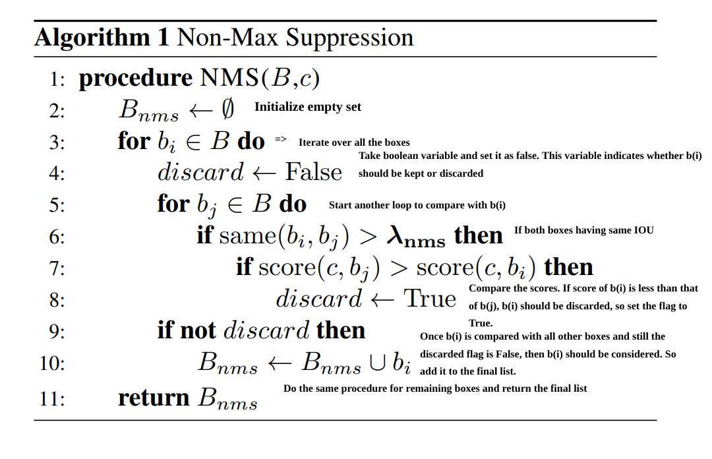

- [(1) How does non-maximum suppression work in object detection? - Quora](https://www.quora.com/How-does-non-maximum-suppression-work-in-object-detection)
	 - IOU calculation is actually used to measure the overlap between two proposals.
	 - Intersection over Union
		 - 
	 - Below is the pseudo code of NMS.
		 - 
	 - code:
		 - 
```python
def nms(dets, thresh):
    x1 = dets[:, 0] #xmin
    y1 = dets[:, 1] #ymin
    x2 = dets[:, 2] #xmax
    y2 = dets[:, 3] #ymax
    scores = dets[:, 4] #confidence
    
    areas = (x2 - x1 + 1) * (y2 - y1 + 1) # 每个boundingbox的面积
    order = scores.argsort()[::-1] # boundingbox的置信度排序
    keep = [] # 用来保存最后留下来的boundingbox
    while order.size > 0:     
        i = order[0] # 置信度最高的boundingbox的index
        keep.append(i) # 添加本次置信度最高的boundingbox的index
        
        # 当前bbox和剩下bbox之间的交叉区域
        # 选择大于x1,y1和小于x2,y2的区域
        xx1 = np.maximum(x1[i], x1[order[1:]]) #交叉区域的左上角的横坐标
        yy1 = np.maximum(y1[i], y1[order[1:]]) #交叉区域的左上角的纵坐标
        xx2 = np.minimum(x2[i], x2[order[1:]]) #交叉区域右下角的横坐标
        yy2 = np.minimum(y2[i], y2[order[1:]]) #交叉区域右下角的纵坐标
        
        # 当前bbox和其他剩下bbox之间交叉区域的面积
        w = np.maximum(0.0, xx2 - xx1 + 1)
        h = np.maximum(0.0, yy2 - yy1 + 1)
        inter = w * h
        
        # 交叉区域面积 / (bbox + 某区域面积 - 交叉区域面积)
        ovr = inter / (areas[i] + areas[order[1:]] - inter)
        #保留交集小于一定阈值的boundingbox
        inds = np.where(ovr <= thresh)[0]
        order = order[inds + 1]
        
    return keep
```