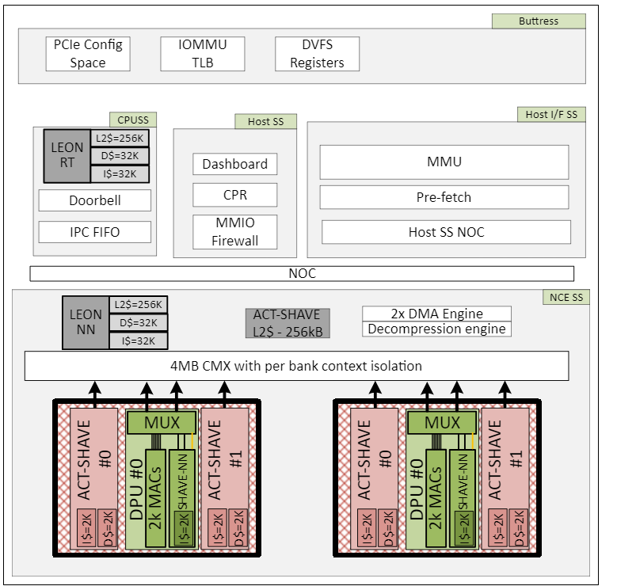
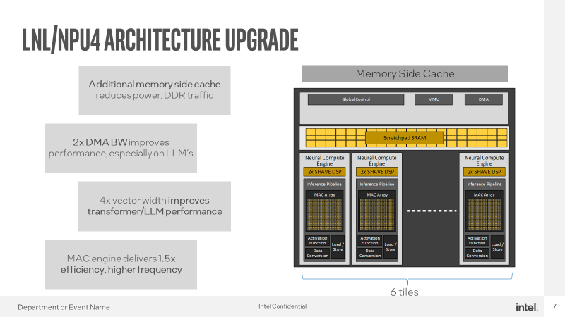
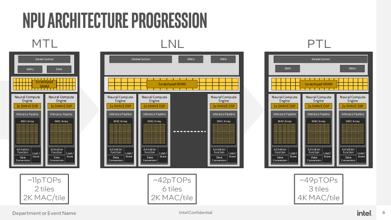
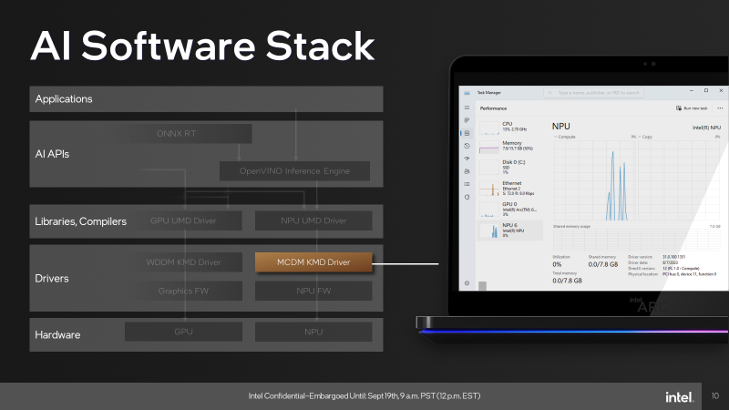
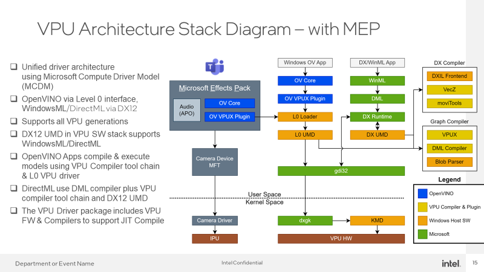
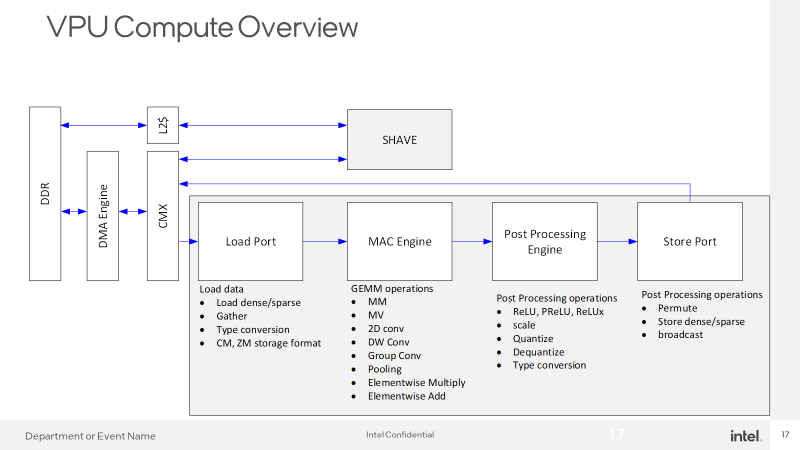
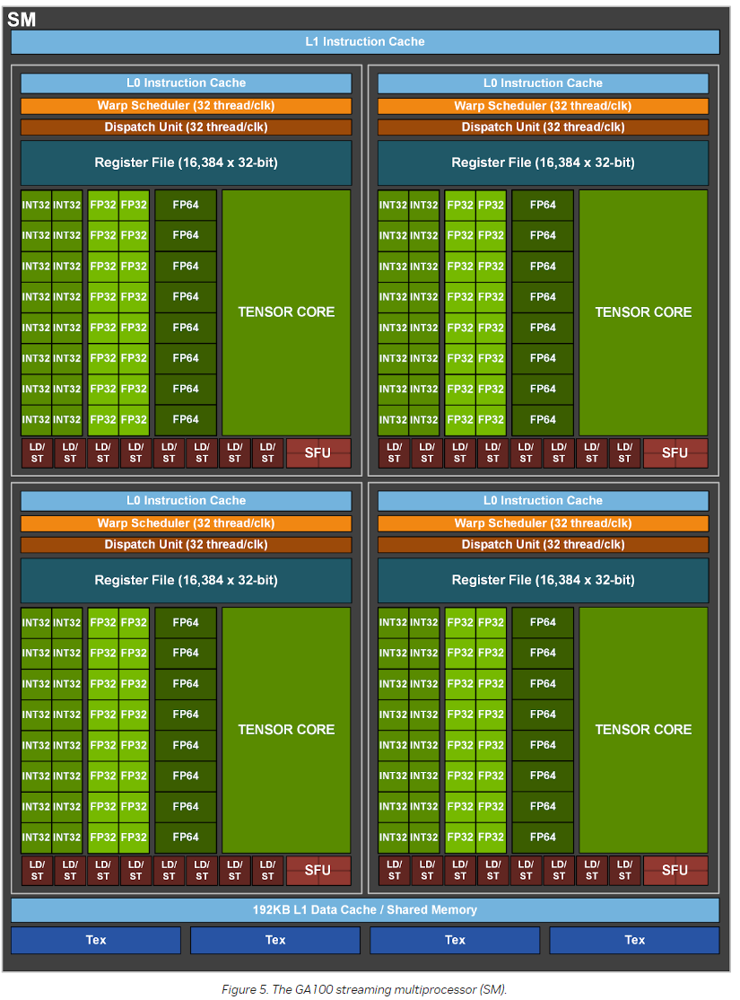

- Computer architecture
	- MMU and Memory controller
		- 通常，当CPU需要访问内存时，它提供一个虚拟地址。MMU将其转换为物理地址。然后，内存控制器使用物理地址来访问RAM中的实际内存单元。
- NPU Integration Overview
	- MTL:
		- 
		- 
	- LNL:
		- 
	- PTL:
		- 
	- Comparision:
		- 
	- Software stack for NPU:
		- 
		- 
	- VPU compute overview:
		- 
		-
- Nvidia Ampere architecture
	- memory hierarchy:
		- 
	- {:height 577, :width 1136}
	- For SM:
		- Structure:
			- {:height 1105, :width 810}
		- SFU: specialized function unit, similar to PPE
		- LD/ST: load and store, similar to ODU/IDU
		- Tensor Core: map to DPU
		- Warp scheduler: 一个warp包含了32个thread，并且32个thread用的是SIMD模式，也就是这32个thread用的是一条指令，但是操作的数据是不同的。也就是**Warp是32宽度的SIMD**
		- Invoke kernel:
			- 
			- Device：指的是 GPU 芯片。
			- {:height 158, :width 721}
			- Grid：对应 Device 级别的调度单位，一组block，一个grid中的block可以在多个SM中执行。
			- Block：对应 SM（Streaming Multiprocessor） 级别的调度单位，一组thread，同block中的thread可以协作。
			- Thread：对应 CUDA Core 级别的调度单位，最小执行单元。
		- Map kernel to hardware:
			- 
			- {:height 356, :width 720}
			- 一个 thread 一定对应一个 CUDA Core，但是CUDA Core可能对应多个 thread。
			- 一个Block内的线程一定会在同一个SM（Streaming Multiprocessor，注意不是后面经常提到的Shared Memory）内，一个SM可以运行多个Block。
			- 每一个block内的thread会以warp为单位进行运算，一个warp对应一条指令流，一个warp内的thread是真正同步的，同一个warp内的thread可以读取其他warp的值。
		- 为什么要分成grid/block/thread:
			- 这样能够map block到SM，map thread到CUDA core。同一个block一定在同一个SM上，并且共享L1，所以内部通信很快。
			- 
	- For better understanding:
		- https://cuda-tutorial.readthedocs.io/en/latest/tutorials/tutorial02/
-