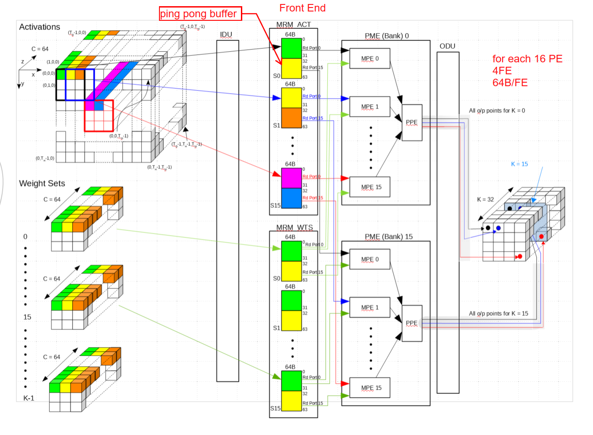
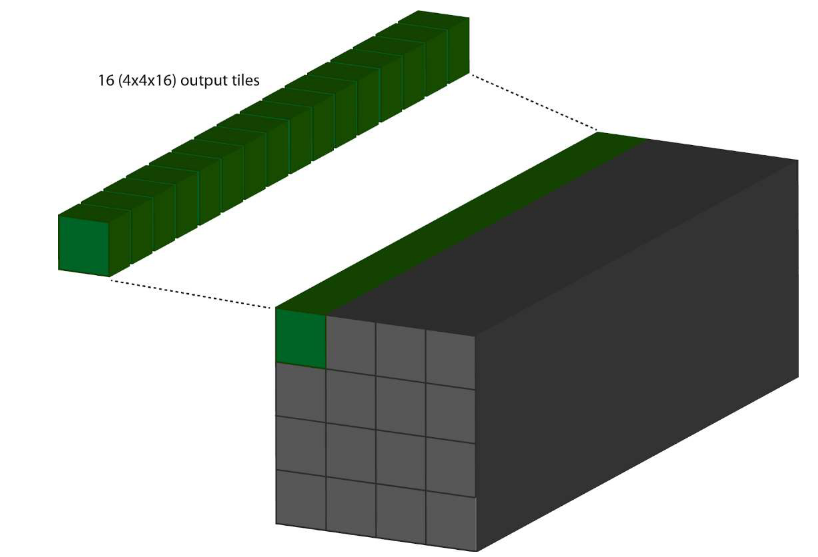
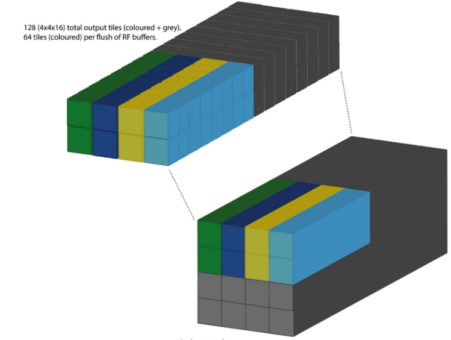
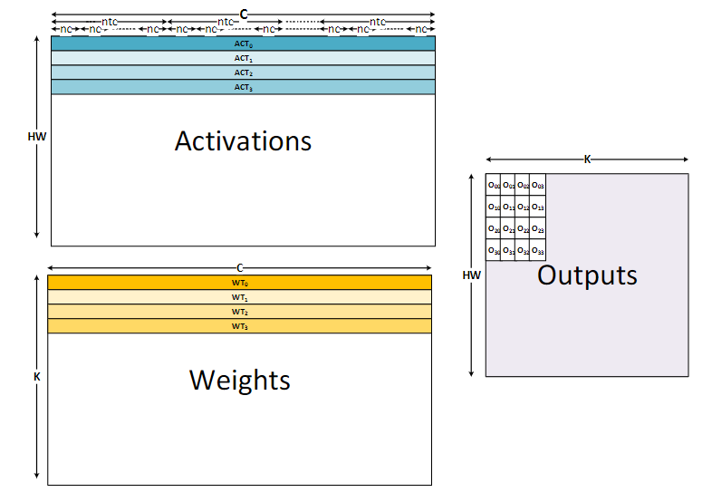
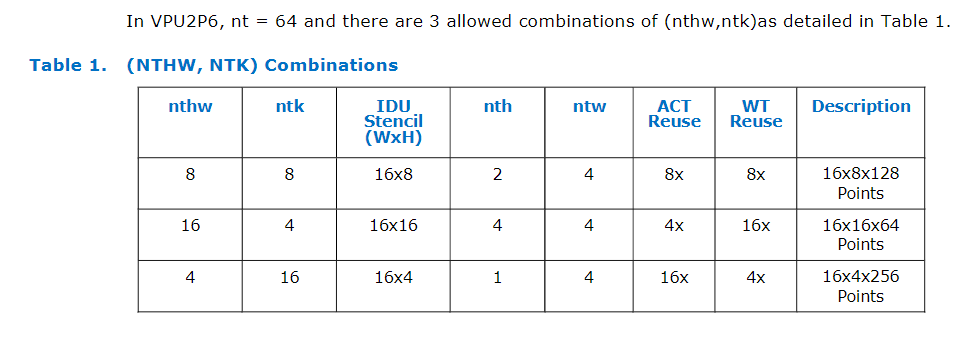
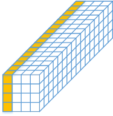
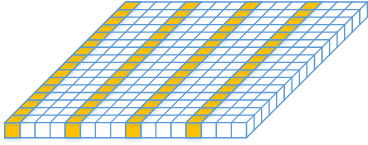
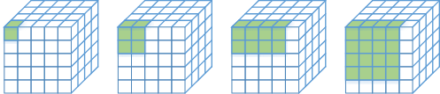

title:: NTHW_NTK
	- ## Related posts
	  collapsed:: true
		- _1646275860602_0.pdf)
			- [[Data Reuse in VPU]]
				- The hardware structure for VPU2P0, or KeemBay
				- ((62202de2-20b1-4530-bc61-8993f0e52c47))
				- For 4x4x16:
					- 
		- 
			- [[Data Reuse in VPU]]
				- ((622031d9-993f-44ac-8601-ca094d5ed731))
					- 第一句话容易理解，如上图所以，每一个ACT MPE中读取了1hx1wx16c的activation，每一个WTS MPE中读取了1hx1wx16c的weights。每一个权重的vector都可以与activation的vector做inner prod。所以有16x16个输出。
					- 
						- 上图中，输出标出的绿色部分是16个output tiles，每一个tile的大小是4x4x16。得到绿色的输出，需要输入为k=256（16x16），h=w=4，c=16。
				- ((62203692-5f49-4eb8-9b92-50f06d9d7d7b))
					- Tile是4x4x16大小的输出，对应在图上就是一个cube。
					- 当前的4x4x16输出cube计算完成之后，我们移到下一个cube的计算，这个时候权重和激活都需要重新load，因为对应的C不同了，不能复用之前的数据。
				- ((6220bc15-8f5e-42a9-932a-586a441e2b04))
					- 在VPU2P6+之后，每个MPE可以生成64个输出点。所以16x16的MPE可以生成16,384个输出的点。也就是64个4x4x16大小的tile。如下图所示。
						- 
					- 我们在图上生成了64 (2x4x8)个输出的tile，每个tile是4x4x16的大小。输入的output channel是8x16=128。输入的hxw是(4x4)x(2x4)=128。
				- ((6220becf-b98f-4873-b1f8-dc6e4e07b0d5))
					- 
					- ((6220bef8-784e-40ef-887a-bae8eddebadb))
					- 对于空间上的一个点的运算，在C方向上读取的最小单元是16，下文中用ntc表示。
					- > ==The MRMs will store “ntc” bytes at a time for a given spatial point or weight set – this is referred to as a context. Each MAC will consume each context at up to “nc” bytes per clock cycle where nc = 4.==
				- 对于一个有16个accumulator context的MAC来说，计算顺序应该如下所示：
					- ACT0xWT0-->ACT0xWT1-->ACT0xWT2-->ACT0xW3-->
					- ACT1xWT0-->ACT1xWT1-->ACT1xWT2-->ACT1xW3-->
					- ACT2xWT0-->ACT2xWT1-->ACT2xWT2-->ACT2xW3-->
					- ACT3xWT0-->ACT3xWT1-->ACT3xWT2-->ACT3xW3-->
				- 运算完成之后会生成4x4个输出点。然后我们将指针挪到ACT0的下一个ntc的位置继续运算。直到指针到达C的末尾。
				- 可以从上面的计算顺序看到，每一个ACT和WT的点都被复用了四次。
				- 为了方便理解，简单的伪代码如下：
					- ```
					  //for VPU2P7
					  vector<int> weights(16, 0);
					  vector<int> activations(16, 0);
					  vector<int> out([nthw, ntk], 0);
					  for (int i = 0; i < nthw; i ++){
					  	for (int j = 0; j < ntk; j ++){
					      	out[i][j] = DPU(weights[j], activations[i]);
					      }
					  }
					  ```
				- ((6220c2c1-b729-478b-a877-5c1716ccffc3))
					- 
		- In a nutshell.
			- For VPU2.0:
			            MATRIX_4X4 -> hw=4x4, c=16, inner product with 1x1x16x16 weight
			                        output 1x1x1 point in output map
			            VECTOR_16x1 -> hw=16x1, c=16, inner product with 1x1x16x16 weight
			                        output 1x1x1 point in output map
			- For VPU2.6+:
			            CUBOID_16x16 -> nth=4, ntw=4, ntk=4, corresponds to 16x16x16 inputs, 16x16x64 outputs, 1x1x16x64 weights
			            CUBOID_8x16 -> nth=2, ntw=4, ntk=8, corresponds to 8x16x16 inputs, 8x16x128 outputs, 1x1x16x128 weights
			            CUBOID_4x16 -> nth=1, ntw=4, ntk=16, corresponds to 4x16x16 inputs, 4x16x256 outputs, 1x1x16x256 weights
			            nthw means that the number of input context, ntk is the number of weight context
			            nthw * ntk = 64, means each MPE outputs 64 output tiles
		- What if the NTHW, NTK constraint is not met?
			- https://docs.intel.com/documents/MovidiusInternal/vpu4/common/has/VPU4HAS.html#z-major-mode
			- > When a reader request is performed and tensor size or number of weights sets is less than the maximum number of activations/weight sets for a read request for a particular NTHW/NTK configuration, then full utilization of the MPE array should still be achieved, but with less CMX reuse. The only caveat to this is when the number of activations for the read request is not a multiple of 4 in either the X or Y direction, in which case full utilization of the grid will not be achieved.
	- ## Questions
	  collapsed:: true
		- What is the tile here means?
			- 4x4x16大小的块
	- ## Tile Stencils
	  collapsed:: true
		- Tensors are partitioned into so-called **tiles** containing 256 points. Tiles come in two different configurations: 4x4x16 and 16x1x16 (obsolete). Figure 3 shows a 4x4x16 tile. Since there are only 64 PPE interfaces, a quarter of a tile can be transferred per clock cycle. In the case of a 4x4x16 tile, the tile data is transferred in 4 slices from left to right as highlighted in Figure: 4x4x16 Tile Configuration.
			- 
			- *4x4x16 Tile Configuration*
		-
		- The 16x1x16 tile configuration is shown in Figure: 16x1x16 Tile Configuration. This configuration is not to be used anymore as it is obsolete. The 64 data points that are being transferred in the first clock cycle are highlighted. The interleaved pattern moves from left to right until the entire tile has been transferred in 4 clock cycles.
		- 
			- *16x1x16 Tile Configuration*
		-
		- If the tensor workload dimensions are such that it is not a multiple of a tile, partial tiles will be transferred. This does only apply to the x and y dimensions, since the z dimension is always a multiple of 16, and thus, a multiple of the z dimension of a tile.
		- The transfer of tiles to the ODU is organized according to one of four different tile stencils as illustrated in Figure: Tile stencils for NTHW=1, NTHW=4, NTHW=8 and NTHW=16; each small box represents a tile.
		- 
			- *Tile stencils for NTHW=1, NTHW=4, NTHW=8 and NTHW=16; each small box represents a tile*
			-
		- The highlighted tiles show the shape of the tile stencil. Within the stencil, tiles are being transferred from left to right, and from top to bottom. Once all the tiles have been transferred, the stencil is advanced in the z dimension until the end of z is reached. In a next step, the stencil is moved to the right and the whole process repeats. Once the end of x is reached, the stencil is advanced in y and moved to the beginning of the x dimension. This way the entire workload can be traversed and transferred to the ODU.
		- The used stencil in the ODU has to match the stencil used by the sending upstream module. This means also that NTHW=1 should never be used under normal circumstances.
- Calculation order
	- First calculate NTHW, NTK, and get the 64 accumulation context. Then calculate in z direction, aka, ntc direction and reuse the 64 accumulation context.
	- ((629409b4-b481-49ef-83f5-13f4cc71e5c9))
- Name definition
	- NTHW:
		- Number of Activation Context
	- NTK:
		- Number of Weight Contexts
	- NHW:
		- Number of Activation Rows in MAC array
	- NK:
		- Number of Weight Rows in MAC array
	- NC:
		- Number of Steps in C a MAC can advance per clock cycle
	- NTC:
		- Number of Bytes per Context stored in MRM
		- Each row of activations and weights is broken into blocks that are ntc steps in C long where ntc = 16. The MRMs will store ntc bytes at a time for a given spatial point or weight set. This is referred to as a context