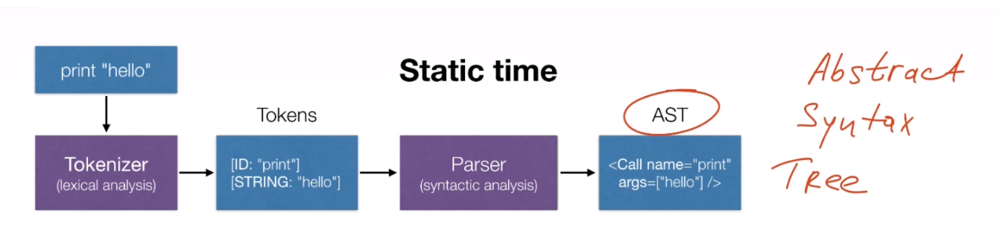
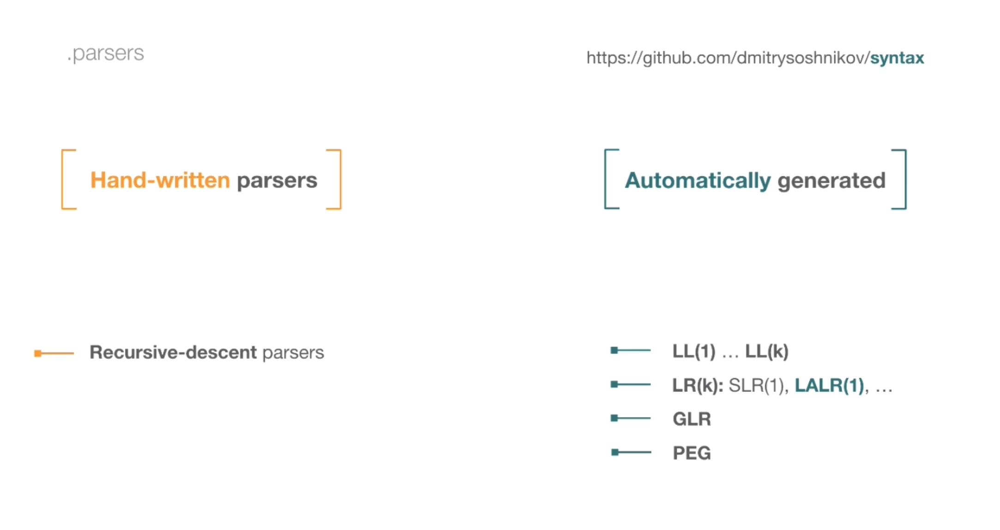
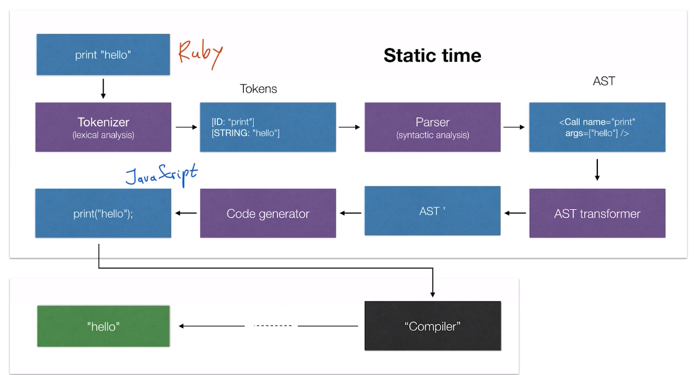

- References
	 - [[O'Reilly - Essentials of Parsing]]
- Parsers, ASTs, Interpreters, and Compilers
	 - 
		 - Tokenizer:
			 - tokenize the original program to tokens (not necessarily valid)
		 - Parser
			 - parse the tokens and do syntactic analysis
			 - transform the tokens into abstract syntax tree
			 - 
		 - AST
			 - 
	 - Interpreters vs compilers
		 - 
			 - Compilers translate semantics to a target language
			 - interpreter implement semantics and can execute these semantics
		 - 
			 - CPU is an interpreter
			 - compile one language to another language with existing interpreter, like translating code to x86/x64 instructions
		 - 
			 - Two types of interpreters
				 - AST-based/Bytecode
		 - 
			 - JIT/AOT
	 -
- AST Interpreters and Virtual Machines
	 - questions
		 - Difference bw AST and Bytecode and usage scenarios?
			 - Bytecode less space than AST
			 - closer to the hardware (optimize at the hardware level)
		 - What is virtual machine?
			 -
		 - what is the difference bw compiler and interpreter?
			 -
	 - https://astexplorer.net/
	 - AST interpreter (high-level semantics)
		 - 
			 - runtime is with respect to the compile time
	 - Bytecode interpreter (aka virtual machine)
		 - 
			 - extra step to produce the bytecode
		 - 
	 - 
	 - 
	 - Compilers: AOT, JIT
		 - 
		 - 
			 - llvm compiler
				 - allows reuse of the compiler backend
				 - 
		 - Just in time compilation
			 - 
		 - AST transformer
			 - 
			 -