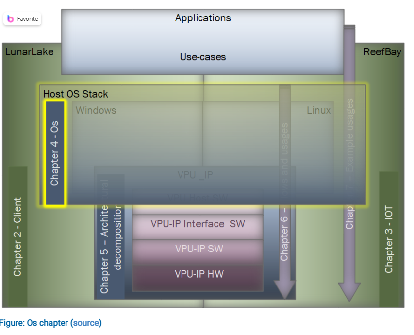
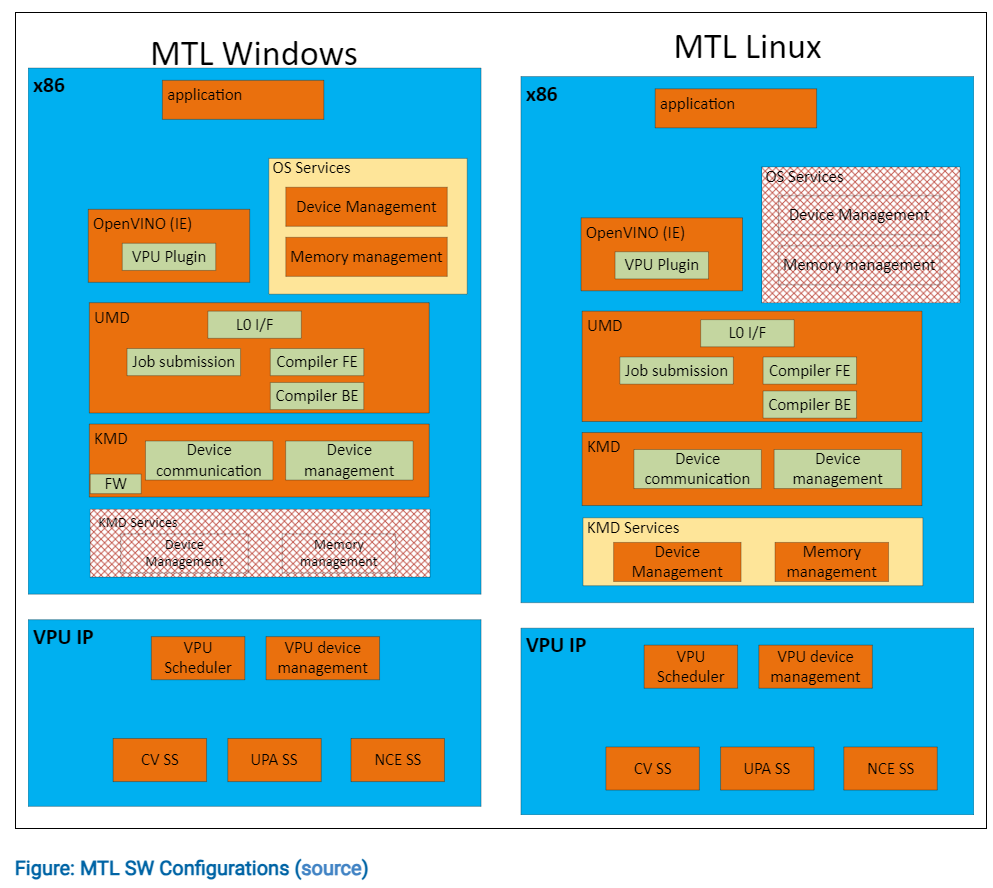
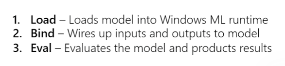
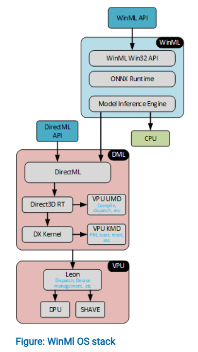
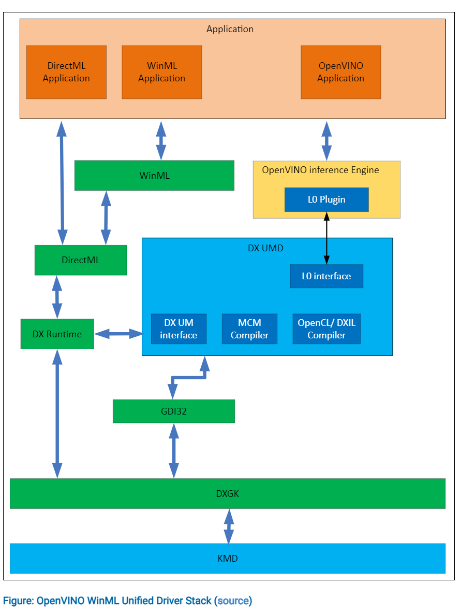
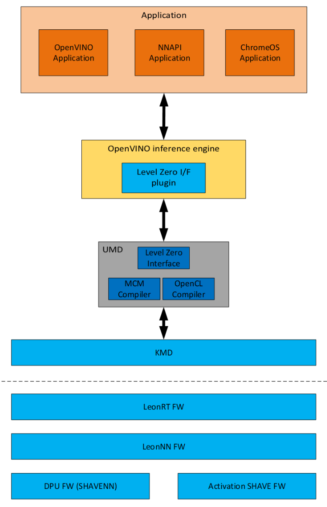
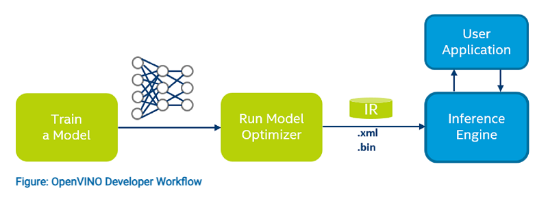

- 
- ### Meteor Lake (MTL) Configuration
	- Windows 和linux的区别，一个是OS去管理memory和队列，一个是KMD管理。
	- 
	- 图上能够看到，对于windows platform，需要在OS services中提供device和memory的management权限。这个是由DXGX(directx graphics driver)管理的。
id:: 65b0abee-5779-4dae-a4ae-b5e14543ec0a
	- 而linux系统不提供这些服务，所以这两个management需要在VPU的driver中实现。
- ### Windows
- #### [[WinML]]
	- 发送 [[meta command]] ，这个会被编译，然后发送到KMD，然后ring door bell，让LeonRT去取。
	- Steps for winml inference:
		- {:height 97, :width 389}
	- WinML OS stack:
		- {:height 593, :width 326}
	- [[DirectML for VPU]]
	- VPU 在DirectML中可以认为是一个DirectCompute device，支持如下两种function：
		- Compute Shader execution that will map to Shave
		- Meta Command execution that will map to NCE or NCE + Shave
			- Meta Command: Deep Learning or Machine Learning (ML) primitive, such as a convolution operation.
		- In order to deliver efficient execution of a Deep Neural Network to allow the accelerator to performance optimizations such as memory resource aliasing and inter-layer fusion. ==Future versions of the SW stack and OS are targeted to support these groupings but for now only one operation at a time is supported.==
- #### Windows Software Stack
	- 记得上一章节提到，device和memory的管理在[[DXGX]]中
		- ((65b0abee-5779-4dae-a4ae-b5e14543ec0a))
	- 另外，图上说明了openvino inference engine最终也是接到DXGX。
	- {:height 786, :width 585}
- ### Linux
- #### Linux Software Stack
	- openvino inference engine call the UMD for compilation through level zero plugin.
	- And then issue the KMD for memory management and device management
	- {:height 588, :width 366}
		-
- ## OpenVINO [[Inference Engine]] Architecture
	- 主要是用这个来做VPU上的inference
	- 流程:
		- Device discovery and connection
		- DL model compiler interface
		- Copying graph file to NCE firmware
		- Run inference
		- Collect profile information
	- 
-