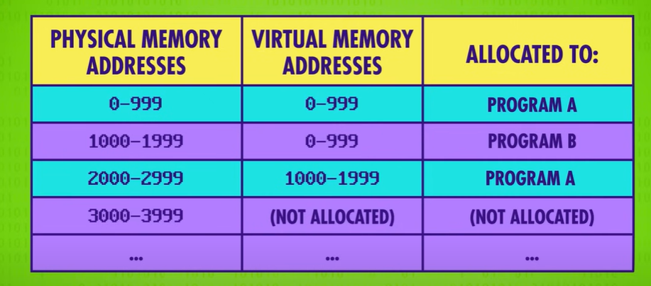

- {{video https://www.youtube.com/watch?v=26QPDBe-NB8&list=PL8dPuuaLjXtNlUrzyH5r6jN9ulIgZBpdo&index=19&ab_channel=CrashCourse}}
- Device drivers
- Multiple processes
	- multi-tasking to prevent one task block every other one. Like printing using mechanical printer.
- Virtual address mapping:
	- memory isolation
	- memory protection
	- 