- [[CUDA Mode]]
- # chapter1 Introduction
  collapsed:: true
	- [cuda_mode_lecture2.pptx](../assets/cuda_mode_lecture2_1735953370210_0.pptx)
	- Power wall
		- 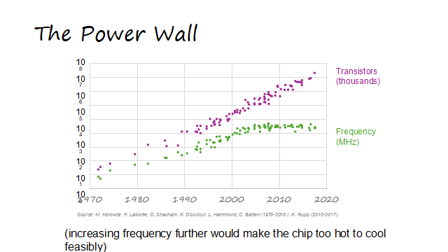
	-
- # chapter 2 Heterogeneous data parallel computing
  collapsed:: true
	- 异构计算 heterogeneous data parallel (CPU + GPU)
		- 
	- data independence create parallelism
		- 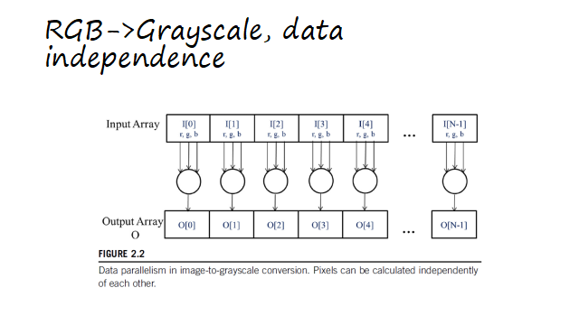
	- CUDA C 101
		- What is [[ANSI C]]?
			- **ANSI C 是 C 语言的一种标准**，曾是主流标准，并奠定了现代 C 语言的基础。ANSI C也被称为C89。尽管已经有了更新的标准（如 C99、C11 等），ANSI C 仍然具有重要的历史地位和影响力。
		- CPU和GPU的multithreading的区别？ #card
			- CPU launch multithreading需要非常大的cost。
			-
		- 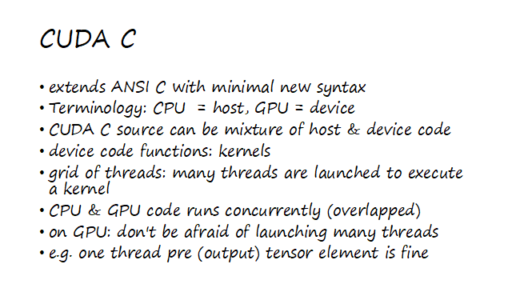
	- Example [[Vector Addition]]
		- 
	- CUDA memory functions:
		- [[cudaMalloc]]
		- 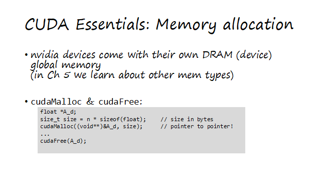
		- [[cudaMemcpy]]
		- 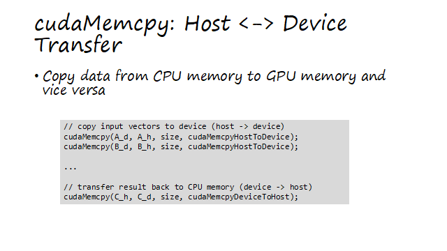
	- Error handling
		- 
	- launching kernels
		- [[CUDA 线程模型]]
		- 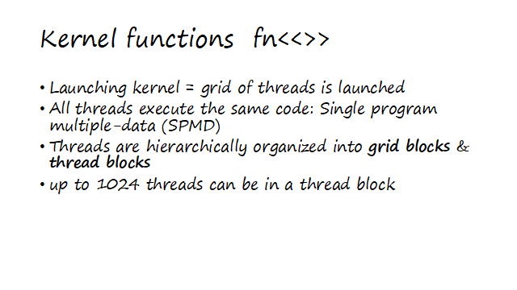
	- kernel coordinates
		- 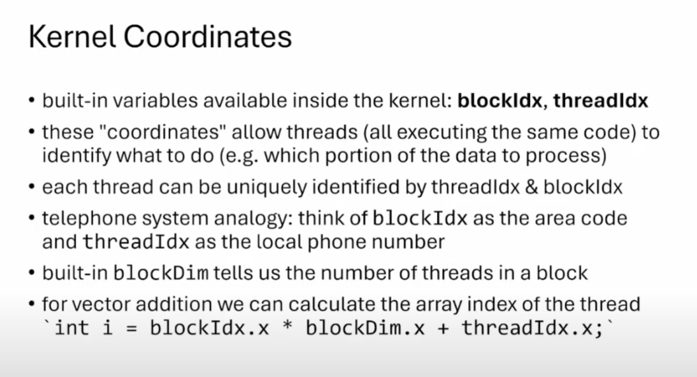{:height 350, :width 644}
		- 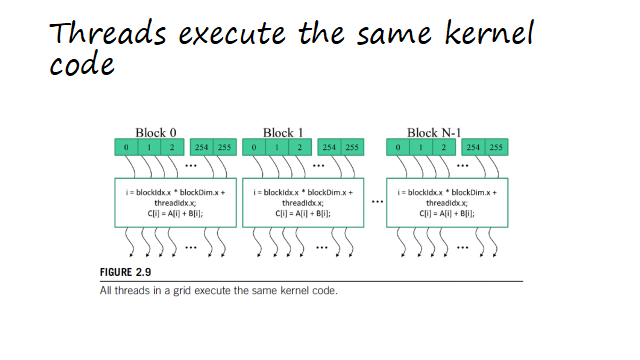
	- key words
		- `__host__`: host端的程序定义
		- `__device__`: device侧的程序定义，从cuda thread内部调用
		- `__global__`: device侧的程序定义，调用的时候会根据形参launch相对应数量的kernel
		- 如果同时有host和device的关键字，cpu和gpu版本都会被编译
		- 
		- {:height 281, :width 602}
	- vector addition
		- ==notes: always check boundary since the data sizes might not perfectly align with the block size==
	- calling kernels:
		- <<<>>> define the configuration for the kernel launch, including number of blocks and number of threads within a block
		- 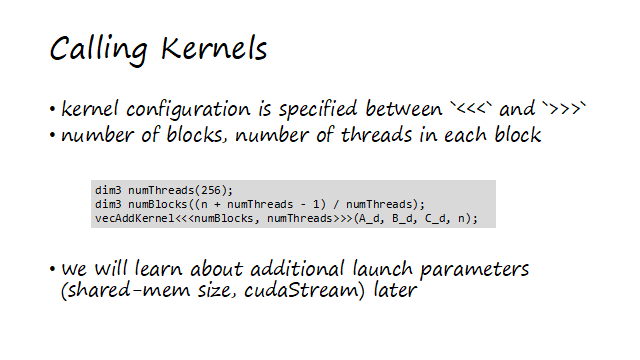
	- Compilation process
		- 1. nvcc is used to compile kernels into PTX
		- 2. graphics driver translates PTX into executable binary (SASS)
		- 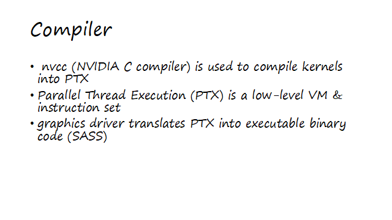
- # Chapter 3 Multidimensional grids and data
  collapsed:: true
	- multi-dim key takeaways:
		- 1.1024 maximum threads within a thread block
		- 2. threads in the same block access the same shared mem
		- 3. all threads in a grid execute the same kernel
		- 4. most common strategy: one thread per output element
		- 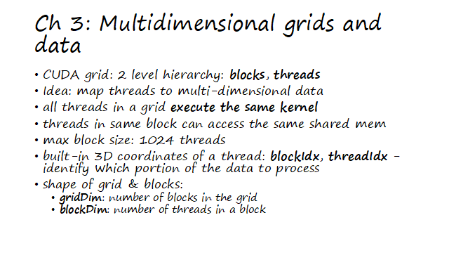
		- 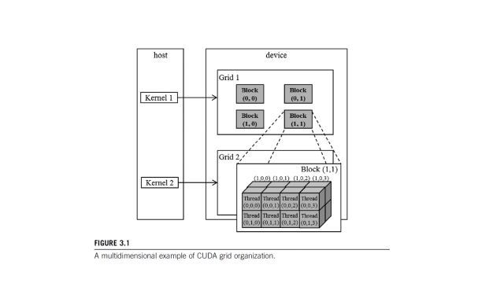
		- 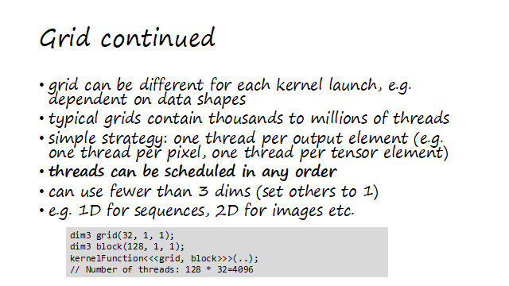
		- 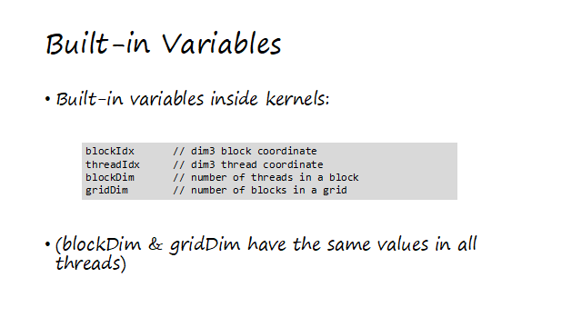
	- memory layout in memory vs logical
		- 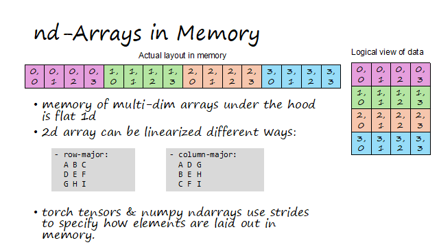
	- image blur example
		- 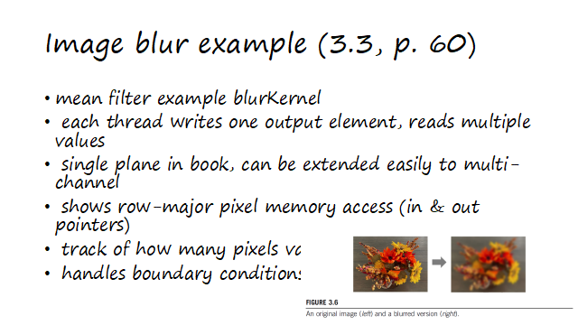
		- 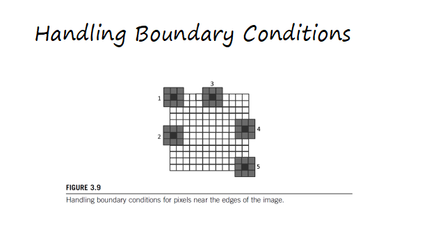
		- 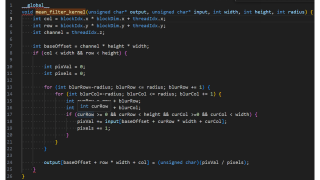
	- matrix multiplication
		- one output element per thread
		- 
		- 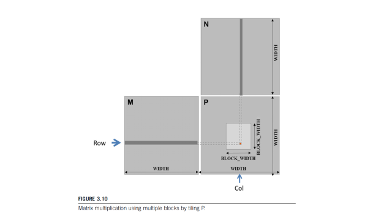
- # Chapter 4: Compute Architecture and Scheduling aka: How to keep all of the GPU busy
  collapsed:: true
	- 
	- [[Ampere ]]
		- 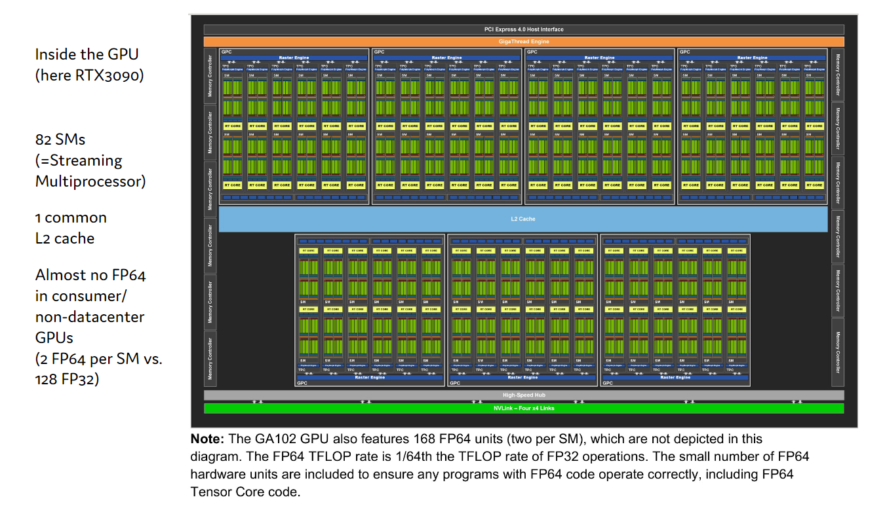
	- Key take aways from [[SM]]
		- thread block is assigned to one SM
		  logseq.order-list-type:: number
		- in the following structure (Ampere), 4 warps (each with 32 threads) can compute at a cycle (because the following structure have 4 warp scheduler, each with one instruction dispatcher)
		  logseq.order-list-type:: number
		- 16K 32-bit registers shared between things scheduled on the same block
		  logseq.order-list-type:: number
		- L1 cache and shared memory is configurable
		  logseq.order-list-type:: number
		- ### **示例**
			- 假设在 **Ampere 架构（RTX 3080）** 中：
				- 一个线程块有 1024 个线程（即 32 个 warp）。
				- 一个 SM 有 **4 个 warp 调度器**，每个调度器每个周期可以调度一个 warp 的指令。
			- 当这个线程块被分配到某个 SM 时：
				- 线程块的 32 个 warp 会被分配给该 SM 上的 4 个 warp 调度器。
				- 调度器动态调度这些 warp 的执行，可能同时运行来自同一个线程块的多个 warp。
				- 如果该 SM 上还有其他线程块的 warp，这些 warp 也会与当前线程块的 warp 一起被调度，充分利用计算资源。
		- 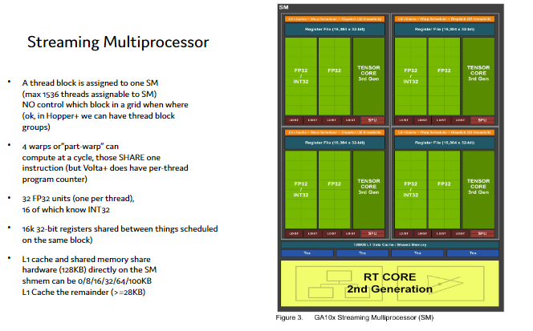
	- 哪些threads会被group到同一个32的warp中？#card
		- **每 32 个连续线程** 会被分配到同一个 warp。
		- **线程分组顺序**：
			- 一维线程块：基于 `threadIdx.x`。
			- 二维线程块：先按 `threadIdx.x`，再按 `threadIdx.y`。
			- 三维线程块：先按 `threadIdx.x`，再按 `threadIdx.y`，最后按 `threadIdx.z`。
			- > 当线程块的线程数 **不是 32 的倍数** 时：最后一个 warp 的线程数可能小于 32，这是一个 **部分 warp**（也称为 **不完整 warp**），但仍然会被调度执行。
	- [[warp divergence]]
		- 关于分支发散的处理方式的迭代:
		- Pascal 及以前：
			- 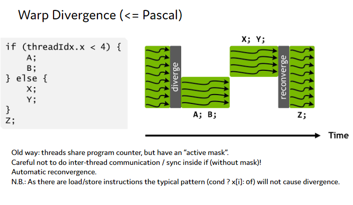
			- 在 **Volta** 架构之前（例如 Pascal、Maxwell 和 Kepler 架构），NVIDIA GPU 的处理模型是基于 **SIMD（Single Instruction, Multiple Data）** 的，所有线程在一个 warp 内共享一个 **Program Counter (PC)**。
			- **统一 Program Counter**:
				- 一个 warp 内的所有线程只能执行同一条指令。
				- 当 warp 中的线程遇到分支（如 `if-else` 或 `switch`）时：
					- **分支路径会被序列化**：GPU 先执行满足 `if` 条件的线程，屏蔽掉其他线程（这些线程进入“等待”状态）。
					- 然后再执行满足 `else` 条件的线程，屏蔽掉之前已经执行过的线程。
				- 这种序列化处理会导致性能下降，因为部分线程在等待期间无法利用硬件资源。
			- **Warp 发散处理方式**:
				- **SIMD 模式**下，warp 中的线程必须严格同步执行。如果出现条件分支，GPU 会使用 **分支掩码（[[branch mask]]）** 来控制哪些线程被激活，哪些线程被屏蔽。
				- 线程发散的执行流程如下：
					- GPU 生成一个 **分支掩码**，表示哪些线程需要执行当前指令。
					- 执行当前分支路径后，切换到下一个路径并更新分支掩码。
					- 当所有线程的分支路径都执行完毕，warp 才能重新合并。
			-
		- Volta及以后：
			- 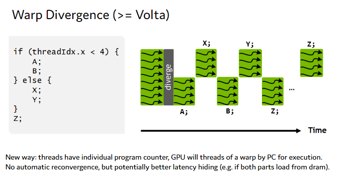
			- 从 **Volta 架构（如 Tesla V100）** 开始，NVIDIA 引入了 **独立线程调度（Independent Thread Scheduling）**，这是一个重大改变，旨在改善 warp 发散问题。
			- #### **1. 独立线程调度（Independent Thread Scheduling）**
				- 在 Volta 架构中，**每个线程都有自己的 Program Counter (PC)**，而不再共享一个统一的 PC。这种设计允许 warp 中的线程可以独立执行不同的指令。
				- **每个线程独立调度**：
					- 每个线程可以独立跟踪自己的执行路径。
					- 即使 warp 中的线程分支不同，它们也可以并行执行，而不需要完全序列化。
				- **线程屏蔽机制优化**：
					- Volta 仍然保持 warp 为基本调度单元，但线程的分支掩码（branch mask）被细化，可以对每个线程进行更精细的控制。
					- 线程进入不同的分支路径时，GPU 能够独立调度这些线程，而不是像之前那样完全序列化分支。
			- #### **2. Warp 内的线程调度更加灵活**
				- 在其中一条指令等待数据读取的时候，另外一组的指令可以进行计算。
			- Note: 需要在线程结束的时候插入一个sync指令 `__syncwarp` 来把所有的warp同步一下。
	- balance resources
		- **充分利用 [[SM]] 数量：** 增加线程块数，以填满所有 SM。
			- [[SM]]数量是怎么演进的？#card
				-
		- **合理设置[[线程块]]大小：** 推荐小于 512 且为 2 的幂。
			- [[线程块]]数量是怎么演进的？ #card
				- 每个 SM（Streaming Multiprocessor）能同时调度的线程数是有限的。例如：
					- 大多数 NVIDIA GPU 上限为 **2048 个线程**（Ampere 架构及之后）。
					- 在某些架构（如 Volta、Pascal）中，这个限制是 **1536 个线程**。
				- CUDA 硬件对单个线程块的大小有上限，通常是 1024 个线程。
				- ==注意上面两者的区别。一个是硬件限制，一个是CUDA的软件限制==
			- 为什么线程块的数量推荐小于512? #card
				- #### **保证更多线程块可同时调度**
					- 一个 SM 上可以同时调度多个线程块。线程块越大，每个 SM 能调度的线程块数就越少，降低并行度。
					- 例如：
						- 如果线程块大小为 1024，一个 SM 最多只能同时调度 2 个线程块（在 2048 最大线程数限制下）。
						- 如果线程块大小为 256，一个 SM 可以调度 8 个线程块，大大提高并行度。
				- #### **符合硬件调度优化**
					- 虽然最大线程块大小通常是 1024，但在实际中，CUDA 程序的性能在线程块大小为 **128 到 512** 之间时通常表现最佳。
					- 小于 512 的线程块大小能更好地适配不同 GPU 架构的硬件调度机制。
			-
		- **避免 warp 发散：** 确保 warp 内线程执行相同指令。
			- warp scheduler是怎么演进的？ #card
			-
		- **减少 64 位运算：** 避免使用 FP64 和 INT64。
		- **平衡资源使用：** 控制共享内存和寄存器使用量，避免 [[register spilling]]。
			- [[CUDA中的资源限制]]
				- registers per thread
					- 对于计算能力 2.x-3.7: 每个线程最多可使用 63 个寄存器
					- 对于计算能力 5.x-8.x: 每个线程最多可使用 **255** 个寄存器
				- registers per SM
				  collapsed:: true
					- 64K个32位寄存器 = 256KB
					- 在Ampere架构中，单个SM的64K个寄存器（256KB）在物理上被分为4个partition，对应4个warp scheduler：
					- 每个partition：
						- 16K个32位寄存器（64KB）
						- 对应一个warp scheduler
					- 重要说明：
						- 这是物理分区，但从编程角度看仍然是统一的资源池
						- warp scheduler可以访问其他partition的寄存器，但访问自己partition的寄存器延迟最低
						- 当多个warp需要跨partition访问寄存器时，可能会出现bank conflict
				- `__launch_bounds__`是什么作用？
					- 使用 CUDA 提供的 `__launch_bounds__` 指令，限制每个线程块的最大线程数和寄存器分配：
					- ```
					  __launch_bounds__(128, 4) // 每个线程块最多 128 线程，最多并行 4 个线程块
					  __global__ void kernelExample() { ... }
					  ```
			- 什么时候会出现register spilling? #card
				- **Register Spilling** 是指当 CUDA kernel 使用的寄存器超过了 GPU 每个线程可用的寄存器数量时，编译器被迫将部分数据（变量）从寄存器“溢出”到全局内存（global memory）中存储。这种行为会显著降低性能，因为访问全局内存的延迟远高于寄存器。
			- #### **减少资源竞争**
				- 每个线程块会消耗共享内存和寄存器等资源。线程块越大，每个线程块的资源需求越高，可能导致硬件资源耗尽，从而限制线程块的数量。
				- 使用较小线程块（如小于 512）可以更好地平衡计算资源和并行度。
		- **使用工具：** 借助 Nsight Compute 和 PyTorch 获取硬件信息并进行性能分析。
		- 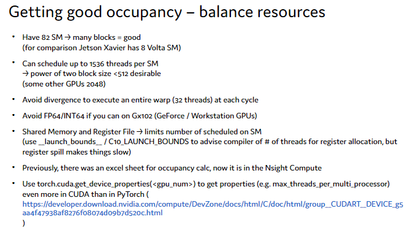
- # Chapter 5: Memory architecture and data locality aka the basics of getting fast kernels
  collapsed:: true
	- memory access as a bottleneck
		- 
		- 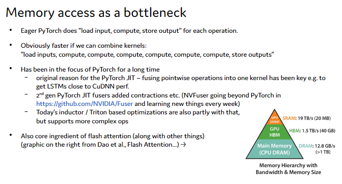
	- pytorch中的内存优化
		- ### **PyTorch JIT（即时编译）和内核融合（Kernel Fusion）**
			- **PyTorch JIT 的初衷：**
				- PyTorch 引入 JIT 编译器的主要目的是通过**将点操作（Pointwise operations）融合到单个 GPU 内核中**来提升性能。
		- ### **第二代 PyTorch JIT Fuser**
			- **第二代 Fuser 是什么？**
				- 这是 PyTorch JIT 的一种高级优化方法，扩展了点操作的融合能力，可以处理更复杂的计算，例如**张量收缩（Tensor Contractions）**（比如矩阵乘法或归约操作）。
				- ### **NVFuser**
					- 由 NVIDIA 提供的下一代 Fuser 库，功能超越了 PyTorch 的默认 Fuser。
					- 它通过硬件感知的优化技术，融合操作并生成高效的 GPU 内核，进一步提升张量计算密集型任务的性能。
					- **持续优化：** NVFuser 是一个开源项目（[GitHub 链接](https://github.com/NVIDIA/Fuser)），每周都会学习和引入新的优化技术。
					- NVFuser 在内核融合的同时，还能够充分考虑硬件特性（如 GPU 的内存层次结构和线程调度机制），从而实现更高效的代码。
		- ### **Triton 和 Inductor 优化**
			- LATER tobe continued
			  :LOGBOOK:
			  CLOCK: [2025-01-06 Mon 10:52:46]--[2025-01-06 Mon 10:52:48] =>  00:00:02
			  :END:
	- Roofline model
		- 能够达到roofline model的条件：
			- perfect overlap bw compute and communication
		- 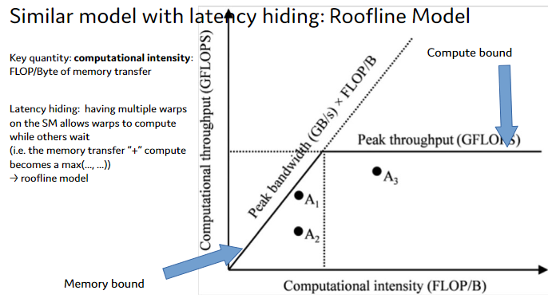
	- memory model
		- 
	- reuse shared memory [[Tiling of reused data]]
		- [[matrix multiplication]]
		- 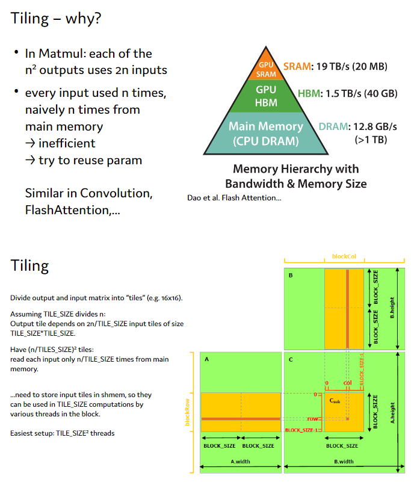
		- [[Memory Coalescing]] and [[Corner Turning]]
		- why we need the two sync threads in  ? #card
		  {{embed ((677b5d40-371f-4de5-8a3c-dee117eb947c))}}
			- 第一个是为了等待所有的线程都把数据loading到shared memory，要不然后面计算的时候可能会使用没有loading到位的数据，导致结果出错。
			- 第二个是为了等待所有线程完成计算。避免后面的loading提前发生，导致一些没有完成计算的线程使用提前loading的下一个循环的数据，导致计算出错。
		- id:: 677b5d40-371f-4de5-8a3c-dee117eb947c
		  ```cpp
		  cuda_src = cuda_begin + r"""
		  constexpr int TILE_SIZE = 16;
		  
		  __global__ void tiled_matmul_kernel(float* out, float* M, float* N, int h, int w, int k) {
		    __shared__ float M_tile[TILE_SIZE][TILE_SIZE];
		    __shared__ float N_tile[TILE_SIZE][TILE_SIZE];
		    
		    // idxes into tile
		    int ir = threadIdx.y;
		    int ic = threadIdx.x;
		    
		    int r = blockIdx.y * blockDim.y + threadIdx.y;
		    int c = blockIdx.x * blockDim.x + threadIdx.x;
		  
		    // note: cannot just exit if we want to do padding!
		    
		    float res = 0.0f;
		    for (int K_tileidx = 0; K_tileidx < (k + TILE_SIZE -1) / TILE_SIZE; K_tileidx++) {
		      // note how threadIdx.x is the fastes moving bit --> coalesced memory access
		      M_tile[ir][ic] = (((r < h) && (K_tileidx * TILE_SIZE + ic < k)) ? M[r * k + K_tileidx * TILE_SIZE + ic] : 0.f);
		      N_tile[ir][ic] = ((((K_tileidx * TILE_SIZE + ir) < k) && (c < w)) ? N[(K_tileidx * TILE_SIZE + ir) * w + c] : 0.f);
		      //M_tile[ir][ic] = M[r * k + K_tileidx * TILE_SIZE + ic];
		      //N_tile[ir][ic] = N[(K_tileidx * TILE_SIZE + ir) * w + c];
		      __syncthreads();
		      for (int idx = 0; idx < TILE_SIZE; idx++) {
		         res += M_tile[ir][idx] * N_tile[idx][ic];
		      }
		      __syncthreads(); // important! (why?)
		    }
		    if ((r < h) && (c < w)) {
		      out[r * w + c] = res;
		    }
		  }
		  
		  torch::Tensor tiled_matmul(const torch::Tensor& m, const torch::Tensor& n) {
		      CHECK_INPUT(m); CHECK_INPUT(n);
		      int h = m.size(0);
		      int w = n.size(1);
		      int k = m.size(1);
		      TORCH_CHECK(k==n.size(0), "Size mismatch");
		      //TORCH_CHECK((k % TILE_SIZE == 0) && (h % TILE_SIZE == 0) && (w % TILE_SIZE == 0), "Padding not done");
		      auto output = torch::empty({h, w}, m.options());
		  
		      dim3 tpb(TILE_SIZE, TILE_SIZE);
		      dim3 blocks(cdiv(w, tpb.x), cdiv(h, tpb.y));
		      tiled_matmul_kernel<<<blocks, tpb>>>(
		          output.data_ptr<float>(), m.data_ptr<float>(), n.data_ptr<float>(), h, w, k);
		      C10_CUDA_KERNEL_LAUNCH_CHECK();
		      return output;
		  }
		  
		  """
		  cpp_src = """
		  torch::Tensor tiled_matmul(const torch::Tensor& m, const torch::Tensor& n);
		  """
		  
		  tiled_matmul_module = torch.utils.cpp_extension.load_inline(
		      "test_ext_tiled_matmul", cpp_src, cuda_src, 
		      functions=['tiled_matmul'], extra_cuda_cflags=['--ptxas-options=-v'], verbose=True)
		  ```
	-
-