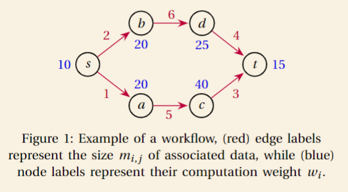

- [[@Parallel Scheduling of DAGs under Memory Constraints]]
- This is max topology cut the POC team are referring to
- # Abstract
	- ## Problem trying to solve
		- ((6434049a-3f23-42d1-98b9-adeade3bdcdf))
		- Too many parallelism when scheduling dynamically by runtime, this is mainly due to the residual connections in neural networks.
	- ## Solution in general
		- ((6434053b-ba85-4960-b963-e84a1351b823))
		- add fictious edges which should correspond to the control edges in NBperf, these edges are aimed to reduce the peak memory consumption during scheduling
		- #l2 #nbperf #scheduling
		- Speaking of which, we should consider the process of memory allocation as the scheduling process. Currently in Nbperf, we only support one by one scheduling with weight prefetching DMA parallel. But actually, in temporal tiling and vertical fusion, we allow some level of parallelism, we should consider that in memory allocation somehow.
- # Introduction
	- ((64340abe-de22-44f8-82c4-531ea6017b88))
	- id:: 64340ac3-695b-438f-bef4-8d5aef0ef3bf
	- The risk of dynamic scheduling clearly is memory allocation since then run-time would need feedback from the CMX to know the allocation status, which is too heavy for run-time
	- ((64340b51-daa1-4b9f-adf6-821eeaa7ae00))
	- Add control edges or so called fictitious edges to control the tasks that can be run in parallel. That is, forbid concurrent execution of memory intensive tasks.
- # Problem Modeling
	- ## Workflow example
		- 
		- Red: memory consumption of preds output to succs input; represented by $$m_{i,j}$$
		- Blue: computation time of node; represented by $$w_i$$
	- ## Simple Data Flow Model
		- ((64340f8b-38ca-4959-8f3d-60983bd69689))
		- ((64341074-9d91-4d11-a7ef-8d9b8f10772b))
		- This model doesn't allow inputs and outputs to be in memory simultaneously. The formula is:
			- $$M_{used}=M_{used}-Inputs(i)+Outputs(i)$$
		- ### Theorem 1.
			- ((643411a8-1a82-4071-94ec-22e463261c5e))
			- Have question about this one.
				- It makes no sense to have the constraint that inputs and outputs are not in memory at the same time.
				- Why the peak memory is the same? Should be different, task a and b if parallel. The memory being processed should be a + b. While in sequence, should be max(a, b)
	- ## Other memory models
		- classical workflow model
			- This makes more sense.
- # Computing the maximal peak memory