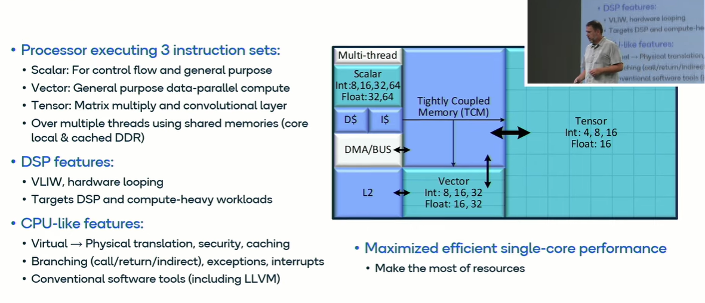
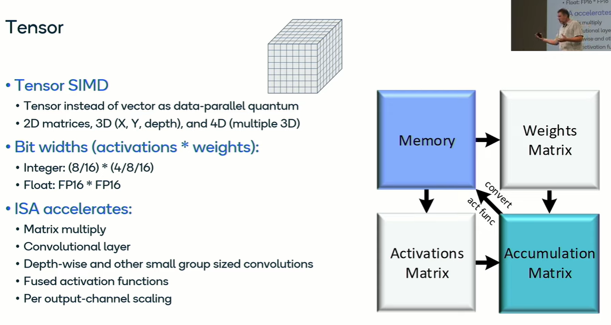
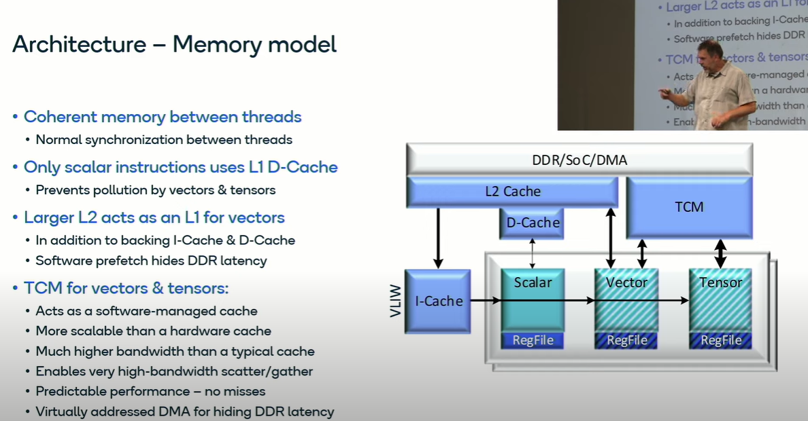

- Rough sketch of Hexagon
	- {:height 506, :width 759}
	- Hexagon supports virtual memory and caching like CPU and can run compiled C code
		- How can the tensor operations run on Hexagon NPU as C code is the question?
	- Interesting point:
		- instructions are first committed and then executed, enables very deep execution pipelines
- Overview:
	- 
	- Vector extention:
		- 
- Tensor extention:
	- Also SIMD, tensor SIMD
	- 
- Programming model:
	- Threads
		- 
- memory model:
	- 
- Locality:
	- 
- Scheduling and Allocation
	- https://docs.qualcomm.com/bundle/publicresource/topics/80-63442-50/scheduling_and_allocation.html
	- In QNN HTP, both scheduling and allocation is done in Graph::prepare() stage. As an overview, the following occurs in regards to *scheduling and allocation*:
		- Memory **blocks are registered** with the allocator.
		- ==**Pre-Scheduler** fits as much data into TCM as possible.==
		- **Spill/fill nodes are inserted** where necessary.
		- Some **ops are split** into launch-wait pairs.
		- **Offsets are allocated** for blocks that reside in VTCM.
		- Ops are **re-scheduled** to maximize parallelism.
	- How are they lowering the graph into?
	- What is the runlist?
-