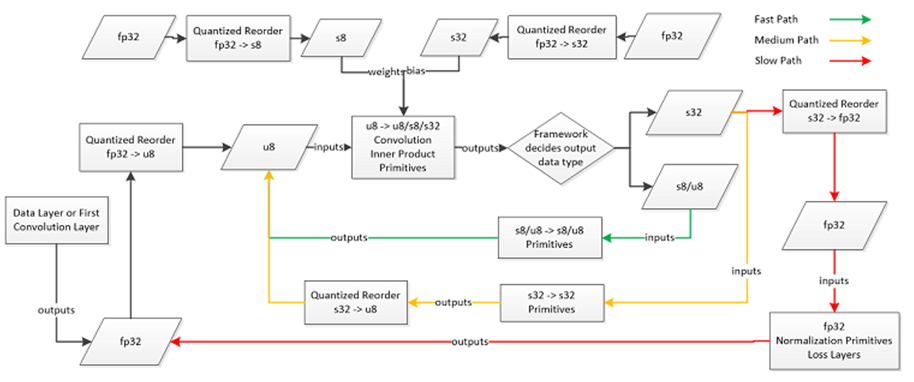
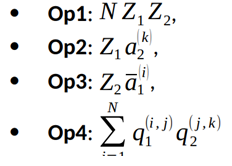

- 1. CPU/GPU situation on weight quantization.
	- GPU:
		- TensorRT uses symmetric quantization to represent both activation data and model weights.
		- https://developer.nvidia.com/blog/achieving-fp32-accuracy-for-int8-inference-using-quantization-aware-training-with-tensorrt/
		- Do we really need bias? No!
		- https://on-demand.gputechconf.com/gtc/2017/presentation/s7310-8-bit-inference-with-tensorrt.pdf
		- https://onnxruntime.ai/docs/performance/quantization.html#data-type-selection
	- CPU:
		- We checked the intel CPU behavior and find that Intel CPU only support symmetric quantization on weights.
		- 
		- [https://www.intel.com/content/www/us/en/developer/articles/technical/lower-numerical-precision-deep-learning-inference-and-training.html](https://www.intel.com/content/www/us/en/developer/articles/technical/lower-numerical-precision-deep-learning-inference-and-training.html)
		- This means that the zero point for weight is zero, and the convolution computation is u8 weights * s8 activations.
		- 
		- On CPU, because of the complexity of Op3 (activation is dynamic during inference), the weights are symmetrically quantized.
		- This proves the novelty of the proposed method in the IDF because on devices like CPU, there is no current solution for the s8s8 convolution where zero point for weight is not zero.
- 2. Zeropoint is used for fixed point only.
	- I think that is the point to clarify why zeropoint is only required for fixed point conversions.  What typically happens when you go from FP32->FP16/FP8 and why there is no need for zeropoint support. This is mostly supposed to educate the reviewers on quantization/training from scratch for lower precision floating point inputs.