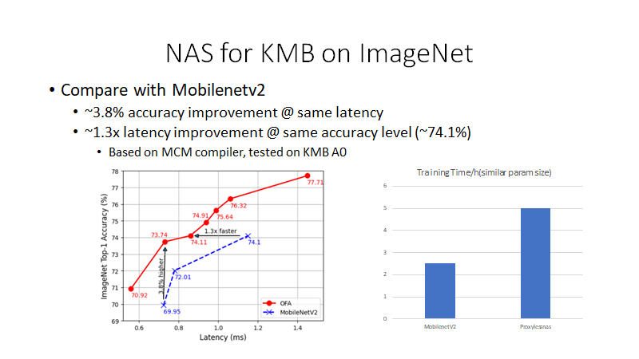
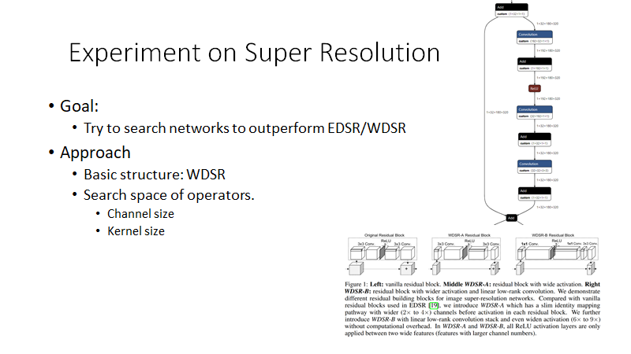

- ==target==: more than 20 minutes I hope
- ## Key points:
	- NAS is helpful for creating efficient network on VPU
	- How to measure the latency for each layer (KMB and MTL)
	- VPU Network Design Insights from NAS:
		- 7x7 kernels
		- Avoid shave layers
		- ...
- ## Reference:
	- Proxylessnas
		- [poster](https://hanlab.mit.edu/files/proxylessNAS/figures/ProxylessNAS_iclr_poster_final.pdf)
		- {{video https://www.youtube.com/watch?v=NYpKa40Xr_k&ab_channel=SamsungSemiconductorInnovationCenter}}
			- {{youtube-timestamp 1783}}
	- [victor's presentation on N-bench](https://intel-my.sharepoint.com/personal/murali_ambati_intel_com/_layouts/15/onedrive.aspx?id=%2Fpersonal%2Fmurali%5Fambati%5Fintel%5Fcom%2FDocuments%2FRecordings%2FVPU%20client%20architecture%2D20220429%5F070344%2DMeeting%20Recording%2Emp4&parent=%2Fpersonal%2Fmurali%5Fambati%5Fintel%5Fcom%2FDocuments%2FRecordings&ga=1)
	- [swpc](https://intel-my.sharepoint.com/:w:/r/personal/victor_y_li_intel_com/_layouts/15/Doc.aspx?sourcedoc=%7B095672FE-25E3-4916-AA74-23DB33261BE0%7D&file=SWPC_2021_NAS_ON_VPU.docx&action=default&mobileredirect=true)
	- [comprehensive study on hw-aware nas](https://arxiv.org/pdf/2101.09336.pdf)
- ## Script:
	- 
		- Hi everyone, my name is Xu. Today I will be presenting the Network architecture search for VPU.
	- 
		- This is today's agenda. First I will briefly introduce what is Network architecture search and why do we use this technique for VPU. Then I will show you the detailed method we used in our experiments for KMB and MTL. Finally, I will share the next step on our experiments for NAS on VPU.
	- 
		- When it comes to neural network design, previous paradigm is use the same network for all platforms. For example, we would use Resnet50 or Mobilenetv2 for classification and yolo for detection. But different chips might have completely different preferences on the optimal network structure. our goal is to design the network architecture that is specialized for our VPU. Instead of running Resnet, Mobilenetv2 networks for all platforms. We would like to have network structures that is customized for VPU.
	- 
		- A network consists of a lot of variants, like the number of layers, and for different layers, we may use different operators like convolution and pooling and so on. For convolution itself, we can change the kernel size and stride and channels and paddings. Another important variant is the activation function where we can use Relu or leaky relu or even softmax and so on. The design space is super huge, and manual selection of these parameters require domain specific knowledge about the task to design a model with good accuracy.
		- To tackle this huge search space, one of the method of designing the architecture for a certain hardware platform is by network architecture search.
	- 
		- Network architecture search consists of the following three components.
		- First is define the search space, that contains all of the variants you want to search in your NAS algorithm. For example, for convolution, we can have 3x3 or 5x5 or 7x7 kernels. Also, we can have different channels or even skip that layer. For pooling, we can have max pooling or avg pooling. For upsampling, we can have bilinear interpolation, nearest upsampling or deconvolution.
		- The second part is search algorithm. Currently the most used is RL based method and gradient based methods.
		- Third part is the evaluation metrics, for example, we may train the network for a few epochs and get the accuracy for that network as reward.
		- The typical process of a NAS goes, first we sample one of the architecture from the search space, we then evaluate the accuracy of the sampled architecture and feed the reward back to the search algorithm. The algorithm learn to select parameters in the search space that is going to increase reward and avoid selecting the networks with low reward in that process. This goes on until the algorithm converges and outputs a searched network that performs best in the process.
	- 
		- However, conventional NAS are computational intensive. Original methods took very long time and many computation resources to search for the optimal networks. For example, to search for a Network for Imagenet dataset, traditional NAS method would sample one of the network architecture in the search space and start training. After the training is done, we took the accuracy as reward and feed back to the agent to learn about the structure. This would take forever to train an agent because training the sampled network structure everytime takes very long time.
		- Therefore, previous work have to utilize proxy tasks like a smaller dataset. For example, cifar-10 instead of Imagenet. Fewer training epochs instead of the full training.
		- But network structure search on proxy tasks might not perform well on the original task since the distribution is different.
	- 
		- In our network architecture search experiments, we use this method named proxylessnas.
		- Proxylessnas directly searches the networks on the target task and hardware. Hence it is proxyless. This is able to reduce the cost of NAS to the same level of regular training. And cooperating the hardware feedback like latency on the hardware, into the search progress.
	- 
		- In proxylessnas, we build a super network with all of the different candidates in the network. Here is a simple network with only one layer. The weight parameters here shown in green and the architecture parameters shown in yellow. And we have a gate to control which candidate operator we would like to enable in the training process. So we can sample different networks from the search space with different set of architecture parameters.
		- During the training process, proxylessnas learn both the weights and architecture parameters. Here the alpha and beta represents the architecture parameters. We binarize these parameters and enable only one path to reduce GPU memory consumption at one time. So even if we have a large design space, the memory required for such search is constant on the GPU.
		- The training of proxylessnas is as follows, the training of weights and architecture parameters are separate in proxylessnas. When training weights, we freeze the arch parameters and stochastically sample binary gates. When training the arch params, we freeze the weights and reset the binary gates and update the arch params on the validation set.
	- 
		- Also, proxylessnas did an latency model to take the direct feedback from the hardware. But directly measure the hardware performance will be super slow. So proxylessnas build a latency model to predict the latency. The latency model is like this, we first build a look up table with all of the candidate ops benchmarked on the target hardware platform.
		- Then the network latency can be estimated with the sum of the operators chosen in that specific architecture.
		- Another good thing is that with the model, we can make the latency also differentiable. So we can do backpropagation on the reward function build with the latency. As shown here, the latency is added to the loss function.
	- 
		- But how to measure the latency for VPU is tricky. To build the latency model for VPU, we need the latency of different candidate operators. One way is to evaluate every time we sample a network from the search space and compile and run the actual network on hardware. But it is going to be super slow since the compilation plus inference time. This will definitely slow the training down. Another option is to use Archbench, but the latency from Archbench is very different with our actual testing results on KMB.
	- 
		- The method we use to get the layer latency for KMB is to actually run that layer on hardware to get the latency. However, measuring only one layer on VPU will have high variance.
		- So we propose to stack to minimize the variance. For operators with the same inputs and output shape, we stack the operators several time. Then we compile the network and get the latency on actual hardware. The operator latency can be estimated by T ➗N
		- For operators having different input and output shape. We stack that operator with several other operators and get the latency and substract the other operator's latency to get the estimation.
	-
	- 
		- This graph here shows the profiled latency using the method in the last slide. The y axis is the model latency. Blue dots represents the profiled latency and the orange dots represents the latency benchmarked on KMB hardware. We randomly generated models from the search space and as you can see in this figure, the latency basically aligned with the actual latency on KMB.
	- 
		- We did some experiments on Imagenet. For this experiment, we used the basic structure of MobilenetV2, and try to replace the MbConv layers in Mobilenet v2 with different kernels and expansion ratios.
	- 
		- Given above efforts, this is the results for ImageNet. As you can see in the bottom left graph, the x axis is the latency benchmarked on KMB A0, the y axis is the top-1 accuracy on Imagenet testing dataset. At similar latency, we are able to get 3.8% accuracy improvement compared with Mobilenetv2. At similar accuracy, we can achieve 30% faster latency compared with Mobilenetv2.
		- The bottom right figure shows the training time of proxylessnas and mobilenetv2. With similar parameter size, proxylessnas would take ~2x longer training time because we need to search for the architecture first and retrain the searched architecture after that. So it took roughly 2x training time than regular training.
	- 
		- This is the searched architecture using proxylessnas.
		- As you can see, this is the Mobilenetv2. The graph in the middle here is the smaller network we searched. The right graph is the middle sized network we searched.
		- As you can see, the network searched is shorted in depth. And the kernels are larger especially for the latter layers. For the last few layers, the kernels are mostly 7x7.
	- 
		- As discussed in the last slide, NAS seems to prefer larger kernel sizes for VPU. This is because in the latter stage of neural networks, the feature map are smaller. Thus, depthwise convolutions are usually BW bounded. This case, increasing the kernel size might be a good idea.
		- We plotted the latency of different kernel sizes as shown in the bottom figure. The x axis is the featuremap size of different stages of neural networks. The y axis is the latency benchmarked for different operators. As you can see, for smaller featuremaps, the latency for different kernel size are very close to each other. For these featuremaps, we can increase the kernel size with no extra harm to latency. But as the feature map increase, the operator become compute bound and increasing the kernel size would increase latency.
	- 
		- In addition to the experiments we did on Imagenet, we also tried to search for super resolution networks for KMB. The idea was to improve the performance of EDSR. EDSR3 only got around 2 fps on KMB B0. This is mainly because of the per-channel slope for prelu in edsr3. This activation function happens on shave, which slowed down the inference.
		- We tried to use architecture search for this. The basic structure for NAS is still EDSR, we split that to three stages, and each stage, we can vary the kernel size and the activation function. Also, before the output, we vary the upsampling method.
	- 
		- As you can see in this figure, we are able to outperform EDSR3 with  the searched networks. The x axis is the PSNR_Y. The y axis is the inference fps. The fps is testing with MCM compiler and run on KMB B0.
		- The red dot here is the original model. This blue dot is the original model with activation function changed from Leaky relu with per-channel slope to relu. You can see that the PSNR_y dropped a bit but the fps increased a lot.
		- The upper three dots are the results from NAS. Basically, NAS can give us a better results compared with EDSR3. This is mainly because in NAS, the nearest upsampling is preferred because of the low cost.
	- 
		- We also did some experiments for MTL. But for MTL, we are not able to measure the actual latency on hardware. So to get the layer latency, we used this tool named nbperf, some of the audience might be familiar about this tool. For those who don't know, this tool for profiling purpose and can profile using VPU-EM, VPUNN and Mathematical method. This is the link to the tool if you are interested. Basically, we can get the operator latency using this tool for MTL and later generations.
	- 
		- We did another experiment for super resolution networks for MTL. The goal is to search for networks to outperform EDSR and WDSR.
		- The basic structure we used WDSR and changed the channel size and kernel size of the operators to form the candidate operation set.
	- 
		- As you can see in the bottom figure, the x axis is the fps, and the y axis is the PSNR. Basically, NAS can give use a compatible or better results compared with fixed WDSR configs.
	- 
		- We also have some other findings when searching for this task.
		- For a networks that can perform better in VPU, you may want to avoid operations that will happen on Shave. For example, activation like softmax and gelu. Try replacing that with relu or leaky relu. For upsampling layer, nearest upsampling have no extra cost, and bilinear upsampling can convert to depthwise convolution. But Interpolation with align corners can only happen on shave. So try to avoid that.
		- Also, VPU would pad the channels to 16x, for some networks with small channel size, it would be a good idea to have 16 channels during training. It might increase accuracy with no cost on fps.
		- Compared with naive convolution, DW separate convolution is faster in VPU and can achieve similar accuracy. But in some cases where the activation needs streaming, for example, for super resolution networks that have high input resolution. DW and PW convolution might both bounded by DMA time. This will results in a longer latency than normal convolution.
	- 