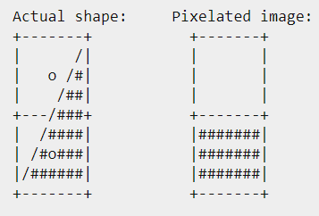

- Recall questions
	- Why will aliasing happen on screens? #ques1 #card
	  card-last-interval:: 4
	  card-repeats:: 2
	  card-ease-factor:: 2.46
	  card-next-schedule:: 2023-02-01T15:14:12.721Z
	  card-last-reviewed:: 2023-01-28T15:14:12.721Z
	  card-last-score:: 5
		- > The reason [alias](https://everything2.com/title/alias)ing occurs is that although real-world shapes have a smooth, [continuous](https://everything2.com/title/continuous) outline, [monitor](https://everything2.com/title/monitor)s, and especially [LCD](https://everything2.com/title/LCD) screens, can only display [discrete](https://everything2.com/title/discrete), distinct points of light, or [pixel](https://everything2.com/title/pixel)s. These square pixels have a uniform colour, and if [anti-aliasing](https://everything2.com/title/anti-aliasing) is not used, the entire pixel will be coloured according to only one colour sample, taken at the centre of the pixel:
		  
		- 本质原因是sampling之后在screen上的一个点对应的颜色是uniform的，所以grid sample会出现aliasing，如上面的描述所示。
	- Why is super sampling? Why can super sampling reduce anti-aliasing? #ques1 #card
	  card-last-interval:: 4
	  card-repeats:: 1
	  card-ease-factor:: 2.6
	  card-next-schedule:: 2023-02-01T15:12:42.856Z
	  card-last-reviewed:: 2023-01-28T15:12:42.857Z
	  card-last-score:: 5
		- 参考：
			- https://zhuanlan.zhihu.com/p/363624370
		- > 这是最简单粗暴的抗锯齿技术。基本思想是：先将场景渲染到一个更高分辨率的帧缓存上，然后分别局部计算多个点的均值得到每个点的颜色。比如目标是得到 1280*1024 的图像，就先渲染 3D 场景到 2560*2048 的帧缓冲上 (4*SSAA)，然后再滤波解析 (Resolve，常用的是Box滤波器)，得到 1280*1024 的图像，如下图所示：
			- 
		- 好处是精度好，坏处是计算量大。