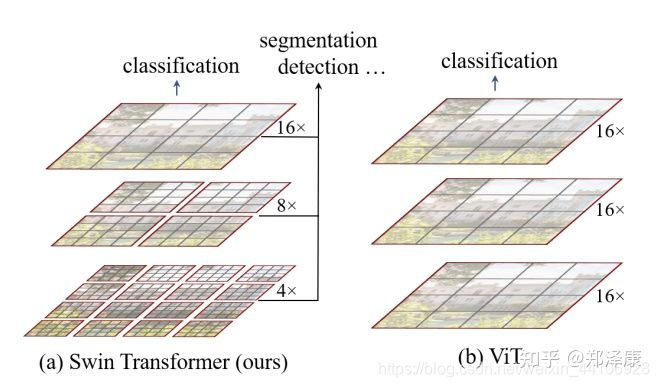
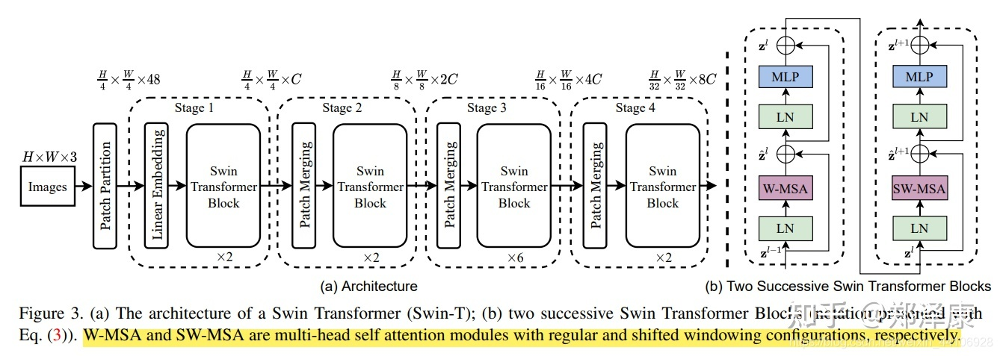
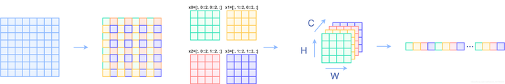
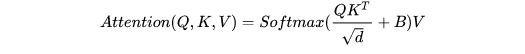
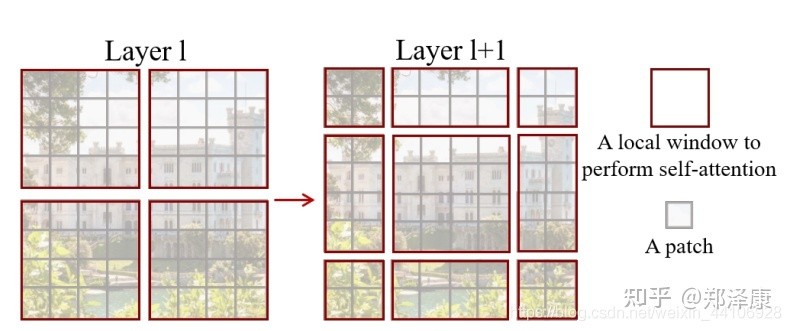
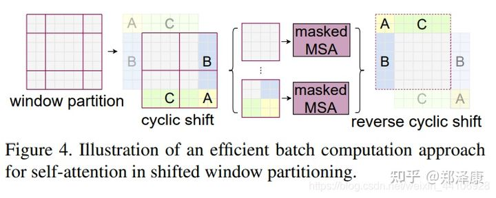
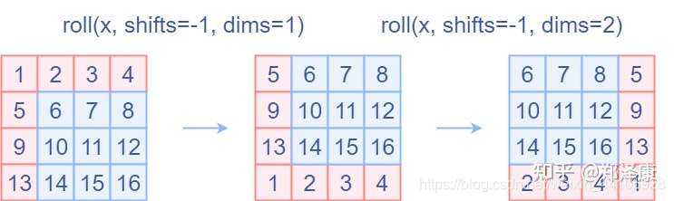
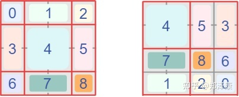
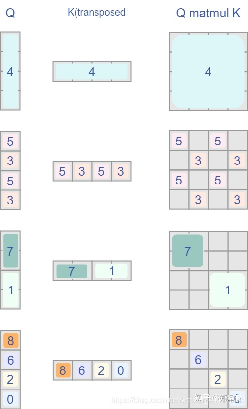

- Metadata
	- [[Class]]: [[Attention]] [[Vision Transformer]]
	- [[Topic]]: https://zhuanlan.zhihu.com/p/367111046
	- [[Lecturer]]:
	- [[Date]]: [[Apr 11th, 2022]]
	- [[Keywords]]:
- Recall Questions
	- 为什么要设计Swin Transformer?
		- 通过引入重叠的window，增加CNN卷积操作的局部性，另一方面能节省计算量
	- Swin Transformer 相对于VIT的区别是什么?
		- 
		- Swin Transformer包含滑窗操作，具有层级设计
			- 包括不重叠的local window和重叠的cross window
- Notes
	- ## Structure of Swin Transformer:
		- {:height 407, :width 1120}
			- 一共四个stage，每个stage都会缩小输入的feature map的分辨率，扩大感受野
		- ### Patch Embedding
			- 经过一个卷积，卷积大小为[3, 96, 4, 4], 输出的大小为[96, 56, 56]
			- {{embed ((6225c19e-a51a-4694-9d1c-ab1853502c4a))}}
			  id:: 625381ff-47e0-4e34-9a02-083f0a657ac7
		- ### Patch Merging
			- 
			- > 个人感觉这像是PixelShuffle的反操作
		- ### Window Partition/Reverse
			- `Windows partition`是将输入的shape从$$[B, H,  W,  C]$$变成$$[B*H*W/window\_size, window\_h, window\_w, C]$$
			- `windows reverse`就是这个的反过程
			- 代码：
				- ```python
				  def window_partition(x, window_size):
				      B, H, W, C = x.shape
				      x = x.view(B, H // window_size, window_size, W // window_size, window_size, C)
				      windows = x.permute(0, 1, 3, 2, 4, 5).contiguous().view(-1, window_size, window_size, C)
				      return windows
				  
				  
				  def window_reverse(windows, window_size, H, W):
				      B = int(windows.shape[0] / (H * W / window_size / window_size))
				      x = windows.view(B, H // window_size, W // window_size, window_size, window_size, -1)
				      x = x.permute(0, 1, 3, 2, 4, 5).contiguous().view(B, H, W, -1)
				      return x
				  ```
		- ### Window Attention
			- Window based multi-head self attention
				- ==这篇文章的关键。传统的Transformer都是基于全局来计算注意力的，因此计算复杂度十分高。而Swin Transformer则将注意力的计算限制在每个窗口内==
				- Attention的公式：
					- 
			- 代码分析：
				- `B_, N, C = x.shape`
					- 输入张量：
						- `numWindows*B, Wh*Ww, C`
				- `qkv = self.qkv(x).reshape(B_, N, 3, self.num_heads, C // self.num_heads).permute(2, 0, 3, 1, 4)`
					- 经过qkv的全连接，输出
						- `3, numWindows*B, num_heads, Wh*Ww, c//num_heads`
					- `q, k, v = qkv[0], qkv[1], qkv[2]`
						- q,k,v分别是其中一个qkv的输出
						- 大小为
							- `numWindows*B, num_heads, Wh*Ww, c//num_heads`
				- `q = q * self.scale`
					- 对q乘以一个scale缩放系数
				- `attn = (q @ k.transpose(-2, -1))`
					- 然后与k（为了满足矩阵乘要求，需要将最后两个维度调换）进行相乘。输出的attn张量
					- 大小为：
						- `numWindows*B, num_heads, Wh*Ww, Wh*Ww`
				- ```python
				          relative_position_bias = self.relative_position_bias_table[self.relative_position_index.view(-1)].view(
				              self.window_size[0] * self.window_size[1], self.window_size[0] * self.window_size[1], -1)  # Wh*Ww,Wh*Ww,nH
				          relative_position_bias = relative_position_bias.permute(2, 0, 1).contiguous()  # nH, Wh*Ww, Wh*Ww
				          attn = attn + relative_position_bias.unsqueeze(0) # (1, num_heads, windowsize, windowsize)
				  ```
					- 位置编码：
						- `relative_position_bias`
							- 大小为`2*window_size-1*2*window_size-1, numHeads`
							- 参与网络学习
						- `relative_position_index`
							- 大小为`Wh*Ww, Wh*Ww`
							- DONE 如何计算？
								- 是一个静态变量，不参与网络学习
						- 用计算得到的相对编码位置索引`relative_position_index`选取，得到形状为
							- `Wh*Ww, Wh*Ww, numHeads`
						- permute之后：
							- `numHeads, Wh*Ww, Wh*Ww`
						- unsqueeze后：
							- `1, numHeads, Wh*Ww, Wh*Ww`
						- 然后加到attn上
				- `attn = self.softmax(attn)`
					- 经过softmax，输出大小为
						- `numWindows*B, num_heads, Wh*Ww, Wh*Ww`
				- `x = (attn @ v).transpose(1, 2).reshape(B_, N, C)`
					- 输出为
						- `numWindows*B,  Wh*Ww, C`
				- `x = self.proj(x)`
					- 输出为
						- `numWindows*B, Wh*Ww, C`
		- ### Shifted Window Attention
			- 为什么要shifted window attention?
				- 前面的windows attention是在每个窗口下计算注意力，为了更好的和其他window进行信息交互，引入shifted window操作
			- Shifted window attention和普通的window attention的区别?
				- 
					- > 左边是没有重叠的Window Attention，而右边则是将窗口进行移位的Shift Window Attention。可以看到移位后的窗口包含了原本相邻窗口的元素。
			- 在是实际代码中，通过对特征图移位（cyclic shift），并给Attention设置mask来间接实现的。能在保持原有的window个数下，最后的计算结果等价
				- 
				- cyclic shift：
					- 
					- `shifted_x = torch.roll(x, shifts=(-self.shift_size, -self.shift_size), dims=(1, 2))`
				- reverse cyclic shift：
					- `x = torch.roll(shifted_x, shifts=(self.shift_size, self.shift_size), dims=(1, 2))`
		- ### Attention Mask
			- 
			- 
			-
- Summary
	-
-