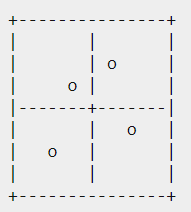

- Recall question
	- What is [[Temporal Anti-Aliasing]]? (帧间抗锯齿技术) #ques1 #card
	  card-last-interval:: 4
	  card-repeats:: 1
	  card-ease-factor:: 2.6
	  card-next-schedule:: 2023-02-01T15:11:33.794Z
	  card-last-reviewed:: 2023-01-28T15:11:33.795Z
	  card-last-score:: 5
		- 讲的比较好的文章
			- [深入浅出Temporal Antialising - 知乎](https://zhuanlan.zhihu.com/p/142922246)
		- use the information of previous frames and current frame to perform anti-aliasing.
		- Sampling method
			- > Sampling the pixels at a different position in each frame can be achieved by adding a per-frame "jitter" when rendering the frames. The "jitter" is a 2D offset that shifts the pixel grid, and its X and Y magnitude are between 0 and 1.[1](https://en.wikipedia.org/wiki/Temporal_anti-aliasing#cite_note-Epic-1)[2](https://en.wikipedia.org/wiki/Temporal_anti-aliasing#cite_note-ziacko-2)
	- What is [[jittered super sampling]]? What is [[halton sequence]]? #ques1 #card
	  card-last-interval:: 4
	  card-repeats:: 2
	  card-ease-factor:: 2.6
	  card-next-schedule:: 2023-02-01T15:14:04.639Z
	  card-last-reviewed:: 2023-01-28T15:14:04.640Z
	  card-last-score:: 5
		- jitter 是随机采样的一种方法。在nxn的格子中随机选取pixel，同时保证各个pixel之间的距离不会过近。2x2举例如下：
			- 
		- [[halton sequence]] 是随机采样的一种方法。
			- > When Jittering, a two-dimensional array of noise is used to move the scene around in an even spread. To get this even spread, the Halton 2, 3 sequence is preferable as this sequence produces a range of random numbers evenly covering a wide range that is much smoother than other noise generating sequences. 
- Benefit: (用到了时域信息，AA效果好)
	- > Temporal Anti-Aliasing (TAA) is an Anti-Aliasing (AA) method that utilizes temporal filtering methods to improve AA stability in motion. What differentiates it from other AA methods is that TAA produces visual results that are better or equal to other AA methods whilst being less performance intensive than other AA methods.
	  Not only this but TAA can also be used in other areas such as smoothing shadow maps and smoother screen space ambient occlusion techniques.