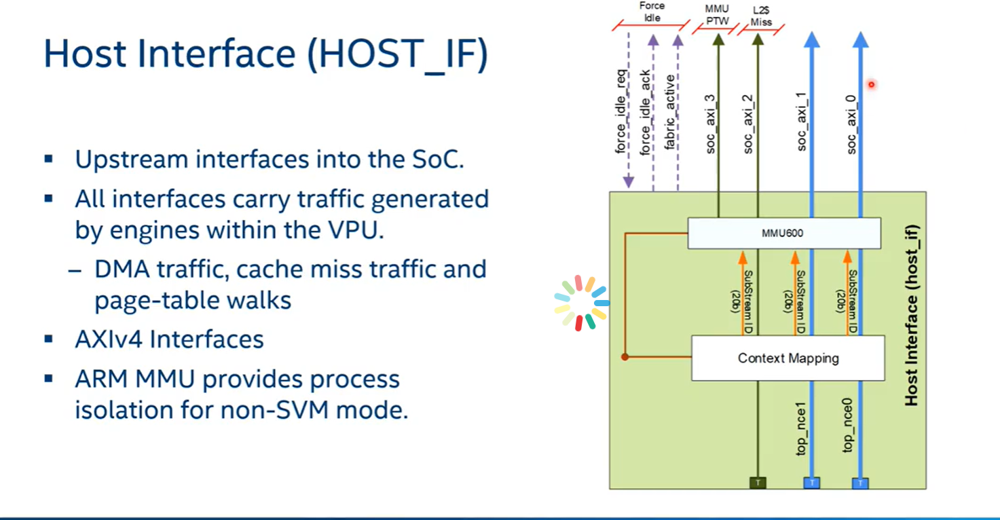
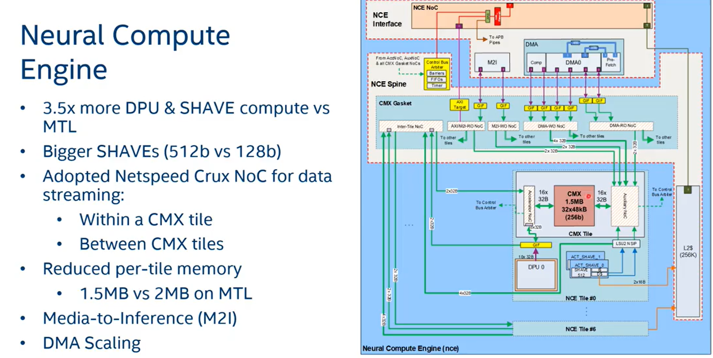
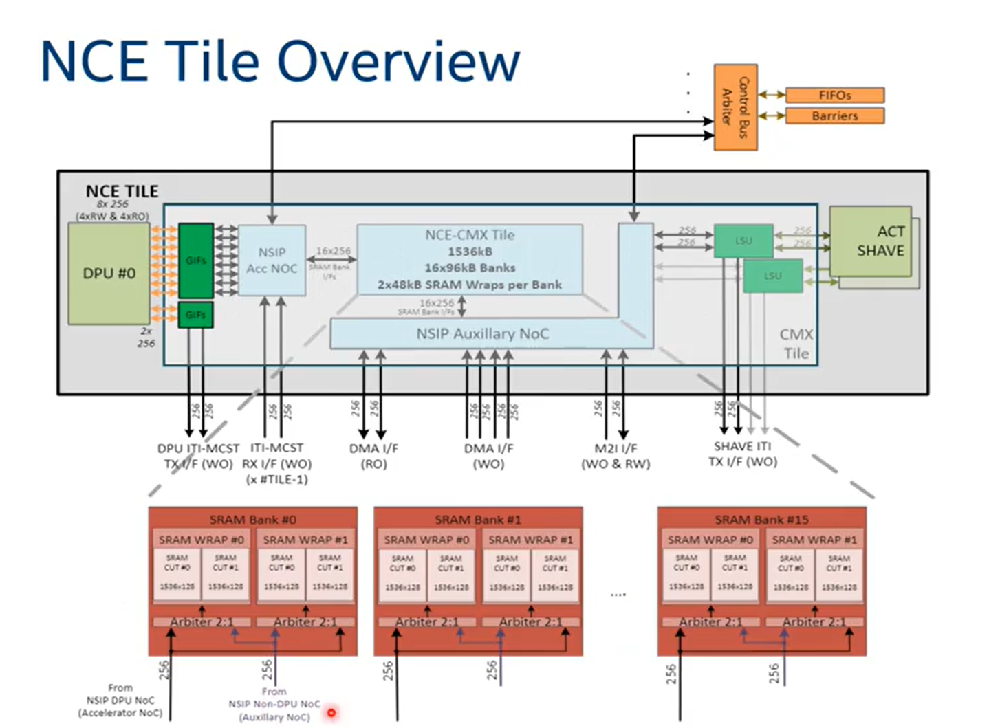
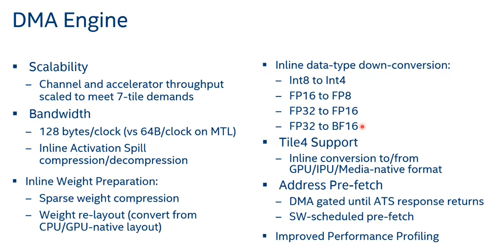
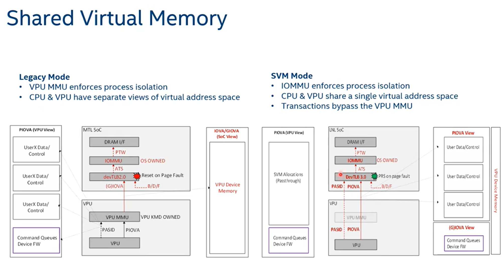
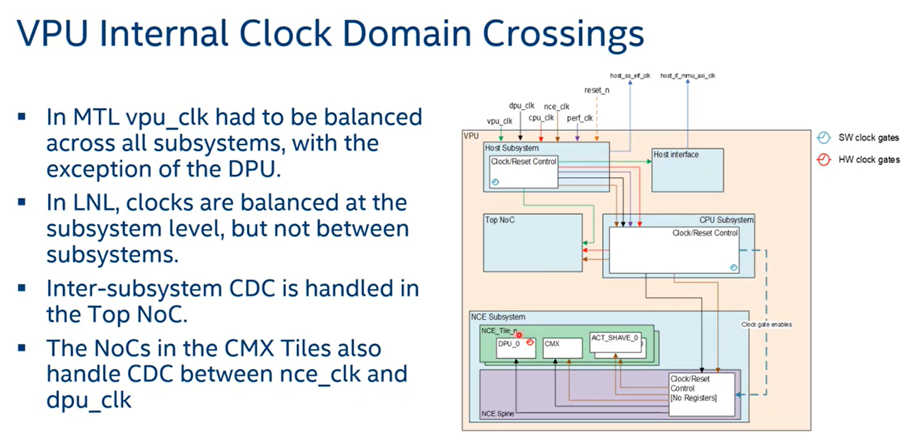

- 
  id:: 662dc1e7-8fe2-48d0-af78-db878f1f9c04
	- Interface:
		- DMA traffic is the left two blue lines, each with 64B/c
		- L2 miss interface: Instruction data/fetch from the risv-5 or shave
		- MMU PTW for page-table walks
	- MMU600 for context switching isolation support
- NCE engine
	- 
	- 
- DMA engine:
	- 
- Shared virtual memory
	- 
	- single view of virtual address space for CPU/VPU in LNL
	- separate views of virtual address for CPU/VPU in MTL
- VPU internal clock
	- 
-