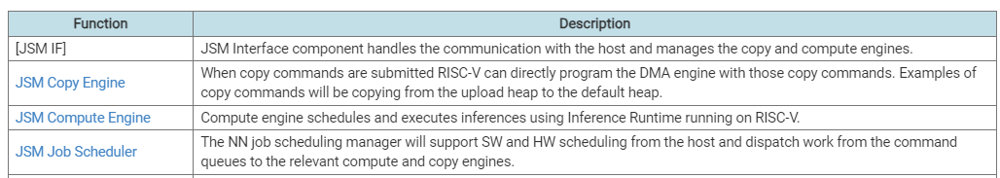
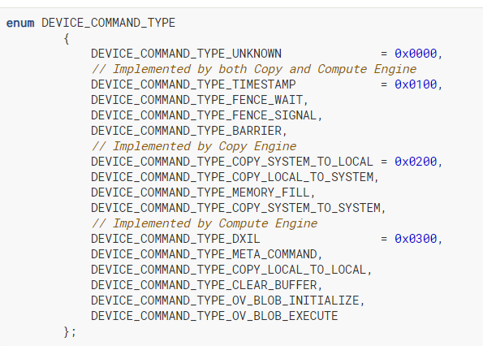

#### Lunar Lake Overview
	- [[Job Scheduler]] runs on [[LeonRT]]
	- 
	- Main FW components and their responsibilities:
		- 
	- The following diagram shows the flow between major FW components while executing compute and copy workloads.
		- 
		- 1. Host submits job and rings doorbell
		- 2. JSM Interface services doorbell IRQ and creates Compute/Copy Engine Job
		- 3. Compute/Copy Engine job is scheduled either using OS Scheduling or HW Scheduling
		- 4. Once the job becomes ready, Compute/Copy Engine starts executing all commands within scheduled batch buffer (job). Note that this requires access to user-data from the Scheduling processor. Inference execute commands are executed by the Compute Engine Runtime, whereas Copy Jobs are executed by the Copy Engine Runtime.
		- 5. JSM Scheduler allocates required resources (tiles) in a 'lazy way' ahead of time through the Resource Manager. JSM dictates internal Power State of the VPU as it has visibility of all the queues and commands being executed: e.g. fences
		- 6. Compute Engine Runtime prepares HW for Inference execution, programs user context (Context Manager) and kicks off Inference
		- 7. Copy Engine Runtime prepares HW for copy jobs and executes copy jobs
		- 8. Compute Engine Runtime and Power Manager produce statistics data into the Statistics Manager, which is sent to the Host through the Sideband FIFO. Based on Compute Engine residency, Power Manager will request new Work Points to keep up with workloads.
		- 9. When all commands in the batch buffer have been executed the Scheduler is notified and a response is sent to the Host through IPC
- ### Firmware Services Components
	- 
	- #### JSM [[Job Scheduler]]
		- The NN Job Scheduler is running on Scheduler CPU ([[LeonRT]]) with the responsibility of scheduling the incoming NN workloads from the host.
		- Scheduling responsibilities:
			- job scheduling
			- job queuing
			- context affinity（类似） optimization
			- ==limited depth job reordering (future)==
	- #### [[JSM Copy Engine]]
		- Copy Engine executes commands provided in batch buffers provided by the Host. Copy Engine runs on RISC-V.
		- When the batch buffer is scheduled to be executed, the Copy Engine parses the batch buffer and generates a list of commands ready to be executed. Upon completion the Copy Engine notifies the Host via IPC (OS Scheduling).
		- Each command is executed by the Copy engine serially until the end of the batch-buffer. Host expects the aggregated status of the execution of the whole batch buffer.
		- ##### Copy Engine Commands
			- Timestamp command: provides the Host with the current VPU Timestamp
			- Fence Wait/Signal command: allows Compute/Copy engine to synchronize jobs even across engines
			- Barrier command: allows to introduce synchronization within jobs
			- Metrics begin/end command: allows to provide the Host with NOC metrics
			- ==Copy commands: allows to execute copy operations==
			- Fill command: allows to fill a block of memory with the intended pattern.
	- #### [[JSM Compute Engine]]
		- Compute Engine allows to run inferences in the VPU by executing commands provided by the Host. Commands are provided in batch buffers as jobs. Compute Engine runs on RISC-V.
		- ##### Compute Engine Commands
			- Timestamp command: provides the Host with the current VPU Timestamp
			- Fence Wait/Signal command: allows Compute/Copy engine to synchronize jobs even across engines.
			- Barrier command: allows to introduce synchronization within jobs.
			- Metrics begin/end command: allows to provide the Host with NOC metrics.
			- Copy commands: allows to execute copy operations.
			- DXIL Dispatch: allows to execute DXIL kernels.
			- Blob Initialize: allows to initialize a blob. Blob Initialize is followed by Blob Execute command. The context of the blob created during this command must be available for Blob Execute (VPU parsed inference)
			- Blob Execute: allows to execute a blob previously initialized with Blob Initialize command (VPU parsed inference).
			- Inference Execute: allows to execute a Host parsed inference which does not require further processing prior to execution.
- ### JSM - VPUIP FW interface
	- The table below summarizes these communications and the method of communication:
		- 
	- 
- ### Communication Interfaces
  collapsed:: true
	- #### IPC
	  collapsed:: true
		- For communication between processors an IPC interface is built. This interface handles the low-level communication between host and VPU IP (JSM).
	- #### [[Doorbell]]
	  collapsed:: true
		- There are 256 doorbells available for job submission from the host.
	- #### Control/Management Command Interface
	  collapsed:: true
		- ##### Components of the Host Interface
		  collapsed:: true
			- | Component | Description |
			  | Command queue | Container for work submission |
			  | Command list | List of commands submitted into the device submitted in a command queue. A [[command list]] could also be referred to as a DMA buffer or [[batch buffer]] |
			  | Engine | A device to do a particular type of work such as Compute, Copy, etc |
			  | Context | A container of work in a particular address space |
			  | Scheduler | The scheduler is responsible for scheduling enqueued work in the Queues to the targeted HW |
	- #### [[Command Queue]]
	  id:: 66377d50-c0aa-402a-abdc-f2af5be8ba1a
	  collapsed:: true
		- A command queue represents a queue of work that is submitted by a particular context to a particular engine. Each engine will have a separate command queue, and each context will have a separate command queue. When a new context is created a command queue for that context should be created for each engine that is available. The VPU will have two engines available:
		  collapsed:: true
			- Copy engine
			- Compute engine
		- A command queue is a construct for the submission of work to the device. ==There will be a single command queue per context and per engine==. Command queues will be created at boot and will be assigned to applications upon context creation. Command Queues will also be associated with a doorbell for submission, so ==when a Command Queue is assigned, a corresponding doorbell will be assigned==.
		  collapsed:: true
			- 
		- #### Level zero command queue creation
		  collapsed:: true
			- ```
			   // Create a command queue Level 0
			   ze_command_queue_desc_t commandQueueDesc = {
			   ZE_COMMAND_QUEUE_DESC_VERSION_CURRENT,
			   ZE_COMMAND_QUEUE_FLAG_NONE,
			   ZE_COMMAND_QUEUE_MODE_DEFAULT,
			   ZE_COMMAND_QUEUE_PRIORITY_NORMAL,
			     0
			  };
			  ze_command_queue_handle_t hCommandQueue;
			  zeCommandQueueCreate(hDevice, &commandQueueDesc, &hCommandQueue);
			  ...
			  ```
	- #### [[Command buffer]]
	  collapsed:: true
		- ```c++
		  typedef struct vpu_cmd_buffer_header {
		      uint32_t cmd_buffer_size; /**< Size of the command buffer */
		      uint32_t cmd_offset;      /**< Offset to the first command in the command buffer from start of buffer header */
		      uint64_t kernel_heap_base_address;     /**< Pointer to kernel heap base address */
		      uint64_t descriptor_heap_base_address; /**< Pointer to descriptor heap base address */
		      uint64_t reserved_1;                   /**< Unused */
		      uint64_t fence_heap_base_address;      /**< Pointer to fence heap base address */
		      uint64_t context_save_area_address;    /**< Pointer to VPU-managed context save area */
		  } vpu_cmd_buffer_header_t;
		  ```
	- #### Return Queue
	  collapsed:: true
		- IPC FIFO will be used for job completion.
- ### [[Command List]] [[batch buffer]]
	- A command list represents a sequence of commands for execution that is pointed to by an entry in the command queue. The command list will be built by the application based on commands created by the compiler(s) and UMD.
	- #### VPU Command List
		- In order to dispatch work from the application to the VPU a standard set of commands will be generated by the compiler and then will be executed by the HW.
		- ##### Supported Command Types in the Command List
			- 
			- 
	- #### Scheduler
		- The scheduler is responsible for scheduling enqueued work in the Queues to the targeted HW. The scheduler will implement scheduling schemes that ensure fairness of scheduling across queues as well as giving scheduling priority to higher priority queues.
- ### NN Framework
	- The Movidius Neural Compute Interface (MvNCI) is the API (mvnci.h) that other firmware components use to load graph files, initialize, and run inferences. It is a handle-based API responsible for dispatching Mapped Inferences to the available tile(s) while maintaining, context isolating, and collecting status and performance metrics of the inferences dispatched.
	- 
	- #### [[Inference Runtime]]
		- The Inference Runtime (IRT) is an arbiter for interrupt handling and job dispatch commands.
		- 
	- #### Activation SHAVE: Activation SHAVE Runtime
		- todo
	- #### NN Firmware Common Components
	  collapsed:: true
		- FIFO connectivity
			- 
			- 
	- #### Context Isolation
	- #### Tasks
		- ##### DPU Tasks
			- 
		- ##### DMA Tasks
		- ##### Management Tasks
			- There may be tasks required of the Inference Runtime during execution of an inference. These tasks are represented as management tasks in the schedule. The compiler creates the management tasks in the same way that tasks for other functional units are scheduled. The Inference Runtime receives an interrupt when a dependent barrier fires (producer count = 0). When the interrupt is received the consumer, count is decremented inside the interrupt service routine.
			- Examples of management task types include:
				- Memory management and transformation tasks (see below)
				- Profiling timestamps and buffer management
				- Inference Pre-emption
		- ##### Barriers
		- ##### Activation SHAVE Tasks (C++, [[DXIL]], OpenCL)
			- 