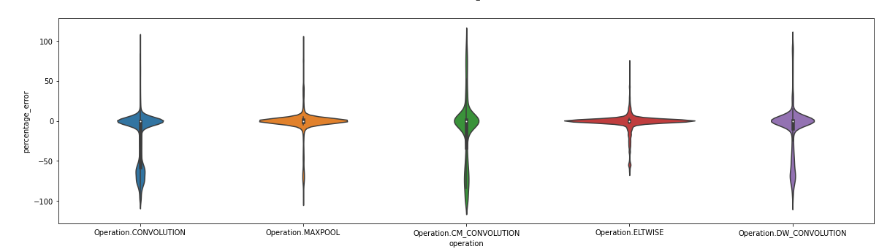
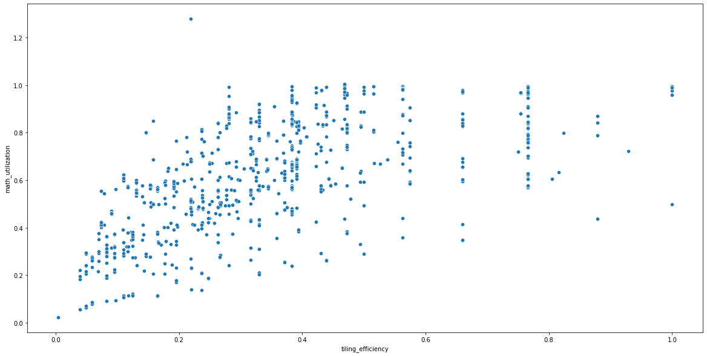
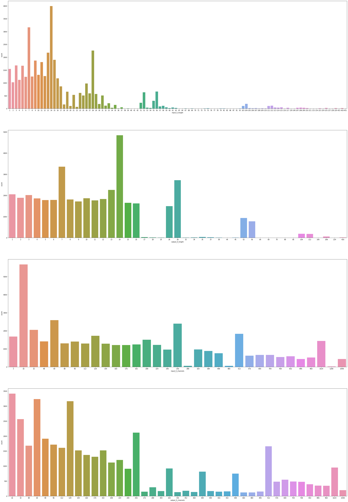
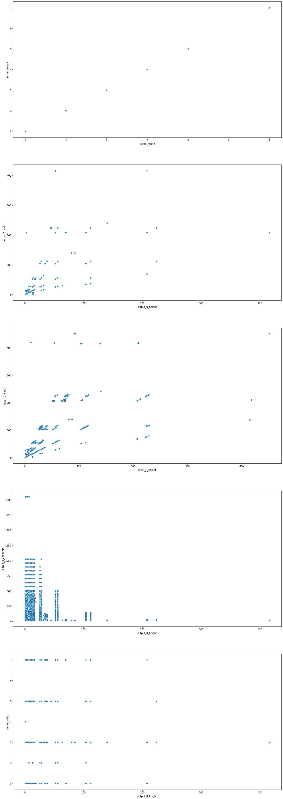
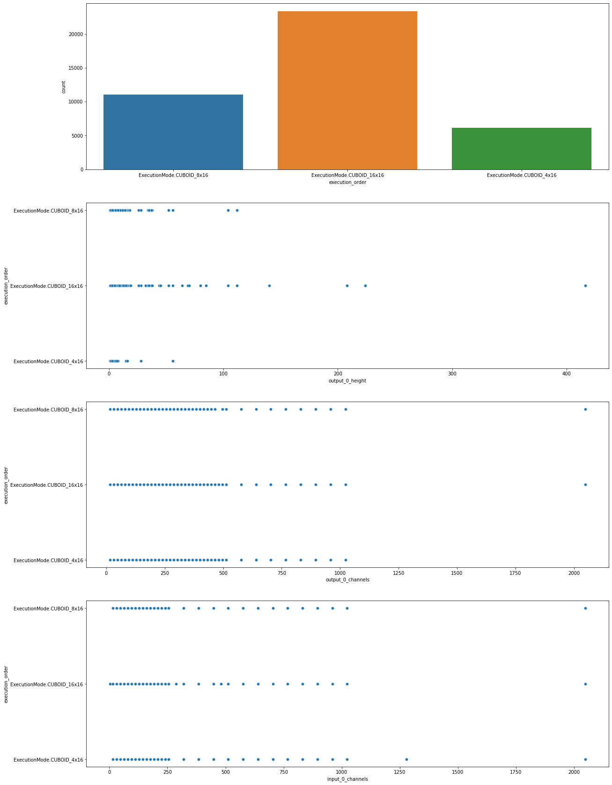

- #[[vpunn Shave Kernel]]
- Slides:
	- https://intel.sharepoint.com/:p:/s/NetworkCompressionVPU/EXh5kRFiDYdFtaPCjk2UuroBGDPh86yG-GiIjQyKpqT8hg?email=xu.qian%40intel.com&e=4%3AQermon&at=9&CID=A51DAAEC-57FE-4399-ADCB-7110B36D21EA&wdLOR=c1F2A14DF-78BF-4889-89D9-FA1A3E946015
- Contexts:
	- [5/5/2022 11:26 PM] Crews, Darren S
	  > very nice analysis Xu!  I think we need some KPIs for accuracy and for inference time.  I would suggest Aswath Narayana, Sandeep and Ambati, Murali to propose an inference time spec.  And Qian, Xu if you could try and come up with a reasonable accuracy expectation proposal
	- accuracy expectation:
		- :LOGBOOK:
		  CLOCK: [2022-05-09 Mon 13:14:57]
		  :END:
- Observation:
	- Almost 1/3 of cycles (5794/15699) from convolution is off by 20% or higher
		- 
	- Some outlier points where mathematical cycles is even larger than the cycles from test in DPU hw.
		- like 39337 in [out.csv](../assets/out_1651670035690_0.csv)
	- The utilization is not aligned with the calculated tiling efficiency
		- 
- Parameters:
	- input_channels, output_channels, output_height, output_width
	- kernel
	- nthw-ntk
	- output_write_tiles, input_0_swizzling, input_1_swizzling, output_0_swizzling have low impact on hw_utilization
	- execution order
- Hist analysis
	- Data distribution:
		- 7, 14, 28 weirdly higher in frequency than other input shapes
		- output height and width mainly locate in 0-16
		- channels are multiplier of 16 and the smaller channels are sampled more, 2**n is sampled more
	- 
- scatter analysis
	- Data distribution:
		- kernel 1, 3, 5, 7 for convolution
		- input width and height are like subplot 3 shows
		- different channels are more sampled for smaller input height and width less sampled for larger input height and width
	- 
- Analysis of Execution order
	- Data analysis
		- CUBIO_16x16 is sampled more than the other two modes
	- 