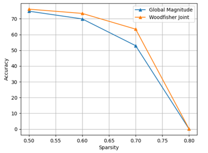
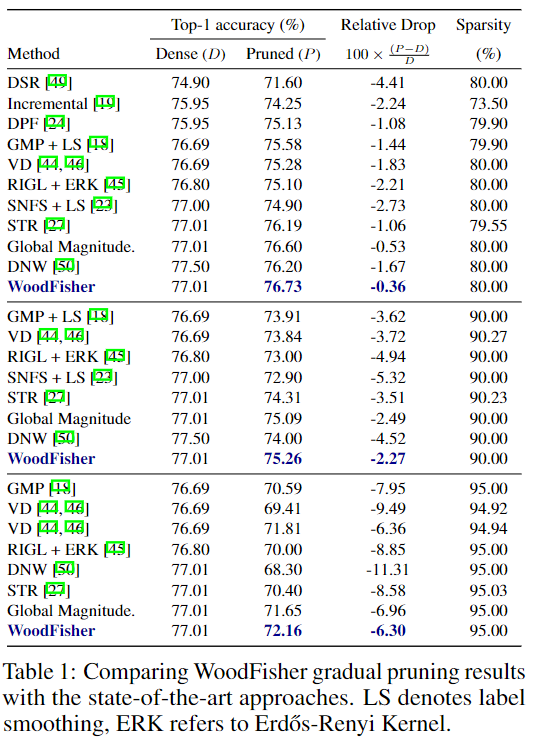

- 
- ## Summary
- Hessian matrix is a good demonstration of the sensitivity of the weight point, Hessian matrix calculation is exhaustive.
- Use Fisher matrix to approximate the Hessian matrix.
- ## Calculation
- ### How to calculate the fisher matrix using woodbury
	- {:height 88, :width 652}
- ### optimal brain damage
	- We start from the idea of pruning (setting to0) the parameters which, when removed, lead to a minimal increase in training loss.
		- 
		- It is often assumed that the network is pruned at a local optimum, which eliminates the first term.  (loss = 0)
	- optimal perturbation δw and change in loss δL are
		- {:height 77, :width 436}
- ### block-wise approximation
	- Hessians tend to be diagonally-dominant
	- > For large models we will need to employ a block-wise approximation, whereby we maintain and estimate limited-size blocks (‘chunks’) on the diagonal and ignore the off-diagonal parts
- ### Pruning method:
	- Layerwise or globally
	- ((626547d7-66fa-4bcf-a830-c7987c71ea32))
- ## Experiments
	- ### Post-training:
		- We mainly used woodfisher for post-training pruning, but it is applicable for training scenarios. The results from our implementation (https://github.com/intel-sandbox/ai.vpu.arch.flex.auto-compression.woodfisher_pytorch) did not reproduce the original paper's results. As the following graph shows, our own implementation of woodfisher have less accuracy than global magnitude.
		- 
		- Luckily, the author opensourced his code (https://github.com/IST-DASLab/WoodFisher) afterwards, and we tried his codebase, and have better performance than global magnitude.I think you don't need to ask for access for both repo. I would suggest you try out the official repo https://github.com/IST-DASLab/WoodFisher since our repo did not reproduce the paper.
		- 
	- ### Training aware
		- ==2.5 days for Resnet50 and 1day for Mobilenet on 4 v100==
		- ((62654925-2e03-40ba-9ecf-da3626a2215e))
		- ==Global magnitude is good enough==
		- 
-