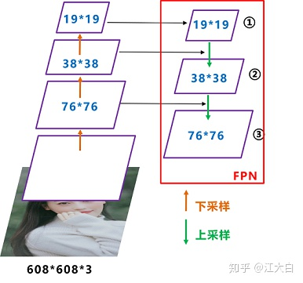
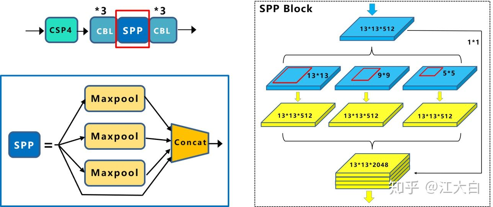
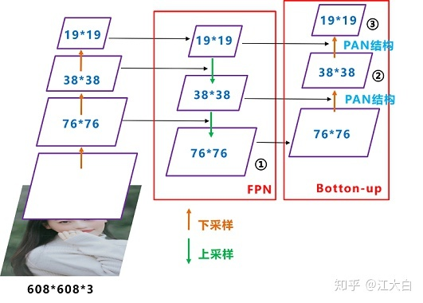

- Yolov3
	 - 
		 - 最后的Prediction中用于预测的三个特征图①19*19*255、②38*38*255、③76*76*255。[注：255表示80类别(1+4+80)×3=255], anchor number for each pixel == 3
		 - [[feature pyramid network]]
			 - 
- Yolov4
	 - 
	 - [[spatial pyramid pooling]]
		 - 采用1×1，5×5，9×9，13×13的最大池化的方式，进行多尺度融合。
		 - 
	 - [[path aggregation network]] + [[feature pyramid network]]
		 - 
		 - 和Yolov3的FPN层不同，Yolov4在FPN层的后面还添加了一个自底向上的特征金字塔。其中包含两个PAN结构。这样结合操作，FPN层自顶向下传达强语义特征，而特征金字塔则自底向上传达强定位特征，两两联手，从不同的主干层对不同的检测层进行参数聚合。
		 - Yolov3的FPN层输出的三个大小不一的特征图①②③直接进行预测，但Yolov4的FPN层，只使用最后的一个76*76特征图①，而经过两次PAN结构，输出预测的特征图②和③。
	 - [[IOU loss]]
- Yolov5
	 - 