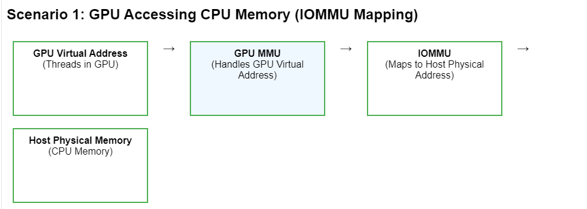
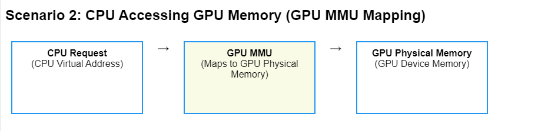
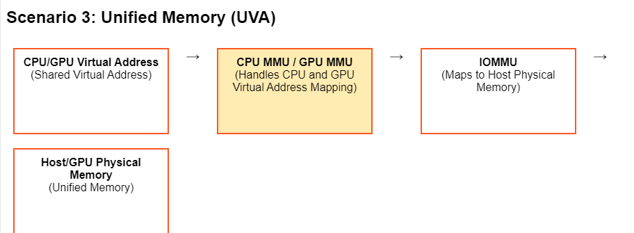

- 用户空间到内核空间是不是一定要拷贝？
	- 用户空间到内核空间不一定要拷贝
	- 可以通过zero copy 实现。
	- Memory space of kernel model
		- 32位linux系统:
			- 内核：3~4G
			- 用户程序：0~3G
- # Zero copy in GPU
	- ## **Zero Copy的原理**
		- **统一虚拟地址空间（Unified Virtual Address Space）**：
			- 从 CUDA 4.0 开始，CPU 和 GPU 在内存访问上支持统一的虚拟地址空间。
			- 这意味着主机内存和设备内存使用共享的地址空间，GPU 可以通过虚拟地址访问主机内存。
		- **主机内存的映射**：
			- 主机内存可以通过 CUDA 的 `cudaHostAlloc` 分配，并设置为可被 GPU 访问的内存。
			- 这种内存会被硬件和驱动程序标记为 **可直接访问的 pinned memory**（固定内存），从而允许 GPU 直接读取或写入。
		- **PCIe 总线访问**：
			- GPU 通过 PCIe 总线直接读取主机内存中的数据，而不需要数据迁移到设备内存。
			- 这种机制的性能通常依赖于 PCIe 带宽，因此适合小规模数据传输或简单的访问模式。
	- ## **Zero Copy 与 Unified Memory 的区别**
		- [[UnifiedMemory]]
		- 虽然 **Zero Copy** 和 **Unified Memory** 都简化了 CPU 和 GPU 之间的数据访问，但它们是不同的机制：
		  
		  | 特性 | Zero Copy | Unified Memory |
		  | ---- | ---- | ---- |
		  | 数据存储位置 | 主机内存 | 主机内存和设备内存 |
		  | 数据迁移 | 无显式迁移，GPU 直接访问主机内存 | 数据按需迁移，可能在主机和设备之间复制 |
		  | 内存分配方式 | 使用 `cudaHostAlloc` | 使用 `cudaMallocManaged` |
		  | 性能依赖 | PCIe 带宽限制 | 数据迁移和硬件分页支持 |
		  | 适用场景 | 小规模数据传输 | 数据频繁在 CPU 和 GPU 之间共享 |
	- ## **例子**：
		- 用`cudaHostAlloc`来分配zero copy支持的主机内存。
		- ```c++
		  #include <cuda_runtime.h>
		  #include <iostream>
		  
		  // Kernel 函数：将数组中的每个元素加 1
		  __global__ void increment_kernel(float* data, int size) {
		      int idx = threadIdx.x + blockIdx.x * blockDim.x;
		      if (idx < size) {
		          data[idx] += 1.0f;  // GPU 直接操作主机内存
		      }
		  }
		  
		  int main() {
		      const int size = 1024; // 数据大小
		      float* host_data;      // 主机内存指针
		      float* device_data;    // GPU 使用的设备指针（指向主机内存）
		  
		      // 分配支持 Zero Copy 的主机内存
		      cudaHostAlloc(&host_data, size * sizeof(float), cudaHostAllocMapped);
		  
		      // 获取主机内存对应的设备指针
		      cudaHostGetDevicePointer(&device_data, host_data, 0);
		  
		      // 初始化主机内存数据
		      for (int i = 0; i < size; i++) {
		          host_data[i] = static_cast<float>(i);
		      }
		  
		      // 在 GPU 上调用内核，直接操作主机内存
		      int threads_per_block = 256;
		      int num_blocks = (size + threads_per_block - 1) / threads_per_block;
		      increment_kernel<<<num_blocks, threads_per_block>>>(device_data, size);
		  
		      // 等待 GPU 完成操作
		      cudaDeviceSynchronize();
		  
		      // 输出数据，直接从主机内存读取
		      std::cout << "Updated data:" << std::endl;
		      for (int i = 0; i < 10; i++) {  // 打印前 10 个元素
		          std::cout << host_data[i] << " ";
		      }
		      std::cout << std::endl;
		  
		      // 释放主机内存
		      cudaFreeHost(host_data);
		  
		      return 0;
		  }
		  ```
	- ## **硬件支持**
		- #### GPU 内存管理单元（MMU，Memory Management Unit） [[MMU]]
			- #[[GpuMMU model]]
			- **作用**：
				- GPU 内部的 MMU 是实现 UVA 的基础。它负责将 GPU 的虚拟地址映射到物理地址。
				- 在支持 UVA 的系统中，GPU 的 MMU 扩展了其功能，使其能够处理来自主机内存的虚拟地址，并通过 PCIe 总线访问主机内存。
			- **特性**：
				- 支持64位虚拟地址。
				- ==能够处理统一的虚拟地址空间，将 GPU 和 CPU 的虚拟地址统一到一个共享地址空间中。==
		- #### **IOMMU（Input-Output Memory Management Unit）**
			- [[IOMMU]]
			- [[IOMMU model]]
			- **作用**：
				- IOMMU 是 CPU 和主板的一部分，用于管理外设（如 GPU、网卡）对主机内存的访问。
				- 在 UVA 模式下，IOMMU 允许 GPU 通过虚拟地址直接访问主机内存，同时保证内存访问的安全性和隔离性。
			- **支持**：
				- 必须在 CPU 和主板上启用 IOMMU 功能。
				- 现代 CPU 和主板（如 Intel VT-d 和 AMD-Vi 技术）通常都支持 IOMMU。
		- #### 固定内存（[[pinned memory]]）支持
			- 固定内存是主机内存的一种特殊分配方式，由 CUDA 提供的 API（如 `cudaHostAlloc`）支持。
			- 固定内存被锁定在主机的物理内存中，不会被操作系统分页到硬盘中。
			- UVA 的实现依赖于固定内存，因为 GPU 在通过统一虚拟地址访问主机内存时，要求这些内存是连续的、且不会被分页。
	- ## **IOMMU vs GPU MMU vs CPUMMU**
		- ### **区别总结**
			- | **特性** | **CPU MMU** | **GPU MMU** | **IOMMU** |
			  | ---- | ---- | ---- |
			  | **作用对象** | 管理 CPU 的虚拟地址空间 | 管理 GPU 的虚拟地址空间 | 管理外设（如 GPU、网卡、硬盘等）的内存访问 |
			  | **映射范围** | 虚拟地址到主机物理内存地址 | 虚拟地址到 GPU 显存地址，或主机内存（UVA） | 虚拟地址到主机物理内存地址 |
			  | **主要职责** | 为进程提供虚拟地址空间隔离和内存保护 | 为 GPU 线程提供地址映射和高效内存访问 | 提供外设的虚拟地址支持，隔离和保护内存访问 |
			  | **分页支持** | 支持分页，可能触发 Page Fault | 支持分页（现代 GPU 支持按需分页与迁移） | 支持 DMA 请求的地址转换 |
			  | **内存保护** | 防止进程违规访问内存区域 | 防止 GPU 线程访问非法内存 | 防止外设访问未经授权的内存区域 |
			  | **应用场景** | 操作系统中的虚拟内存管理 | GPU 并行计算和内存优化 | 外设的 DMA 操作、虚拟化环境 |
			  | **典型硬件支持** | CPU（如 Intel、AMD 的 MMU） | GPU（如 NVIDIA 的 GPU 内存管理单元） | CPU 和主板（如 Intel VT-d、AMD-Vi 技术） |
			  
			  ---
		- ### **GPU MMU 和 IOMMU 的联系**
			- 在现代计算机中，**GPU MMU 和 IOMMU** 可能会协作完成 GPU 的内存管理：
			- 在启用 **Unified Virtual Addressing（UVA）** 或 **Unified Memory** 的情况下：
				- **IOMMU** 将 GPU 的虚拟地址映射到主机内存的物理地址。
				- **GPU MMU** 负责将 GPU 内核中使用的虚拟地址映射到 IOMMU 提供的主机物理地址。
			- **GPU MMU 和 IOMMU 的分工**：
				- GPU MMU 主要处理 GPU 内部的地址映射和显存管理。
				- IOMMU 负责跨设备的地址管理，允许 GPU 访问主机内存。
		- ### 例子
			- 
				- Zero copy的场景
				- GPU 的线程使用虚拟地址访问数据。
				- **GPU MMU** 将虚拟地址解析为 IOMMU 的虚拟地址。
				- **IOMMU** 将虚拟地址映射到主机物理地址。
				- GPU 通过 PCIe 直接访问主机内存的物理地址。
			- 
				- CPU 发出内存访问请求（通常通过 CUDA API）。
				- **GPU MMU** 将请求的虚拟地址映射到 GPU 的显存物理地址。
				- 数据通过 PCIe 从 GPU 显存返回到主机内存。
			- 
				- #UnifiedMemory
				- CPU 和 GPU 使用统一的虚拟地址空间，虚拟地址对两者相同。
				- CPU 的虚拟地址由 **CPU MMU** 映射，GPU 的虚拟地址由 **GPU MMU** 映射。
				- 通过 **IOMMU** 映射到主机物理地址，或者通过 GPU MMU 映射到显存物理地址。
				- 内存按需迁移，数据可以在主机内存和显存之间移动。