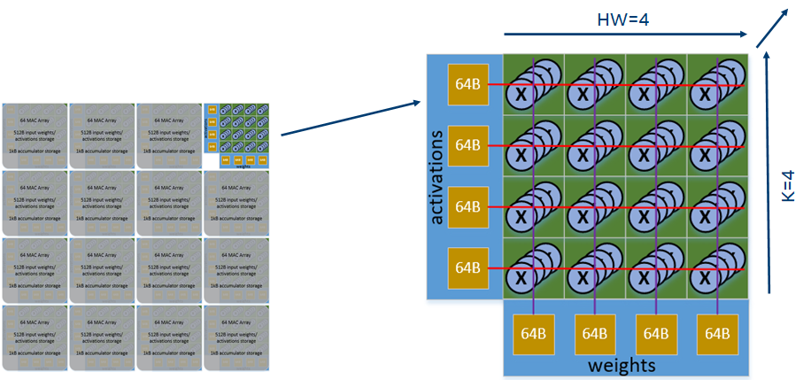
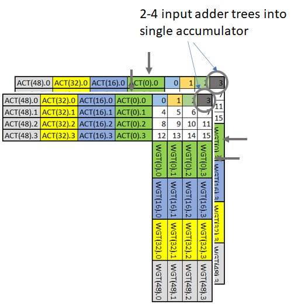

title:: adder tree in VPU4.0
- alias:: adder tree in LNL
- [[VPU MRM structure]]
	- https://videoportal.intel.com/media/LNL+iVPU+HW+architecture+-+Intro/0_idoakxtc
	- ### Overall structure
		- 
			- MRM contains:
			  4x4 grid of 64MAC array with 512B of storage for weights and activations
			  1kB for accumulator storage
			  Groups of 4 MACs with adder tree
	- ### [[Single sparse cell]]
		- 
			- 4x4x8 MAC array
			  4 in HW, 4 in K, 8 in C
			  64B MRM FE for activations and weights for each 4 x 4MACs
		- Addressing into MRM FE
			- Each individual PE can address into each of the 64B of the MRM FE
				- 16 – 64:1 muxes for each PE for both weights and activations
				- 
- ### [[4 input adder tree]]
	- 4 MAC PE contains 4 multipliers and an adder tree
	- There are a total of 64 – 4B RF accumulators for each 4 MAC PE
	- 
- ### [[dual 4 input adder tree]]
	- To minimize the number of muxes, we look at breaking the config into two 4 input muxes, but we look at keeping them within a context, or within a channel set
	- 
- ==Due to the HW architecture we actually need 32 input channels to get 100% HW utilization. With 16 input channels we will only get 50% HW utilization. this is due to the dual 4 input adder tree, when there are only 16 inputs, only one of the 4 input adder trees will be used.==